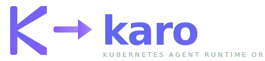

<p align="center">
  
</p>

<p align="center">
  <em>Pronounced <strong>KAH-roh</strong>, rhymes with "pharaoh"</em>
</p>

KARO is a Kubernetes-native operator that provides first-class CRD primitives for deploying, orchestrating, and governing AI agents at scale. It brings the same declarative, observable, and policy-driven approach that Kubernetes uses for containers to the world of AI agents.

## Overview

KARO defines 15 Custom Resource Definitions that cover the full lifecycle of AI agent operations:

| CRD | Purpose |
|-----|---------|
| **ModelConfig** | Model provider bindings (Anthropic, OpenAI, Bedrock, Vertex) |
| **AgentSpec** | Agent identity, capabilities, model binding, and scaling policy |
| **AgentInstance** | Running agent lifecycle (Pending, Running, Idle, Hibernated, Terminated) |
| **AgentTeam** | Multi-agent teams with shared resources and role-based routing |
| **TaskGraph** | DAG-based task orchestration with eval gates and retry policies |
| **Dispatcher** | Capability-based task routing and agent scaling |
| **AgentMailbox** | Persistent messaging between operator and agents (survives restarts) |
| **MemoryStore** | Long-term agent memory (mem0, Redis, pgvector backends) |
| **ToolSet** | MCP tool registration and governance |
| **SandboxClass** | Security boundaries (gVisor, network policy, filesystem restrictions) |
| **AgentLoop** | Cron and event-driven agent scheduling |
| **AgentPolicy** | Governance: model constraints, tool limits, audit, data classification |
| **EvalSuite** | Automated evaluation gates for task quality |
| **AgentChannel** | Human-agent communication via Slack, Telegram, Discord, Teams |
| **AgentGateway** | Request-level proxy for agent→LLM / MCP / A2A traffic with rate limits, budgets, auth, failover, and unified observability (agentgateway.dev-based) |

## Architecture

```
                    ┌──────────────┐
                    │  AgentChannel│ ◄── Slack / Telegram / Discord
                    └──────┬───────┘
                           │
┌──────────┐    ┌──────────▼───────────┐    ┌──────────────┐
│ AgentLoop├───►│     TaskGraph        │◄───┤  EvalSuite   │
└──────────┘    │  (DAG of tasks)      │    └──────────────┘
                └──────────┬───────────┘
                           │
                ┌──────────▼───────────┐
                │     Dispatcher       │
                │ (capability routing) │
                └──────────┬───────────┘
                           │
              ┌────────────┼────────────┐
              ▼            ▼            ▼
        ┌──────────┐ ┌──────────┐ ┌──────────┐
        │ AgentInst│ │ AgentInst│ │ AgentInst│
        │  (pod)   │ │  (pod)   │ │  (pod)   │
        └─────┬────┘ └────┬─────┘ └────┬─────┘
              │           │            │
              ▼           ▼            ▼
        ┌──────────────────────────────────┐
        │    agent-runtime-mcp sidecar     │
        │  (8 MCP tools over JSON-RPC 2.0) │
        └────────────────┬─────────────────┘
                         │ LLM / MCP / A2A
                         ▼
                ┌──────────────────┐
                │   AgentGateway   │ ──► Model providers, MCP servers, peer agents
                │ (proxy + policy) │     (rate limits, budgets, failover, tracing)
                └──────────────────┘
```

## Key Features

- **DAG Task Orchestration** -- TaskGraph defines tasks with dependencies, eval gates, and retry policies. The Dispatcher routes tasks to agents by capability.
- **Scale-to-Zero** -- Agents hibernate when idle, wake on mailbox messages. No pods running when there's no work.
- **MCP-First Runtime Contract** -- Every agent pod gets an `agent-runtime-mcp` sidecar exposing 8 tools (`poll_mailbox`, `ack_message`, `complete_task`, `fail_task`, `add_task`, `query_memory`, `store_memory`, `report_status`).
- **Request-Level Gateway** -- AgentGateway proxies agent→LLM, agent→tool (MCP), and agent→agent (A2A) traffic with per-agent rate limits, budget controls, provider failover, and unified metrics/tracing. Reference `ModelConfig`, `ToolSet`, or `AgentSpec` via `gatewayRef` and traffic routes through the bundled [agentgateway.dev](https://github.com/agentgateway/agentgateway) build automatically.
- **Agent Framework Agnostic** -- Reference harnesses for [Goose](https://github.com/block/goose) and Claude Code. Any agent that speaks MCP can plug in.
- **Policy & Governance** -- AgentPolicy controls model access, tool usage, loop limits, and data classification. EvalSuite gates ensure quality before tasks close.
- **Human-in-the-Loop** -- AgentChannel integrates with Slack, Telegram, Discord, and Teams for approvals, overrides, and notifications.
- **Observability** -- 60+ Prometheus metrics, VictoriaMetrics integration, 10 alerting rules, and a Grafana dashboard out of the box.

## Quick Start

### Prerequisites

- Kubernetes cluster (1.28+)
- Helm 3
- `kubectl` configured

### Install with Helm

```bash
helm install karo charts/karo/ \
  --namespace karo-system \
  --create-namespace
```

### Create Your First Agent

```yaml
# 1. Configure a model
apiVersion: karo.dev/v1alpha1
kind: ModelConfig
metadata:
  name: claude-sonnet
spec:
  provider: anthropic
  name: claude-sonnet-4-20250514
  apiKeySecret:
    name: anthropic-credentials
    key: api-key

# 2. Define an agent
apiVersion: karo.dev/v1alpha1
kind: AgentSpec
metadata:
  name: coder-agent
spec:
  modelConfigRef:
    name: claude-sonnet
  systemPrompt:
    inline: "You are a software engineer..."
  capabilities:
    - name: impl
    - name: review
  scaling:
    minInstances: 0
    maxInstances: 3
    startPolicy: OnDemand

# 3. Create a task graph
apiVersion: karo.dev/v1alpha1
kind: TaskGraph
metadata:
  name: feature-auth
  labels:
    team: alpha
spec:
  tasks:
    - id: design
      title: "Design auth module"
      type: design
      description: "Design OAuth2 integration"
    - id: implement
      title: "Implement auth module"
      type: impl
      deps: [design]
  dispatchPolicy:
    maxConcurrent: 2
    retryPolicy:
      maxRetries: 2
      onExhaustion: EscalateToHuman
```

See [`config/samples/`](config/samples/) for complete examples of all 15 CRDs.

## Project Structure

```
├── api/v1alpha1/          # CRD type definitions (15 CRDs)
├── cmd/
│   ├── main.go            # Operator entrypoint
│   └── agent-runtime-mcp/ # MCP sidecar binary
├── internal/
│   ├── controller/        # 15 reconcilers
│   ├── dag/               # DAG cycle detection (Kahn's algorithm)
│   ├── eval/              # Eval case runner
│   ├── git/               # Git credential injection
│   └── runtime/           # MCP server, tools, debug server
├── harness/
│   ├── goose/             # Goose reference harness
│   └── claude-code/       # Claude Code reference harness
├── charts/karo/           # Helm chart
├── config/
│   ├── crd/bases/         # Generated CRD manifests
│   ├── rbac/              # Generated RBAC
│   └── samples/           # Sample manifests for all CRDs
└── docs/
    └── karo-spec-v0.4.0-alpha.md  # Full specification
```

## Documentation

- [Full Specification (v0.4.0-alpha)](docs/karo-spec-v0.4.0-alpha.md) -- Complete spec with all CRD definitions, Go types, controller flows, and implementation details (~5,200 lines)

## Development

```bash
# Build the operator
go build ./...

# Run tests
go test ./...

# Generate deepcopy functions
controller-gen object paths="./api/..."

# Generate CRD manifests
controller-gen crd:allowDangerousTypes=true paths="./api/..." output:crd:artifacts:config=config/crd/bases

# Generate RBAC
controller-gen rbac:roleName=manager-role paths="./internal/..." output:rbac:artifacts:config=config/rbac
```

## License

Apache License 2.0
