# KARO — Kubernetes Agent Runtime Orchestrator
## Project Specification v0.4.0-alpha

> **Changelog from v0.3.0:**
> - **Change 7: Task spec/status split.** Task runtime state (`status`, `assignedTo`, `assignedAt`, `failureNotes`, `resultArtifactRef`, `retryCount`, `evalResult`, `completedAt`) moved from `spec.tasks[]` to `status.taskStatuses` map (keyed by task ID). `spec.tasks[]` now contains only declarative task definitions. TaskGraph uses the `/status` subresource for all runtime state updates. This follows Kubernetes convention: `spec` = desired state, `status` = observed state.
> - **Change 8: AgentMailbox hardened for etcd storage.** Removed `persistence` block (retention is now handled by audit system). Lowered `maxMessages` → `maxPendingMessages` default from 1000 to 100. Added `maxMessageSizeBytes` (default 4096). Controller aggressively GCs processed messages immediately on agent acknowledgement — no retention in mailbox status. Added `acknowledgeMessage` controller function. Added Go type definitions for `AgentMailboxSpec`, `AgentMailboxStatus`, `MailboxMessage`, `TaskAssignedPayload`, `MessageType` enums. Per-message CRD migration tracked in v1beta1 roadmap.
> - **Change 9: Implementation order clarified — TaskGraph/Dispatcher decoupling.** Removed false circular dependency between TaskGraph and Dispatcher. TaskGraph (step 10) emits Kubernetes events and updates status — it does not import Dispatcher. Dispatcher (step 11) watches TaskGraph status changes via `Watches()`. Added `SetupWithManager` code for both controllers showing the event-based coupling pattern. AgentTeam moved to step 12 (after Dispatcher, which it references).
> - **Change 10: Agent Runtime Contract added.** New section defining how agent processes interact with the KARO operator at runtime. Contract is MCP-first: an `agent-runtime-mcp` sidecar runs in every AgentInstance pod exposing KARO operations as MCP tools (`karo_poll_mailbox`, `karo_ack_message`, `karo_complete_task`, `karo_fail_task`, `karo_add_task`, `karo_query_memory`, `karo_store_memory`, `karo_report_status`). Sidecar is auto-injected by AgentInstance controller. Includes full MCP tool schemas (JSON), permission governance table, debug REST endpoint spec, agent framework compatibility matrix, project structure additions (`cmd/agent-runtime-mcp/`, `internal/runtime/`, `sdk/python/`). Also fixes duplicate `internal/` directory in project structure.
> - **Change 11: AgentTeam sharedResources propagation clarified.** AgentTeam controller does NOT mutate AgentSpec objects. Shared resource resolution happens at AgentInstance creation time: AgentSpec explicit values take precedence, AgentTeam sharedResources are fallback defaults. Added `resolveEffectiveBindings()` Go code, `EffectiveBindings` struct with source tracking, `TeamSharedResources` Go type. Updated AgentInstance controller responsibilities and reconciliation flow diagram.
> - **Change 12: Timeout defaults and guidance.** Added `defaultTimeoutMinutes` (default: 60) to `DispatchPolicy` as graph-level fallback. Added recommended timeout values per task type in Task Go type comments (design: 120, impl: 240, eval: 60, review: 120, infra: 180).
> - **Change 13: ToolSet transport mismatch fixed.** GitHub tool corrected from `stdio` to `streamable-http` (stdio has no HTTP endpoint). Code-executor corrected to use `command` field instead of `endpoint` for stdio transport.
> - **Change 14: SandboxClass domain-based egress clarified.** `allowedDomains` cannot use standard Kubernetes NetworkPolicy (CIDR-only). Controller auto-detects Istio (ServiceEntry/Sidecar), Cilium (CiliumNetworkPolicy with toFQDNs), or falls back to DNS-resolved CIDR rules with staleness warnings.
> - **Change 15: Complete Go type definitions for all 13 CRDs.** Added missing Go types: `AgentInstanceSpec`, `AgentInstanceStatus`, `AgentInstancePhase`, `TaskRef`, `HibernationConfig`, `MemoryStoreSpec`, `MemoryBackend`, `Mem0Config`, `MemoryScope`, `ToolSetSpec`, `ToolEntry`, `MCPTransport`, `SandboxClassSpec`, `SandboxNetworkPolicy`, `FilesystemConfig`, `SecurityContextConfig`, `AgentLoopSpec`, `LoopTrigger`, `EventSource`, `LoopEvalGate`, `DispatcherSpec`, `DispatchMode`, `CapabilityRoute`, `MessagingConfig`, `LLMRouteConfig`, `AgentPolicySpec` (with all nested types), `EvalSuiteSpec`, `EvalCase`, `Assertion`, `AssertionType`. Added naming note on `AgentSpecSpec`.
> - **Change 16: Rate limiting multi-replica semantics clarified.** Rate limiting runs on leader replica only (controller-runtime leader election). Distributed rate limiting for sidecar-direct model calls tracked as v1beta1 concern.
> - **Change 17: Hibernation semantics clarified.** AgentInstance wraps a raw Pod, not a Deployment. Hibernation = checkpoint to MemoryStore + delete Pod. Wake = recreate Pod + inject prior context. Updated reconciliation flow diagram.
> - **Change 18: Context token tracking contract defined.** Agent reports usage via `karo_report_status` MCP tool. Sidecar writes to `AgentInstance.status.contextTokensUsed`. Controller checks against `maxContextTokens` and triggers `onContextExhaustion`. Recommended reporting interval: every 10 tool calls or 30 seconds. Added inline documentation to AgentSpec YAML.
> - Minor: Fixed Helm chart image tag to match spec version (0.4.0-alpha). Confirmed IAM ARN double-colon is correct (region is empty for global IAM resources).
> - **Change 19: Reference Agent Harness (Goose).** New section defining Goose (block/goose, Apache 2.0, AAIF/Linux Foundation) as the reference agent harness. Includes integration architecture, container image spec (`karo-goose-harness`), bootstrap agent loop script, Goose recipe templates per task type, and alternative harness compatibility table (Claude Code, OpenCode, Codex, LangGraph, custom Go). Updated AgentSpec runtime image to `karo-goose-harness`. Added `harness/goose/` to project structure with Dockerfile, bootstrap scripts, and recipe templates.
> - **Change 20: Structured capabilities and agent config files.** Upgraded `capabilities` from `[]string` to `[]AgentCapability` with optional `skillPrompt` (inline or ConfigMap) and `requiredTools`. Added `agentConfigFiles` to AgentSpec for mounting SOUL.md, AGENTS.md, TOOLS.md (AAIF conventions) into agent pods via ConfigMap volumes. Added `AgentCapability`, `AgentConfigFile`, `ConfigFileSource` Go types. Added `skillPrompt` and `taskDescription` to `TaskAssignedPayload`. Updated AgentInstance controller to mount config files. Skill CRD and `gitRef` config source tracked in v1beta1 roadmap.
> - **Change 21: AgentChannel CRD (14th CRD).** New CRD for human-to-agent communication via external messaging platforms. v1alpha1 supports Slack (Socket Mode + HTTP), Telegram (BotFather, inline keyboards, DM policy), Discord (guild/channel, role-based access, thread replies), Microsoft Teams (tenant/team/channel), and generic webhook. Inspired by OpenClaw's channel adapter pattern — each platform is a pluggable adapter with platform-specific config; create multiple AgentChannel resources for multi-platform presence on the same team. Supports inbound message routing (task-creation, human-override, auto-classify), outbound notifications, interactive approval gates, and multi-team handoff chains. Added `approval` task type and `AwaitingApproval` task phase. Full Go type definitions including `TelegramConfig`, `DiscordConfig`, `TeamsConfig`. YAML examples for Slack, Telegram, and Discord. v1beta1 roadmap includes WhatsApp, Signal, Matrix, Google Chat, Mattermost, LINE, and cross-platform identity binding. CRD count: 13 → 14.
> - **Change 22: Claude Code as co-reference harness.** Added Claude Code alongside Goose as a reference agent harness. Includes comparison table, integration architecture, Dockerfile, bootstrap script, `.mcp.json` template for `agent-runtime-mcp` sidecar registration, and decision guide for choosing between Goose and Claude Code. Claude Code provides maximum agent capability with Auto Mode, native MCP Tool Search, CLAUDE.md support, and Vertex AI/Bedrock integration. Section renamed from "Reference Agent Harness" to "Reference Agent Harnesses" (plural).
> - **Change 23: Observability section.** New section defining the complete observability stack. VictoriaMetrics as the metrics backend (Prometheus-compatible, lower resource usage). 60+ metrics across 8 categories: TaskGraph (completion, duration, retries, timeouts), Agent (context tokens, hibernation, uptime), Dispatcher (latency, queue depth), Mailbox (pending, dropped), EvalSuite (pass rate, gate blocks), Model usage (tokens, cost, latency, rate limits, errors), AgentChannel (approvals, handoffs), Policy (violations, mutations). VMServiceScrape/VMPodScrape configs for auto-discovery. 10 alerting rules via VMRule. Full Grafana dashboard JSON with 12 panels across 4 rows (fleet overview, TaskGraph detail, agent performance, channel & cost). Helm integration with `observability` values block.
> - **Change 24: Agent scaling and scale-to-zero.** Added `scaling` block to AgentSpec with `minInstances` (0 for scale-to-zero), `maxInstances` (parallel worker cap), `startPolicy` (OnDemand/Immediate), and `cooldownSeconds`. OnDemand is the default — no pod is created until a task is dispatched. The Dispatcher creates AgentInstances up to maxInstances to process tasks in parallel; each instance handles one task at a time. After task completion, idle instances are terminated after cooldown if minInstances is 0. Added `AgentScaling` and `StartPolicy` Go types. Updated Dispatcher flow to check idle instances first, then scale up if under maxInstances. Updated AgentInstance reconciliation flow with OnDemand start gate and cooldown-based scale-down. Added scaling metrics (desired, max, scale-up, scale-down counters).
> - Added `EvalPending` to task status enum (was in state machine diagram but missing from enum)
> - Added `resultArtifactRef` field for eval gate input
> - Added `assignedTo` / `assignedAt` fields for dispatch tracking
> - Added `timeoutMinutes` field on tasks
>
> **Changelog from v0.2.0:**
> - Added Vertex AI (GKE) and AWS Bedrock (EKS) ModelConfig examples with workload identity auth
> - Added A2A (Agent2Agent Protocol) design note and future roadmap entry
> - Clarified agent execution model: TaskGraph is the durable source of truth; A2A deferred to future
>
> **Changelog from v0.1.0:**
> - Change 1: Renamed `beads` → `tasks` throughout (TaskGraph, AgentInstance, all code)
> - Change 2: Added `workspaceCredentials` to `AgentSpec` for git repo access (PR creation)
> - Change 3: EvalSuite clarified — eval gates task closure, not agents directly. Gate binding moves to `TaskGraph.spec.tasks[].evalGate`
> - Change 4: Added `TaskMutation` capability in `AgentPolicy` for agents adding tasks at runtime
> - Change 5: Added `ModelConfig` as a standalone CRD (split from AgentSpec)
> - Change 6: Added `AgentTeam` as a grouping primitive
> - CRD count: 11 → 13

---

## Table of Contents

1. [Overview](#overview)
2. [Motivation & Prior Art](#motivation--prior-art)
3. [Design Principles](#design-principles)
4. [Architecture](#architecture)
5. [CRD Reference](#crd-reference)
6. [Controller Reconciliation Flows](#controller-reconciliation-flows)
7. [Interaction Flows](#interaction-flows)
8. [Observability](#observability)
9. [Agent Runtime Contract](#agent-runtime-contract)
10. [Reference Agent Harnesses](#reference-agent-harnesses)
11. [Installation](#installation)
12. [Project Structure](#project-structure)
13. [Implementation Guide for Claude Code](#implementation-guide-for-claude-code)
14. [Roadmap](#roadmap)

---

## Overview

**KARO** (Kubernetes Agent Runtime Orchestrator) is a Kubernetes-native operator that provides first-class primitives for deploying, orchestrating, and governing AI agents at scale. KARO treats agents as schedulable, observable, and governable Kubernetes workloads — not as scripts or ephemeral processes.

KARO introduces fourteen Custom Resource Definitions (CRDs) that model every layer of an agent system: model configuration, identity, team grouping, memory, tooling, sandboxing, scheduling, task orchestration, dispatch, messaging, evaluation, policy, and human communication channels. Together they form a complete declarative API surface for multi-agent systems on Kubernetes.

**API Group:** `karo.dev`
**Initial Version:** `v1alpha1`
**Operator Framework:** Operator SDK (Go)
**Scope:** All CRDs are namespace-scoped
**Install:** Helm chart + Kustomize manifests

---

## Motivation & Prior Art

### The Problem

AI agents in production require more than a running container. They need:

- **Persistent identity** that survives context window exhaustion and process restarts
- **Memory** that is scoped, typed, and governed — not a flat key-value store
- **Proactive scheduling** — the ability to wake, act, and sleep on a heartbeat
- **DAG-aware task orchestration** — dependencies between work items across multiple agents
- **Tool governance** — agents should only access tools they are explicitly permitted to use
- **Sandboxing** — untrusted code execution must be isolated at the kernel level
- **Dispatch** — a typed routing layer that maps work to capable agents via messaging
- **Git workspace credentials** — dev agents need ambient git identity to create PRs
- **Team grouping** — agents working together need a shared resource boundary
- **Model configuration** — model provider details should be decoupled from agent identity

No existing Kubernetes project addresses all of these as first-class CRD primitives.

### Reference Projects

#### kubernetes-sigs/agent-sandbox
The official Kubernetes SIG Apps project (March 2026) that introduced the `Sandbox`, `SandboxClaim`, `SandboxTemplate`, and `SandboxWarmPool` CRDs. It solves singleton stateful workloads with lifecycle management (pause/resume/hibernate) and strong isolation via gVisor/Kata Containers. KARO's `SandboxClass` and `AgentInstance` are directly inspired by this work and are designed to be compatible with it. KARO does not reimplement sandbox isolation — it delegates `runtimeClassName` to the cluster's configured runtime.

**Gap:** agent-sandbox has no concept of memory, loop/heartbeat, task graphs, tool governance, or dispatch. KARO builds the orchestration layer above it.

#### McKinsey ARK (Agentic Runtime for Kubernetes)
ARK defines seven core CRDs (`Agent`, `Team`, `Query`, `ModelConfig`, `Tool`, `Evaluator`, `Memory`) making agent systems resource-oriented and declarative. It is the most complete prior art. ARK's production insight is critical: agents should not orchestrate themselves — a deterministic workflow engine that enforces phase transitions works; letting agents decide what comes next leads to circular dependencies and analysis loops on larger codebases. This directly validates KARO's `TaskGraph` as a deterministic DAG controller.

**Gap:** ARK has no DAG-aware TaskGraph primitive, no AgentLoop/heartbeat, and no AgentMailbox dispatch pattern. KARO is framework-agnostic and targets platform engineering use cases.

#### kagent (CNCF Sandbox, Solo.io)
kagent has `Agent`, `ModelConfig`, and `ToolServer` CRDs. Agents can be grouped into teams where a planning agent assigns tasks to individual agents. It is purpose-built for cloud-native operations (troubleshooting, observability, GitOps automation) using AutoGen/ADK internally.

**Gap:** No TaskGraph, no loop/heartbeat, no MemoryStore CRD, no AgentMailbox. KARO adopts kagent's `ModelConfig` separation pattern and `AgentTeam` concept.

#### Steve Yegge's Gastown / Beads
Gastown is a multi-agent coding orchestrator built on top of the Beads issue-tracking system (Git + SQLite). Beads introduces three critical concepts that directly inform KARO's design:

1. **Task Graphs** — work structured as interconnected micro-tasks with dependency edges
2. **Persistent Agent Identity** — Role Beads and Agent Beads are pinned identities that never close
3. **GUPP** (Gas Town Universal Pull Protocol) — if there is work on your hook, you must run it. This is the heartbeat/loop primitive that keeps agents alive beyond context window limits.

The Gastown concept of a **Convoy** (a named collection of tasks forming a unit of work) maps directly to KARO's `TaskGraph`. The **Dispatcher** in KARO is equivalent to Gastown's Mayor + sling/nudge mechanism. The **AgentMailbox** is the Kubernetes-native equivalent of a Gas Town hook.

**Gap:** Gastown is a local CLI tool backed by Git. It has no multi-tenancy, no RBAC, no cluster-scale scheduling, no network policy, and no isolation primitives. KARO is Gastown's concepts expressed as a Kubernetes operator.

#### agentic-layer/agent-runtime-operator
Provides `Agent`, `AgentGateway`, and `AgentGatewayClass` CRDs focused on MCP gateway routing and observability wiring.

**Gap:** No memory, loop, task graph, sandbox, or dispatch primitives.

### KARO's Differentiation

| Primitive | agent-sandbox | ARK | kagent | Gastown | **KARO** |
|---|---|---|---|---|---|
| ModelConfig CRD | ❌ | ✅ | ✅ | ❌ | ✅ |
| AgentTeam CRD | ❌ | ✅ | ✅ partial | ❌ | ✅ |
| Sandbox / isolation | ✅ | ❌ | ❌ | ❌ | ✅ |
| Memory as CRD | ❌ | ✅ partial | ❌ | ✅ Git-backed | ✅ scoped |
| Loop / heartbeat | ❌ | ❌ | ❌ | ✅ GUPP | ✅ |
| TaskGraph (DAG) | ❌ | ❌ | ❌ | ✅ Beads | ✅ |
| Task eval gates | ❌ | ❌ | ❌ | ❌ | ✅ |
| Task mutation by agents | ❌ | ❌ | ❌ | ✅ manual | ✅ governed |
| Tool governance | ❌ | ❌ | partial | ❌ | ✅ |
| Git workspace credentials | ❌ | ❌ | ❌ | ✅ manual | ✅ |
| Dispatcher / routing | ❌ | ✅ partial | ✅ partial | ✅ Mayor | ✅ typed |
| AgentMailbox | ❌ | ❌ | ❌ | ✅ hooks | ✅ |
| Policy / governance | ❌ | ❌ | partial | ❌ | ✅ |
| Multi-tenant / RBAC | ✅ | ❌ | ❌ | ❌ | ✅ |

---

## Design Principles

1. **Declarative first.** Every agent concern is expressed as a Kubernetes resource. No imperative scripts.
2. **Namespace = agent boundary.** A namespace provides RBAC, network policy, and resource quota for free. KARO adds agent-semantic isolation on top.
3. **Identity survives ephemerality.** Agents die (context windows fill, pods crash). The `AgentSpec` and `AgentInstance` are persistent identities separate from the running container.
4. **Memory is governed, not global.** `MemoryStore` has explicit scope (agent-local, team-shared), retention policy, and access binding. Memory is not a shared mutable blob.
5. **Tools are permitted, not assumed.** Agents can only call tools in their bound `ToolSet`. Tools are MCP servers with explicit permission grants.
6. **Work is tracked, not assumed.** Task state lives in `TaskGraph` CRDs in etcd — not in an agent's context window. Work survives agent restarts.
7. **Orchestration is deterministic.** The `TaskGraph` controller enforces phase transitions. Agents do not decide what work comes next — the DAG does. Agents are good at generating content within bounded tasks; they struggle with meta-level workflow sequencing.
8. **Loop enables proactivity.** The `AgentLoop` with heartbeat schedule is the GUPP equivalent — agents are not purely reactive.
9. **Dispatch is typed.** The `Dispatcher` routes by capability, not just availability. An eval task goes to an eval-capable agent.
10. **Models are decoupled from agents.** `ModelConfig` is a standalone CRD. Multiple agents share one ModelConfig. Swap providers without touching agent definitions.
11. **Composable with LangGraph.** LangGraph (and equivalent frameworks) run *inside* an `AgentInstance`. KARO is the orchestration layer above — it does not replace agent reasoning frameworks.
12. **TaskGraph is the durable source of truth — not agent-to-agent communication.** The Agent2Agent (A2A) protocol enables peer agents to discover and communicate with each other over HTTP. KARO deliberately does not use A2A for task handoff in v1alpha1. Task state lives in etcd via `TaskGraph`. If an agent pod crashes mid-task, the task is retried from the last known state by the controller. A2A communication is ephemeral and session-scoped — it cannot provide the durability, DAG enforcement, retry semantics, or audit trail that `TaskGraph` provides. A2A may be introduced in a future release as an optional intra-execution peer dialogue layer (e.g. a coder agent asking a reviewer a clarifying question mid-task), but it will never replace `TaskGraph` as the task tracking plane.
13. **CNCF-compatible.** Apache 2.0 license, Go, controller-runtime, operator-sdk, Helm, Kustomize, OLM-ready.

---

## Architecture

### Layer Model

```
┌─────────────────────────────────────────────────────────┐
│  Layer 8: Human Communication                           │
│  AgentChannel                                           │
├─────────────────────────────────────────────────────────┤
│  Layer 7: Team Grouping                                 │
│  AgentTeam                                              │
├─────────────────────────────────────────────────────────┤
│  Layer 6: Governance & Eval                             │
│  AgentPolicy, EvalSuite                                 │
├─────────────────────────────────────────────────────────┤
│  Layer 5: Dispatch & Orchestration                      │
│  Dispatcher, AgentMailbox                               │
├─────────────────────────────────────────────────────────┤
│  Layer 4: Task Plane                                    │
│  TaskGraph (tasks + evalGate + mutation)                │
├─────────────────────────────────────────────────────────┤
│  Layer 3: Scheduling                                    │
│  AgentLoop                                              │
├─────────────────────────────────────────────────────────┤
│  Layer 2: Runtime Concerns                              │
│  MemoryStore, ToolSet, SandboxClass                     │
├─────────────────────────────────────────────────────────┤
│  Layer 1: Core Identity                                 │
│  ModelConfig, AgentSpec, AgentInstance                  │
└─────────────────────────────────────────────────────────┘
```

### Namespace Boundary Pattern

A namespace is the recommended unit of isolation for an agent team. The `AgentTeam` CRD is the primary user-facing resource — most users create a Team rather than wiring individual AgentSpecs manually:

```
namespace: team-alpha
├── ModelConfig/claude-sonnet          # shared model config
├── AgentTeam/alpha-team               # top-level grouping
├── AgentSpec/planner
├── AgentSpec/coder                    # has workspaceCredentials for git
├── AgentSpec/reviewer
├── AgentInstance/planner-xyz
├── AgentInstance/coder-abc
├── MemoryStore/team-shared-memory
├── ToolSet/alpha-permitted-tools
├── SandboxClass/alpha-restricted
├── AgentLoop/daily-review
├── TaskGraph/feature-auth
├── Dispatcher/alpha-router
├── AgentMailbox/planner-mailbox
├── AgentMailbox/coder-mailbox
├── AgentPolicy/alpha-policy           # includes taskMutation rules
├── EvalSuite/alpha-evals
└── AgentChannel/alpha-slack-channel   # Slack integration + approval gates
```

### Component Interaction Overview

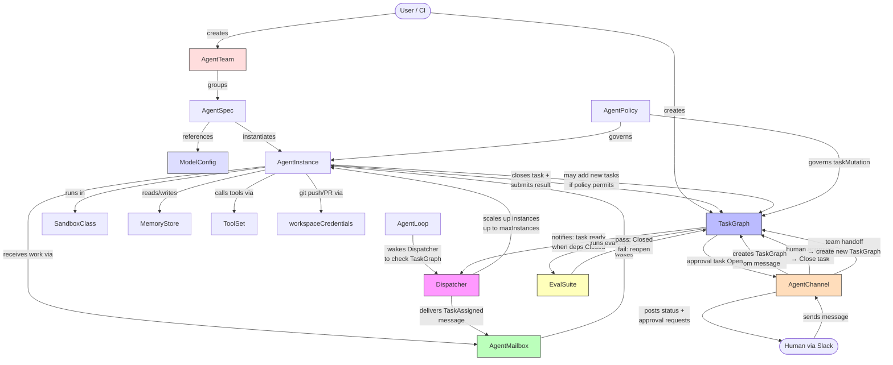

---

## CRD Reference

All CRDs are in API group `karo.dev/v1alpha1` and are namespace-scoped.

---

### 1. ModelConfig

**Purpose:** Declares a model provider, model name, credentials, and call parameters as a standalone reusable resource. Multiple `AgentSpec` resources reference one `ModelConfig`. Swapping model providers does not require touching agent definitions.

**Inspiration:** kagent `ModelConfig`, ARK `ModelConfig` — both independently arrived at this separation.

KARO supports four deployment patterns for model access:
- **Anthropic direct** — API key secret, works on any cluster
- **AWS Bedrock on EKS** — no static credentials; uses IRSA (IAM Roles for Service Accounts) via pod annotation
- **Google Vertex AI on GKE** — no static credentials; uses GKE Workload Identity via service account binding
- **OpenAI / Azure OpenAI / Ollama** — API key or endpoint-based

The `AgentSpec` and agent harness code are identical across all providers. Only the `ModelConfig` changes per environment.

#### Example 1: Anthropic Direct (any cluster)

```yaml
apiVersion: karo.dev/v1alpha1
kind: ModelConfig
metadata:
  name: claude-sonnet-direct
  namespace: team-alpha
spec:
  provider: anthropic
  name: claude-sonnet-4-20250514

  # Static API key stored in a Kubernetes Secret
  apiKeySecret:
    name: anthropic-credentials
    key: ANTHROPIC_API_KEY

  parameters:
    maxTokens: 8192
    temperature: 0.7
    topP: 1.0

  rateLimit:
    requestsPerMinute: 60
    tokensPerMinute: 100000
    tokensPerDay: 2000000
```

#### Example 2: AWS Bedrock on EKS (IRSA — no static credentials)

KARO injects the Bedrock endpoint and region as env vars. Authentication is handled entirely by IRSA — no API key secret needed. The controller annotates the AgentInstance pod's ServiceAccount with the IAM role ARN.

```yaml
apiVersion: karo.dev/v1alpha1
kind: ModelConfig
metadata:
  name: bedrock-claude-sonnet
  namespace: team-alpha
spec:
  provider: aws-bedrock
  # Bedrock model ID format: <provider>.<model-id>-v<version>
  name: anthropic.claude-sonnet-4-20250514-v1:0

  # No apiKeySecret needed — auth via IRSA
  # The controller annotates the AgentInstance pod ServiceAccount:
  #   eks.amazonaws.com/role-arn: <irsaRoleArn>
  bedrock:
    region: us-east-1
    # IAM role ARN with bedrock:InvokeModel permission
    # Must have trust policy allowing the pod's ServiceAccount
    irsaRoleArn: "arn:aws:iam::123456789012:role/karo-agent-bedrock-role"
    # Optional: cross-account role or VPC endpoint
    endpointOverride: ""           # leave empty for public Bedrock endpoint

  parameters:
    maxTokens: 8192
    temperature: 0.7

  rateLimit:
    requestsPerMinute: 50          # Bedrock has per-account TPM limits — tune accordingly
    tokensPerMinute: 80000
    tokensPerDay: 1500000

---
# Required IAM policy for the IRSA role (attach to irsaRoleArn):
# {
#   "Effect": "Allow",
#   "Action": [
#     "bedrock:InvokeModel",
#     "bedrock:InvokeModelWithResponseStream"
#   ],
#   "Resource": [
#     "arn:aws:bedrock:us-east-1::foundation-model/anthropic.claude-sonnet-4-*"
#   ]
# }
```

#### Example 3: Google Vertex AI on GKE (Workload Identity — no static credentials)

KARO binds the AgentInstance pod's Kubernetes ServiceAccount to a GCP Service Account via Workload Identity. No API key or service account JSON needed in the cluster.

```yaml
apiVersion: karo.dev/v1alpha1
kind: ModelConfig
metadata:
  name: vertex-claude-sonnet
  namespace: team-alpha
spec:
  provider: google-vertex
  # Vertex AI model ID format: <model>@<version>
  name: claude-sonnet-4@20250514

  # No apiKeySecret needed — auth via GKE Workload Identity
  vertex:
    project: my-gcp-project-id
    location: us-central1           # model must be available in this region
    # GCP Service Account with roles/aiplatform.user permission
    # The controller creates the Workload Identity binding:
    #   KSA team-alpha/karo-agent-sa → GSA karo-agent@my-gcp-project-id.iam.gserviceaccount.com
    gcpServiceAccount: "karo-agent@my-gcp-project-id.iam.gserviceaccount.com"
    # Optional: use a VPC-internal Vertex endpoint (Private Service Connect)
    endpointOverride: ""

  parameters:
    maxTokens: 8192
    temperature: 0.7

  rateLimit:
    requestsPerMinute: 60
    tokensPerMinute: 100000
    tokensPerDay: 2000000

---
# Required GCP IAM binding (run once per project):
# gcloud projects add-iam-policy-binding my-gcp-project-id \
#   --member="serviceAccount:karo-agent@my-gcp-project-id.iam.gserviceaccount.com" \
#   --role="roles/aiplatform.user"
#
# Workload Identity binding (run once per namespace):
# gcloud iam service-accounts add-iam-policy-binding \
#   karo-agent@my-gcp-project-id.iam.gserviceaccount.com \
#   --role roles/iam.workloadIdentityUser \
#   --member "serviceAccount:my-gcp-project-id.svc.id.goog[team-alpha/karo-agent-sa]"
```

#### Example 4: OpenAI

```yaml
apiVersion: karo.dev/v1alpha1
kind: ModelConfig
metadata:
  name: openai-gpt4o
  namespace: team-alpha
spec:
  provider: openai
  name: gpt-4o

  apiKeySecret:
    name: openai-credentials
    key: OPENAI_API_KEY

  parameters:
    maxTokens: 4096
    temperature: 0.7

  rateLimit:
    requestsPerMinute: 60
    tokensPerMinute: 100000
    tokensPerDay: 2000000
```

#### Example 5: Ollama (self-hosted, on-cluster)

```yaml
apiVersion: karo.dev/v1alpha1
kind: ModelConfig
metadata:
  name: ollama-llama3
  namespace: team-alpha
spec:
  provider: ollama
  name: llama3.1:70b

  # Ollama runs as a service in-cluster — no auth needed
  endpoint: "http://ollama.ollama-system.svc.cluster.local:11434"

  parameters:
    maxTokens: 4096
    temperature: 0.7

  rateLimit:
    requestsPerMinute: 10          # self-hosted — tune to your hardware capacity
```

**Go type fields:**
```go
type ModelConfigSpec struct {
    Provider     string                        `json:"provider"`
    Name         string                        `json:"name"`
    APIKeySecret *corev1.SecretKeySelector     `json:"apiKeySecret,omitempty"`
    Endpoint     string                        `json:"endpoint,omitempty"`
    Bedrock      *BedrockConfig                `json:"bedrock,omitempty"`
    Vertex       *VertexConfig                 `json:"vertex,omitempty"`
    Parameters   ModelParameters               `json:"parameters,omitempty"`
    RateLimit    ModelRateLimit                `json:"rateLimit,omitempty"`
}

type BedrockConfig struct {
    Region           string `json:"region"`
    IRSARoleArn      string `json:"irsaRoleArn"`
    EndpointOverride string `json:"endpointOverride,omitempty"`
}

type VertexConfig struct {
    Project            string `json:"project"`
    Location           string `json:"location"`
    GCPServiceAccount  string `json:"gcpServiceAccount"`
    EndpointOverride   string `json:"endpointOverride,omitempty"`
}

type ModelParameters struct {
    MaxTokens   int32   `json:"maxTokens,omitempty"`
    Temperature float64 `json:"temperature,omitempty"`
    TopP        float64 `json:"topP,omitempty"`
}

type ModelRateLimit struct {
    RequestsPerMinute int32 `json:"requestsPerMinute,omitempty"`
    TokensPerMinute   int64 `json:"tokensPerMinute,omitempty"`
    TokensPerDay      int64 `json:"tokensPerDay,omitempty"`
}
```

**Controller responsibilities:**
- For `anthropic` / `openai` / `azure`: validate API key secret exists and is non-empty
- For `aws-bedrock`: annotate AgentInstance pod ServiceAccount with `eks.amazonaws.com/role-arn: <irsaRoleArn>`; inject `AWS_REGION`, `AWS_BEDROCK_MODEL_ID` env vars; do not inject any static credentials
- For `google-vertex`: create/verify Workload Identity IAM binding between the KSA and GSA; annotate pod ServiceAccount with `iam.gke.io/gcp-service-account: <gcpServiceAccount>`; inject `VERTEX_PROJECT`, `VERTEX_LOCATION`, `VERTEX_MODEL_ID` env vars
- For `ollama`: inject `OLLAMA_HOST` and model name env vars; no credential handling
- Enforce rate limits via a token bucket per ModelConfig — emit events and block when exceeded
  - **Multi-replica note:** Rate limiting runs only on the leader replica (controller-runtime leader election ensures single-writer). Non-leader replicas do not enforce rate limits. For v1alpha1 this is sufficient — the leader processes all reconciliation. If future workloads require distributed rate limiting (e.g. the `agent-runtime-mcp` sidecar making direct model calls), a shared rate limiter (Redis-backed or CRD-based counter with atomic updates) would be needed. This is tracked as a v1beta1 concern.
- Update status `CredentialsValid` and `EndpointReachable` conditions

**status:**
```yaml
status:
  phase: Ready                     # Ready | Degraded | Unknown
  provider: aws-bedrock
  resolvedEndpoint: "https://bedrock-runtime.us-east-1.amazonaws.com"
  lastValidatedAt: "2026-03-27T10:00:00Z"
  conditions:
    - type: CredentialsValid
      status: "True"
      reason: IRSAAnnotationApplied
    - type: EndpointReachable
      status: "True"
```

---

### 2. AgentSpec

**Purpose:** Declares the identity, model binding, workspace credentials, and runtime bindings of an agent type. Analogous to a `Deployment` — it defines *what* an agent is, not a running instance.

**Analogy:** Gastown Role Bead + Agent Bead combined as a Kubernetes resource.

**Change from v0.1.0:** `model` block replaced with `modelConfigRef`. New `workspaceCredentials` block added for git access.

```yaml
apiVersion: karo.dev/v1alpha1
kind: AgentSpec
metadata:
  name: coder-agent
  namespace: team-alpha
spec:
  # Model — reference to a ModelConfig CRD
  modelConfigRef:
    name: claude-sonnet

  # System prompt — inline or ConfigMap reference
  systemPrompt:
    configMapRef:
      name: coder-agent-prompt
      key: prompt.txt

  # Capability labels — used by Dispatcher for routing
  # Each capability can optionally include a skill prompt and required tools
  capabilities:
    - name: impl
      # Optional: structured skill definition (if omitted, capability is a simple routing label)
      skillPrompt:
        configMapRef:
          name: impl-skill-prompt
          key: prompt.txt
      requiredTools:
        - github
        - code-executor
    - name: code-review
      skillPrompt:
        inline: |
          When reviewing code, focus on: correctness, security, performance,
          readability, and test coverage. Provide specific line-level feedback.
    - name: debugging

  # Agent configuration files — mounted into the agent pod
  # These follow the AAIF ecosystem conventions (AGENTS.md, CLAUDE.md, etc.)
  # The harness (Goose, Claude Code) picks them up natively.
  # KARO does not interpret these files — it only mounts them.
  agentConfigFiles:
    # SOUL.md — agent persona, communication style, values
    # Defines HOW the agent behaves: tone, level of detail, risk appetite, etc.
    - name: soul
      mountPath: /workspace/SOUL.md
      source:
        configMapRef:
          name: coder-agent-soul
          key: SOUL.md

    # AGENTS.md — project-specific guidance (AAIF/Linux Foundation standard)
    # Defines repo structure, coding standards, build commands, test patterns.
    # Typically lives in the git repo itself. If the agent clones a repo, the
    # harness reads AGENTS.md from the repo root automatically (Goose, Claude Code).
    # This mount is for injecting a default AGENTS.md when no repo is cloned.
    - name: agents
      mountPath: /workspace/AGENTS.md
      source:
        configMapRef:
          name: project-agents-md
          key: AGENTS.md

    # TOOLS.md — tool usage guidelines
    # Defines how the agent should use its available tools: when to use GitHub
    # vs local git, when to run tests, preferred search strategies, etc.
    - name: tools
      mountPath: /workspace/TOOLS.md
      source:
        configMapRef:
          name: coder-tools-guidance
          key: TOOLS.md

  # Bound resources
  memoryRef:
    name: team-shared-memory       # MemoryStore name
  toolSetRef:
    name: alpha-permitted-tools    # ToolSet name
  sandboxClassRef:
    name: alpha-restricted         # SandboxClass name

  # Git workspace credentials — injected as env vars into AgentInstance pod
  # Enables: git clone, git push, gh pr create, hub, gitea CLI etc.
  workspaceCredentials:
    git:
      - name: github-enterprise
        type: token                # token | ssh | app
        host: "ghe.company.com"   # github.com | gitlab.com | gitea.internal | ghe.company.com
        credentialSecret:
          name: coder-agent-git-token
          key: GITHUB_TOKEN
        scope: push                # read | push | admin
        # Injected into pod as:
        # KARO_GIT_HOST_0=ghe.company.com
        # KARO_GIT_TOKEN_0=<token>
        # KARO_GIT_SCOPE_0=push
        # Also configures ~/.gitconfig and gh auth inside the container

  # Runtime image (the agent process that runs inside the pod)
  # KARO is harness-agnostic — any agent framework that supports MCP tool calling works.
  # The reference harness is Goose (block/goose) — see "Reference Agent Harness" section.
  # Other compatible harnesses: Claude Code, OpenCode, custom LangGraph/CrewAI wrappers.
  # KARO ships the agent-runtime-mcp sidecar (auto-injected) which provides
  # the MCP tools for the agent to interact with the platform.
  runtime:
    image: ghcr.io/karo-dev/karo-goose-harness:latest  # Goose + KARO bootstrap config
    resources:
      requests:
        cpu: "500m"
        memory: "1Gi"
      limits:
        cpu: "2"
        memory: "4Gi"

  # Lifecycle
  maxContextTokens: 200000
  onContextExhaustion: restart     # restart | checkpoint | terminate
  # Context token tracking: the operator cannot introspect the LLM's context window
  # from outside the agent process. The agent reports token usage via the
  # karo_report_status MCP tool (contextTokensUsed field). The agent-runtime-mcp
  # sidecar writes this to AgentInstance.status.contextTokensUsed.
  # The AgentInstance controller periodically checks: if contextTokensUsed >=
  # maxContextTokens, it triggers onContextExhaustion behaviour:
  #   restart:    checkpoint to MemoryStore, delete pod, recreate with fresh context
  #   checkpoint: checkpoint to MemoryStore, continue running (agent must manage window)
  #   terminate:  set phase Terminated, emit event
  # Agent frameworks that track token usage natively (e.g. Claude Code) should call
  # karo_report_status periodically (recommended: every 10 tool calls or 30 seconds).

  # Whether this agent can receive dispatched tasks
  dispatchable: true

  # Scaling — controls how many parallel AgentInstances can run for this spec
  # KARO treats agents as a worker pool: the Dispatcher creates instances as needed
  # to process tasks in parallel, up to maxInstances. Each instance processes one task.
  scaling:
    minInstances: 0                  # 0 = scale to zero when no work (hibernate-by-default)
    maxInstances: 5                  # max parallel workers for this agent type
    # startPolicy controls when pods are created:
    #   OnDemand:  no pod until a task is dispatched to this agent (default, scale-to-zero)
    #              the Dispatcher creates an AgentInstance when work arrives
    #              the AgentInstance controller creates the Pod only when a mailbox message exists
    #   Immediate: create minInstances pods on AgentSpec creation (always-on)
    startPolicy: OnDemand            # OnDemand | Immediate
    # cooldownSeconds: time to wait after task completion before terminating idle instances
    # Only applies when minInstances: 0 — prevents thrashing on bursty workloads
    cooldownSeconds: 300             # 5 minutes

status:
  phase: Ready                     # Ready | Degraded | Unknown
  activeInstances: 2
  desiredInstances: 5
  idleInstances: 0
  hibernatedInstances: 3
  lastUpdated: "2026-03-27T10:00:00Z"
  conditions:
    - type: Ready
      status: "True"
      reason: AgentSpecValidated
    - type: ModelConfigReady
      status: "True"
    - type: GitCredentialsValid
      status: "True"
```

**Go type fields:**
```go
// Note: The type name AgentSpecSpec is intentionally awkward — it is the Spec of the AgentSpec CRD.
// Renaming the CRD to "Agent" would give a cleaner AgentSpec type name but would conflict with
// the common English noun and the naming convention used by ARK/kagent. The awkwardness is accepted
// as a tradeoff for CRD naming clarity. The kubebuilder marker `+kubebuilder:object:root=true`
// on the AgentSpec CRD type resolves any ambiguity in generated code.
type AgentSpecSpec struct {
    ModelConfigRef       corev1.LocalObjectReference  `json:"modelConfigRef"`
    SystemPrompt         SystemPromptConfig            `json:"systemPrompt"`
    Capabilities         []AgentCapability             `json:"capabilities"`
    AgentConfigFiles     []AgentConfigFile             `json:"agentConfigFiles,omitempty"`
    MemoryRef            *corev1.LocalObjectReference  `json:"memoryRef,omitempty"`
    ToolSetRef           *corev1.LocalObjectReference  `json:"toolSetRef,omitempty"`
    SandboxClassRef      *corev1.LocalObjectReference  `json:"sandboxClassRef,omitempty"`
    WorkspaceCredentials *WorkspaceCredentialsConfig   `json:"workspaceCredentials,omitempty"`
    Runtime              RuntimeConfig                 `json:"runtime"`
    MaxContextTokens     int64                         `json:"maxContextTokens,omitempty"`
    OnContextExhaustion  string                        `json:"onContextExhaustion,omitempty"`
    Dispatchable         bool                          `json:"dispatchable"`
    Scaling              AgentScaling                  `json:"scaling,omitempty"`
}

// AgentScaling controls how many parallel AgentInstances exist for this spec.
// The Dispatcher creates instances as needed to process tasks in parallel.
// Each instance processes one task at a time.
type AgentScaling struct {
    MinInstances     int32       `json:"minInstances"`               // 0 = scale to zero
    MaxInstances     int32       `json:"maxInstances"`               // max parallel workers
    StartPolicy      StartPolicy `json:"startPolicy,omitempty"`      // OnDemand | Immediate
    CooldownSeconds  int32       `json:"cooldownSeconds,omitempty"`  // delay before terminating idle instances
}

type StartPolicy string
const (
    // StartPolicyOnDemand: no pod until a task is dispatched. Scale-to-zero default.
    // The Dispatcher creates an AgentInstance when work arrives.
    // The AgentInstance controller creates the Pod only when a mailbox message exists.
    StartPolicyOnDemand  StartPolicy = "OnDemand"
    // StartPolicyImmediate: create minInstances pods on AgentSpec creation. Always-on.
    StartPolicyImmediate StartPolicy = "Immediate"
)

// AgentCapability defines a capability the agent can perform.
// At minimum, it is a routing label used by the Dispatcher.
// Optionally, it includes a skill prompt (instructions for HOW to perform the capability)
// and a list of tools required to exercise it.
type AgentCapability struct {
    Name          string              `json:"name"`                    // routing label: impl, code-review, design, eval, etc.
    SkillPrompt   *SystemPromptConfig `json:"skillPrompt,omitempty"`   // optional instructions for this skill
    RequiredTools []string            `json:"requiredTools,omitempty"` // tool names from ToolSet required for this skill
}

// AgentConfigFile defines a file to mount into the agent pod.
// These follow AAIF ecosystem conventions (AGENTS.md, SOUL.md, TOOLS.md, CLAUDE.md).
// KARO does not interpret these files — it only mounts them into the pod.
// The harness (Goose, Claude Code, etc.) reads and applies them natively.
type AgentConfigFile struct {
    Name      string          `json:"name"`                // logical name (e.g. "soul", "agents", "tools")
    MountPath string          `json:"mountPath"`           // path inside the pod (e.g. "/workspace/SOUL.md")
    Source    ConfigFileSource `json:"source"`
}

type ConfigFileSource struct {
    ConfigMapRef *ConfigMapKeyRef `json:"configMapRef,omitempty"`
    // Future: secretRef, gitRef (fetch from repo at startup)
}

type WorkspaceCredentialsConfig struct {
    Git []GitCredential `json:"git,omitempty"`
}

type GitCredential struct {
    Name             string                     `json:"name"`
    Type             string                     `json:"type"` // token | ssh | app
    Host             string                     `json:"host"`
    CredentialSecret corev1.SecretKeySelector   `json:"credentialSecret"`
    Scope            string                     `json:"scope"` // read | push | admin
}

type SystemPromptConfig struct {
    // Inline prompt text (mutually exclusive with configMapRef)
    Inline       string                       `json:"inline,omitempty"`
    // Reference to a ConfigMap key containing the prompt
    ConfigMapRef *ConfigMapKeyRef             `json:"configMapRef,omitempty"`
}

type ConfigMapKeyRef struct {
    Name string `json:"name"`
    Key  string `json:"key"`
}

type RuntimeConfig struct {
    Image     string                        `json:"image"`
    Resources corev1.ResourceRequirements   `json:"resources,omitempty"`
}
```

**Controller responsibilities:**
- Resolve `modelConfigRef` — set `ModelConfigReady` condition
- Resolve `memoryRef`, `toolSetRef`, `sandboxClassRef` — set conditions for each
- Validate git credential secrets exist and are non-empty — set `GitCredentialsValid` condition
- When `AgentInstance` is created from this spec, inject git credentials as env vars and configure `~/.gitconfig` + `~/.config/gh/hosts.yml` via init container

---

### 3. AgentInstance

**Purpose:** A running instantiation of an `AgentSpec`. Analogous to a `Pod` from a `Deployment`. Manages the full lifecycle: `Pending → Running → Idle → Hibernated → Terminated`. Wraps a Kubernetes `Pod`.

**Change from v0.1.0:** `currentBeadRef` renamed to `currentTaskRef`.

```yaml
apiVersion: karo.dev/v1alpha1
kind: AgentInstance
metadata:
  name: coder-agent-abc123
  namespace: team-alpha
spec:
  agentSpecRef:
    name: coder-agent

  # Current task this instance is working on
  currentTaskRef:
    taskGraph: feature-auth
    taskId: impl-endpoints

  # Hibernation policy
  hibernation:
    idleAfter: 10m                 # hibernate after 10min idle
    resumeOnMail: true             # wake when mailbox receives message

status:
  phase: Running                   # Pending | Running | Idle | Hibernated | Terminated
  podRef:
    name: coder-agent-abc123-pod
  startedAt: "2026-03-27T09:00:00Z"
  lastActiveAt: "2026-03-27T10:05:00Z"
  contextTokensUsed: 45230
  conditions:
    - type: Ready
      status: "True"
    - type: Hibernated
      status: "False"
```

**Go type definitions:**
```go
type AgentInstanceSpec struct {
    AgentSpecRef corev1.LocalObjectReference `json:"agentSpecRef"`
    CurrentTaskRef *TaskRef                  `json:"currentTaskRef,omitempty"`
    Hibernation    HibernationConfig         `json:"hibernation,omitempty"`
}

type TaskRef struct {
    TaskGraph string `json:"taskGraph"`
    TaskID    string `json:"taskId"`
}

type HibernationConfig struct {
    IdleAfter    metav1.Duration `json:"idleAfter,omitempty"`    // e.g. "10m"
    ResumeOnMail bool            `json:"resumeOnMail,omitempty"` // wake when mailbox receives message
}

type AgentInstanceStatus struct {
    Phase             AgentInstancePhase     `json:"phase"`
    PodRef            *corev1.ObjectReference `json:"podRef,omitempty"`
    StartedAt         *metav1.Time           `json:"startedAt,omitempty"`
    LastActiveAt      *metav1.Time           `json:"lastActiveAt,omitempty"`
    ContextTokensUsed int64                  `json:"contextTokensUsed"`
    Conditions        []metav1.Condition     `json:"conditions,omitempty"`
}

type AgentInstancePhase string
const (
    AgentInstancePhasePending    AgentInstancePhase = "Pending"
    AgentInstancePhaseRunning    AgentInstancePhase = "Running"
    AgentInstancePhaseIdle       AgentInstancePhase = "Idle"
    AgentInstancePhaseHibernated AgentInstancePhase = "Hibernated"
    AgentInstancePhaseTerminated AgentInstancePhase = "Terminated"
)
```

**Controller responsibilities:**
- **Resolve effective bindings** — call `resolveEffectiveBindings()` to merge AgentSpec (explicit) with AgentTeam sharedResources (fallback). AgentSpec values take precedence. See AgentTeam section for resolution logic.
- Create/delete the backing Pod using spec from `AgentSpec` + `SandboxClass`
- Inject `agent-runtime-mcp` sidecar container (see Agent Runtime Contract)
- Inject env vars: model credentials (from resolved `ModelConfig`), memory credentials (from resolved `MemoryStore`), MCP endpoints (from resolved `ToolSet`), git credentials (from `AgentSpec.workspaceCredentials`)
- **Mount agent config files:** For each entry in `AgentSpec.agentConfigFiles`, create a volume from the ConfigMap source and mount it at the specified `mountPath`. These files (SOUL.md, AGENTS.md, TOOLS.md, etc.) are read by the harness natively — the controller does not interpret their contents.
- Run init container to configure `~/.gitconfig` and `gh` auth from injected git credentials
- Monitor context token usage (reported via `karo_report_status` MCP tool) — trigger `onContextExhaustion` behaviour
- **Hibernation:** AgentInstance wraps a raw Pod, not a Deployment. Hibernation means deleting the Pod and preserving state. On hibernate: (1) checkpoint working state to MemoryStore via `karo_report_status` with `checkpoint-requested`, (2) wait for agent acknowledgement or timeout, (3) delete the Pod, (4) set phase to `Hibernated`. On wake (triggered by mailbox message if `resumeOnMail: true`): (1) recreate the Pod with the same spec, (2) inject a `LoopTick` or `TaskAssigned` message with prior context from MemoryStore, (3) set phase to `Running`. The agent process is ephemeral — identity and state survive via `AgentSpec`, `MemoryStore`, and `TaskGraph`.
- Watch `AgentMailbox` for incoming messages → wake from hibernation
- Report status conditions including binding sources (e.g. `MemoryStoreSource: AgentTeam/alpha-team`)

---

### 4. AgentTeam

**Purpose:** Groups multiple `AgentSpec` resources into a named team with shared memory, tools, and dispatcher. The primary user-facing abstraction — most users create a Team rather than wiring individual AgentSpecs manually. Inspired by ARK `Team` and kagent team pattern.

```yaml
apiVersion: karo.dev/v1alpha1
kind: AgentTeam
metadata:
  name: alpha-team
  namespace: team-alpha
spec:
  description: "Full-stack feature development team"

  # Team members with roles
  agents:
    - agentSpecRef:
        name: planner-agent
      role: orchestrator           # orchestrator | executor | evaluator | reviewer
    - agentSpecRef:
        name: coder-agent
      role: executor
    - agentSpecRef:
        name: reviewer-agent
      role: evaluator

  # Shared resources — applied to all agents in team unless overridden on AgentSpec
  sharedResources:
    memoryRef:
      name: team-shared-memory
    toolSetRef:
      name: alpha-permitted-tools
    sandboxClassRef:
      name: alpha-restricted
    modelConfigRef:
      name: claude-sonnet

  # Dispatcher for this team
  dispatcherRef:
    name: alpha-router

  # Policy applied to all team members
  policyRef:
    name: alpha-policy

  # Loop for team-level heartbeat
  loopRef:
    name: daily-review

status:
  phase: Ready                     # Ready | Degraded | Partial
  readyAgents: 3
  totalAgents: 3
  activeInstances: 2
  conditions:
    - type: AllAgentsReady
      status: "True"
    - type: DispatcherReady
      status: "True"
```

**Go type fields:**
```go
type AgentTeamSpec struct {
    Description     string               `json:"description,omitempty"`
    Agents          []AgentTeamMember    `json:"agents"`
    SharedResources TeamSharedResources  `json:"sharedResources,omitempty"`
    DispatcherRef   corev1.LocalObjectReference `json:"dispatcherRef"`
    PolicyRef       *corev1.LocalObjectReference `json:"policyRef,omitempty"`
    LoopRef         *corev1.LocalObjectReference `json:"loopRef,omitempty"`
}

type AgentTeamMember struct {
    AgentSpecRef corev1.LocalObjectReference `json:"agentSpecRef"`
    Role         string                      `json:"role"`
}

type TeamSharedResources struct {
    MemoryRef       *corev1.LocalObjectReference `json:"memoryRef,omitempty"`
    ToolSetRef      *corev1.LocalObjectReference `json:"toolSetRef,omitempty"`
    SandboxClassRef *corev1.LocalObjectReference `json:"sandboxClassRef,omitempty"`
    ModelConfigRef  *corev1.LocalObjectReference `json:"modelConfigRef,omitempty"`
}
```

**Shared resource propagation semantics (v0.4.0):**

The AgentTeam controller does **NOT** mutate AgentSpec objects. Shared resources are resolved at **AgentInstance creation time** by the AgentInstance controller, not by the AgentTeam controller. This preserves GitOps compatibility (the AgentSpec in git matches the AgentSpec in the cluster) and avoids ownership conflicts when an agent belongs to multiple teams or is removed from a team.

Resolution order (AgentSpec takes precedence over AgentTeam):

```
for each binding (memoryRef, toolSetRef, sandboxClassRef, modelConfigRef):
    1. If AgentSpec has an explicit value → use it
    2. Else if agent is a member of an AgentTeam with sharedResources → use team value
    3. Else → field is unset (AgentInstance controller reports a condition warning)
```

The AgentInstance controller discovers team membership by listing `AgentTeam` resources in the namespace and checking if the `AgentSpec` is in the team's `agents[]` list. If the agent is in multiple teams (unusual but valid), the first matching team is used and a warning event is emitted.

```go
// resolveEffectiveBindings builds the effective config for an AgentInstance
// by merging AgentSpec (explicit) with AgentTeam (shared, fallback).
func (r *AgentInstanceReconciler) resolveEffectiveBindings(
    ctx context.Context,
    agentSpec *karov1alpha1.AgentSpec) (*EffectiveBindings, error) {

    bindings := &EffectiveBindings{}

    // 1. Start with AgentSpec explicit values
    bindings.ModelConfigRef = agentSpec.Spec.ModelConfigRef
    bindings.MemoryRef = agentSpec.Spec.MemoryRef
    bindings.ToolSetRef = agentSpec.Spec.ToolSetRef
    bindings.SandboxClassRef = agentSpec.Spec.SandboxClassRef

    // 2. Find AgentTeam membership (if any)
    team, err := r.findTeamForAgent(ctx, agentSpec)
    if err != nil {
        return nil, err
    }

    // 3. Fill in gaps from team sharedResources
    if team != nil && team.Spec.SharedResources != (karov1alpha1.TeamSharedResources{}) {
        shared := team.Spec.SharedResources
        if bindings.MemoryRef == nil && shared.MemoryRef != nil {
            bindings.MemoryRef = shared.MemoryRef
            bindings.MemorySource = "AgentTeam/" + team.Name
        }
        if bindings.ToolSetRef == nil && shared.ToolSetRef != nil {
            bindings.ToolSetRef = shared.ToolSetRef
            bindings.ToolSetSource = "AgentTeam/" + team.Name
        }
        if bindings.SandboxClassRef == nil && shared.SandboxClassRef != nil {
            bindings.SandboxClassRef = shared.SandboxClassRef
            bindings.SandboxSource = "AgentTeam/" + team.Name
        }
        if shared.ModelConfigRef != nil {
            // ModelConfigRef on AgentSpec is required, but team can override
            // Only override if explicitly set on team AND agent spec allows it
            // For v1alpha1: team modelConfigRef is a default, not an override
        }
    }

    return bindings, nil
}

type EffectiveBindings struct {
    ModelConfigRef  corev1.LocalObjectReference
    MemoryRef       *corev1.LocalObjectReference
    ToolSetRef      *corev1.LocalObjectReference
    SandboxClassRef *corev1.LocalObjectReference
    // Source tracking — for status conditions and debugging
    MemorySource    string  // "AgentSpec" or "AgentTeam/<name>"
    ToolSetSource   string
    SandboxSource   string
}
```

**Controller responsibilities:**
- Validate all `agentSpecRef` entries exist and are `Ready`
- Validate all `sharedResources` references exist (MemoryStore, ToolSet, SandboxClass, ModelConfig)
- **Do NOT mutate AgentSpec objects** — shared resource resolution is the AgentInstance controller's job
- Create an `AgentMailbox` for each member that doesn't already have one
- Aggregate team health into `status.phase` — `Ready` only when all agents are Ready
- Watch for new agents added to the team and validate their readiness

---

### 5. MemoryStore

**Purpose:** First-class persistent memory for agents. Declares the backend (mem0 by default), scope, retention, and access binding. Memory is not a shared mutable blob — it has explicit governance.

**Analogy:** Gastown Beads data plane for context/memory, but Kubernetes-native and scoped.

```yaml
apiVersion: karo.dev/v1alpha1
kind: MemoryStore
metadata:
  name: team-shared-memory
  namespace: team-alpha
spec:
  backend:
    type: mem0                     # mem0 | redis | pgvector | custom
    mem0:
      apiKeySecret:
        name: mem0-credentials
        key: MEM0_API_KEY
      organizationId: "org-abc123"
      projectId: "proj-xyz456"

  # Scope determines which agents can access this store
  scope: team                      # agent-local | team | org

  # Which agents are bound to this store
  boundAgents:
    - name: coder-agent
    - name: planner-agent
    - name: reviewer-agent

  # Retention
  retentionDays: 90
  maxMemories: 10000

  # Memory categories to track
  categories:
    - decisions
    - code-patterns
    - architecture
    - errors

status:
  phase: Ready
  memoryCount: 1247
  backendEndpoint: "https://api.mem0.ai"
  lastSyncedAt: "2026-03-27T10:00:00Z"
  conditions:
    - type: BackendReachable
      status: "True"
```

**Go type definitions:**
```go
type MemoryStoreSpec struct {
    Backend        MemoryBackend               `json:"backend"`
    Scope          MemoryScope                 `json:"scope"`           // agent-local | team | org
    BoundAgents    []corev1.LocalObjectReference `json:"boundAgents,omitempty"`
    RetentionDays  int32                       `json:"retentionDays,omitempty"`
    MaxMemories    int64                       `json:"maxMemories,omitempty"`
    Categories     []string                    `json:"categories,omitempty"`
}

type MemoryBackend struct {
    Type string       `json:"type"` // mem0 | redis | pgvector | custom
    Mem0 *Mem0Config  `json:"mem0,omitempty"`
}

type Mem0Config struct {
    APIKeySecret   corev1.SecretKeySelector `json:"apiKeySecret"`
    OrganizationID string                   `json:"organizationId"`
    ProjectID      string                   `json:"projectId"`
}

type MemoryScope string
const (
    MemoryScopeAgentLocal MemoryScope = "agent-local"
    MemoryScopeTeam       MemoryScope = "team"
    MemoryScopeOrg        MemoryScope = "org"
)
```

**Controller responsibilities:**
- Inject memory access credentials into bound AgentInstance pods as env vars
- Enforce scope — reject cross-namespace memory access
- Report memory count and backend health in status

---

### 6. ToolSet

**Purpose:** A named, governed collection of MCP server tools. Agents can only call tools in their bound `ToolSet`. Tools are MCP servers — KARO does not implement tool execution, it governs access.

```yaml
apiVersion: karo.dev/v1alpha1
kind: ToolSet
metadata:
  name: alpha-permitted-tools
  namespace: team-alpha
spec:
  tools:
    - name: github
      type: mcp
      transport: streamable-http     # stdio | sse | streamable-http
      endpoint: "http://github-mcp-server:8080"
      permissions:
        - read
        - write
      credentialSecret:
        name: github-mcp-credentials
        key: GITHUB_TOKEN

    - name: web-search
      type: mcp
      transport: sse
      endpoint: "http://web-search-mcp:8080"
      permissions:
        - search

    - name: code-executor
      type: mcp
      transport: stdio               # stdio — runs as subprocess, no endpoint needed
      command: ["/usr/local/bin/code-exec-mcp"]  # binary path inside agent pod
      permissions:
        - execute
      sandboxRequired: true        # requires SandboxClass enforcement

  # Policy reference for additional governance
  policyRef:
    name: alpha-policy

status:
  phase: Ready
  availableTools: 3
  conditions:
    - type: AllToolsReachable
      status: "True"
```

**Go type definitions:**
```go
type ToolSetSpec struct {
    Tools     []ToolEntry                   `json:"tools"`
    PolicyRef *corev1.LocalObjectReference  `json:"policyRef,omitempty"`
}

type ToolEntry struct {
    Name             string                    `json:"name"`
    Type             string                    `json:"type"`                       // mcp
    Transport        MCPTransport              `json:"transport"`                  // stdio | sse | streamable-http
    Endpoint         string                    `json:"endpoint,omitempty"`         // for sse / streamable-http
    Command          []string                  `json:"command,omitempty"`          // for stdio — binary + args
    Permissions      []string                  `json:"permissions,omitempty"`
    CredentialSecret *corev1.SecretKeySelector `json:"credentialSecret,omitempty"`
    SandboxRequired  bool                      `json:"sandboxRequired,omitempty"`
    Builtin          bool                      `json:"builtin,omitempty"`          // true for agent-runtime-mcp
}

type MCPTransport string
const (
    MCPTransportStdio          MCPTransport = "stdio"
    MCPTransportSSE            MCPTransport = "sse"
    MCPTransportStreamableHTTP MCPTransport = "streamable-http"
)
```

**Controller responsibilities:**
- Inject MCP server configuration into bound AgentInstance pods
- Enforce `sandboxRequired` — reject tool calls from non-sandboxed instances
- Report tool availability in status

---

### 7. SandboxClass

**Purpose:** Declares the isolation policy for agent tool execution environments. Pluggable via Kubernetes `runtimeClassName` — KARO does not implement isolation, it governs which runtime class is applied to agent pods.

```yaml
apiVersion: karo.dev/v1alpha1
kind: SandboxClass
metadata:
  name: alpha-restricted
  namespace: team-alpha
spec:
  # Delegates to Kubernetes runtimeClassName
  runtimeClassName: gvisor         # gvisor | kata-containers | runc | kata-qemu

  # Network egress policy
  networkPolicy:
    egress: restricted             # restricted | open | none
    allowedDomains:
      - "api.github.com"
      - "ghe.company.com"
      - "pypi.org"
      - "registry.npmjs.org"
    allowedCIDRs: []
    # Implementation note: Kubernetes NetworkPolicy only supports CIDR-based egress rules,
    # not DNS domains. allowedDomains is enforced via one of these strategies (auto-detected):
    #   1. If Istio is present: generate ServiceEntry + Sidecar resources for domain-based egress
    #   2. If Cilium is present: generate CiliumNetworkPolicy with FQDN rules
    #   3. Fallback: controller resolves domains to IPs periodically and generates
    #      standard NetworkPolicy with CIDR rules (IPs may go stale — emit warning)
    # allowedCIDRs are always applied directly as standard Kubernetes NetworkPolicy rules.

  # Filesystem restrictions
  filesystem:
    readOnlyRootFilesystem: true
    allowedMounts:
      - /tmp
      - /workspace

  # Resource limits applied to sandboxed pods
  resourceLimits:
    cpu: "2"
    memory: "4Gi"
    ephemeralStorage: "10Gi"

  # Security context
  securityContext:
    runAsNonRoot: true
    runAsUser: 1000
    allowPrivilegeEscalation: false
    seccompProfile:
      type: RuntimeDefault
    capabilities:
      drop:
        - ALL

status:
  phase: Ready
  runtimeClassAvailable: true
  conditions:
    - type: RuntimeClassAvailable
      status: "True"
```

**Go type definitions:**
```go
type SandboxClassSpec struct {
    RuntimeClassName string                `json:"runtimeClassName"`
    NetworkPolicy    SandboxNetworkPolicy  `json:"networkPolicy,omitempty"`
    Filesystem       FilesystemConfig      `json:"filesystem,omitempty"`
    ResourceLimits   corev1.ResourceList   `json:"resourceLimits,omitempty"`
    SecurityContext  SecurityContextConfig `json:"securityContext,omitempty"`
}

type SandboxNetworkPolicy struct {
    Egress         string   `json:"egress"`                   // restricted | open | none
    AllowedDomains []string `json:"allowedDomains,omitempty"`
    AllowedCIDRs   []string `json:"allowedCIDRs,omitempty"`
}

type FilesystemConfig struct {
    ReadOnlyRootFilesystem bool     `json:"readOnlyRootFilesystem,omitempty"`
    AllowedMounts          []string `json:"allowedMounts,omitempty"`
}

type SecurityContextConfig struct {
    RunAsNonRoot             bool                           `json:"runAsNonRoot,omitempty"`
    RunAsUser                *int64                         `json:"runAsUser,omitempty"`
    AllowPrivilegeEscalation bool                           `json:"allowPrivilegeEscalation,omitempty"`
    SeccompProfile           *corev1.SeccompProfile         `json:"seccompProfile,omitempty"`
    Capabilities             *corev1.Capabilities           `json:"capabilities,omitempty"`
}
```

**Controller responsibilities:**
- Apply security context and resource limits to all AgentInstance pods bound to this class
- Generate network egress rules from `allowedDomains` and `allowedCIDRs`:
  - Detect cluster CNI/mesh: check for Istio, Cilium, or fall back to standard NetworkPolicy
  - Istio: create `ServiceEntry` + `Sidecar` egress rules per domain
  - Cilium: create `CiliumNetworkPolicy` with `toFQDNs` rules
  - Fallback: resolve domains to IPs, generate standard `NetworkPolicy` with CIDR rules, re-resolve periodically (emit `DomainResolutionStale` warning if IPs change)
- `allowedCIDRs` are always applied as standard Kubernetes `NetworkPolicy` egress rules regardless of CNI
- Report runtime class availability in status

---

### 8. AgentLoop

**Purpose:** The heartbeat/proactive scheduling primitive. Wakes the `Dispatcher` on a schedule to check the `TaskGraph` for ready tasks, and/or delivers a `LoopTick` message to a specific agent. This is the Kubernetes-native GUPP equivalent — agents are not purely reactive.

**Clarification from v0.1.0:** The loop does not directly trigger agents. It wakes the Dispatcher, which then checks the TaskGraph for ready tasks and routes accordingly.

```yaml
apiVersion: karo.dev/v1alpha1
kind: AgentLoop
metadata:
  name: daily-review
  namespace: team-alpha
spec:
  agentSpecRef:
    name: planner-agent

  # Scheduling — cron and/or event driven
  triggers:
    - type: cron
      schedule: "0 9 * * 1-5"     # 9am weekdays
    - type: event
      source:
        kind: TaskGraph
        name: "*"                  # any TaskGraph in namespace
        event: TaskFailed          # trigger on task failure

  # On each trigger:
  # 1. Wake the Dispatcher to check for ready tasks in TaskGraph
  # 2. Deliver a LoopTick message to the bound agent's mailbox with prior context
  contextCarryover: true           # inject prior loop state into next invocation
  # When contextCarryover is true, the AgentLoop controller:
  #   1. Queries MemoryStore for memories with category "loop-summary" and
  #      createdBy matching the bound agent, ordered by most recent
  #   2. Injects the most recent loop summary into the LoopTick message payload
  #      as a "priorContext" field
  # The agent is expected to write a loop summary to MemoryStore (category:
  # "loop-summary") at the end of each loop run via karo_store_memory.
  # When contextCarryover is false, each loop invocation starts with no prior context.

  # Inject a prompt at each invocation
  loopPrompt:
    configMapRef:
      name: daily-review-prompt
      key: prompt.txt

  # Concurrency control
  maxConcurrent: 1
  concurrencyPolicy: Forbid        # Forbid | Replace | Allow

  # Dispatcher to wake on each tick
  dispatcherRef:
    name: alpha-router

  # EvalSuite gate — skip loop if last eval failed
  evalGate:
    evalSuiteRef:
      name: alpha-evals
    minPassRate: 0.80

status:
  phase: Active                    # Active | Suspended | Disabled | GateBlocked
  lastRunAt: "2026-03-27T09:00:00Z"
  nextRunAt: "2026-03-28T09:00:00Z"
  lastRunResult: Success           # Success | Failed | Skipped | GateBlocked
  consecutiveFailures: 0
  conditions:
    - type: ScheduleValid
      status: "True"
    - type: EvalGatePassing
      status: "True"
```

**Go type definitions:**
```go
type AgentLoopSpec struct {
    AgentSpecRef    corev1.LocalObjectReference  `json:"agentSpecRef"`
    Triggers        []LoopTrigger                `json:"triggers"`
    ContextCarryover bool                        `json:"contextCarryover,omitempty"`
    LoopPrompt      *SystemPromptConfig          `json:"loopPrompt,omitempty"`
    MaxConcurrent   int32                        `json:"maxConcurrent,omitempty"`   // default: 1
    ConcurrencyPolicy string                     `json:"concurrencyPolicy,omitempty"` // Forbid | Replace | Allow
    DispatcherRef   corev1.LocalObjectReference   `json:"dispatcherRef"`
    EvalGate        *LoopEvalGate                `json:"evalGate,omitempty"`
}

type LoopTrigger struct {
    Type     string           `json:"type"`     // cron | event
    Schedule string           `json:"schedule,omitempty"` // cron expression
    Source   *EventSource     `json:"source,omitempty"`   // for event triggers
}

type EventSource struct {
    Kind  string `json:"kind"`
    Name  string `json:"name"`  // "*" for any in namespace
    Event string `json:"event"` // e.g. TaskFailed, TaskGraphCompleted
}

type LoopEvalGate struct {
    EvalSuiteRef corev1.LocalObjectReference `json:"evalSuiteRef"`
    MinPassRate  float64                     `json:"minPassRate"`
}
```

**Controller responsibilities:**
- Parse and validate cron expressions
- Create/manage a backing Kubernetes `CronJob` for cron triggers
- Watch declared event sources for event-driven triggers
- On trigger: (1) notify Dispatcher to check TaskGraph, (2) deliver LoopTick to agent mailbox
- Check EvalSuite gate before running — set `GateBlocked` if failing
- Enforce concurrency policy
- Update status after each run

---

### 9. TaskGraph

**Purpose:** A DAG-aware task tracking plane. Declares a set of tasks with explicit dependency edges, optional eval gates on task closure, and mutation permissions for agents to add tasks at runtime. This is the living plan — it is mutable. The controller dispatches only tasks whose dependencies are all `Closed`.

**Design decision (v0.4.0): spec/status split for task runtime state.**

Task definitions (id, title, type, deps, acceptance criteria, eval gate) live in `spec.tasks[]` — this is the declarative desired state. All mutable runtime state (status, assignment, failure notes, eval results, retry count) lives in `status.taskStatuses` — a map keyed by task ID. This follows Kubernetes convention (`spec` = desired state, `status` = observed state) and enables:

- **Clean RBAC separation:** Agents PATCH `spec` to add tasks; the operator updates `status` via the `/status` subresource. No risk of spec updates clobbering runtime state or vice versa.
- **Reduced reconciliation noise:** Status subresource updates do not trigger spec watches, avoiding unnecessary reconciliation loops.
- **Webhook clarity:** Validating webhooks on spec only fire for structural changes (new tasks, dep changes), not for every status transition.
- **Concurrent safety:** Spec and status have independent `resourceVersion` tracks, so an agent adding a task cannot conflict with the controller transitioning a different task's status.

The controller builds an internal `resolvedTask` view by joining `spec.tasks[]` with `status.taskStatuses[]` during reconciliation.

**Changes from v0.1.0:**
- `beads` renamed to `tasks` throughout
- Each task has an `evalGate` block — eval runs before accepting task closure
- Tasks have `addedBy` and `addedAt` for mutation audit trail
- `dispatchPolicy` has `allowAgentMutation` flag (governed by `AgentPolicy`)

**Changes from v0.3.0:**
- Task runtime state split from `spec.tasks[]` to `status.taskStatuses` map
- Added `EvalPending` to task status enum
- Added `resultArtifactRef` field for eval gate input
- Added `assignedTo` / `assignedAt` for dispatch tracking
- Added `timeoutMinutes` for task-level timeouts

```yaml
apiVersion: karo.dev/v1alpha1
kind: TaskGraph
metadata:
  name: feature-auth
  namespace: team-alpha
  labels:
    team: alpha
spec:
  description: "Implement OAuth2 authentication flow"

  # The agent responsible for managing this graph (planner role)
  ownerAgentRef:
    name: planner-agent

  # Dispatcher to use when tasks become ready
  dispatcherRef:
    name: alpha-router

  # The tasks — form the DAG
  # spec.tasks[] contains ONLY declarative task definitions
  # All runtime state (status, assignment, results) is in status.taskStatuses
  tasks:
    - id: design
      title: "Design OAuth2 API contract"
      type: design                 # design | impl | eval | review | infra
      description: "Define OpenAPI spec for auth endpoints"
      deps: []                     # no dependencies — immediately dispatchable
      priority: High
      addedBy: planner-agent       # audit: who created this task
      addedAt: "2026-03-27T09:00:00Z"
      timeoutMinutes: 120          # task fails if InProgress longer than this
      acceptanceCriteria:
        - "OpenAPI spec committed to repo"
        - "Auth flow diagram approved"
      # No evalGate on design tasks — human review suffices

    - id: schema
      title: "Design user/session DB schema"
      type: design
      deps: [design]
      priority: High
      addedBy: planner-agent
      addedAt: "2026-03-27T09:00:00Z"
      timeoutMinutes: 120
      acceptanceCriteria:
        - "Migration files created"

    - id: impl-auth
      title: "Implement auth endpoints"
      type: impl
      deps: [design, schema]
      priority: High
      addedBy: planner-agent
      addedAt: "2026-03-27T09:00:00Z"
      timeoutMinutes: 240
      acceptanceCriteria:
        - "All endpoints return correct HTTP codes"
        - "Unit tests passing"
      # Eval gate — task only Closes if eval passes
      evalGate:
        evalSuiteRef:
          name: alpha-evals
        minPassRate: 0.90
        # On fail: task returns to Open with failure notes injected into next dispatch
        onFail: Reopen             # Reopen | Escalate
      sandboxClassOverride:
        name: alpha-restricted

    - id: impl-middleware
      title: "Implement auth middleware"
      type: impl
      deps: [impl-auth]
      priority: Medium
      addedBy: planner-agent
      addedAt: "2026-03-27T09:00:00Z"
      timeoutMinutes: 180

    - id: eval-auth
      title: "Write and run auth test suite"
      type: eval
      deps: [impl-auth, impl-middleware]
      priority: High
      addedBy: planner-agent
      addedAt: "2026-03-27T09:00:00Z"
      timeoutMinutes: 120
      acceptanceCriteria:
        - "95%+ test coverage on auth package"
        - "All integration tests pass"

  # Dispatch policy
  dispatchPolicy:
    maxConcurrent: 3               # max tasks in-flight simultaneously
    defaultTimeoutMinutes: 60      # applied to tasks without explicit timeoutMinutes
    retryPolicy:
      maxRetries: 2
      backoffSeconds: 60
      onExhaustion: EscalateToHuman

    # Agent task mutation — governed by AgentPolicy
    # Agents with taskMutation permission can PATCH this TaskGraph spec to add tasks
    allowAgentMutation: true

# Status — all runtime state lives here, updated via /status subresource
# The controller is the sole writer to status. Agents never write status directly.
status:
  phase: InProgress                # Pending | InProgress | Completed | Failed | Blocked

  # Aggregate counters — computed by controller from taskStatuses
  totalTasks: 5
  openTasks: 1
  dispatchedTasks: 1
  inProgressTasks: 1
  closedTasks: 2
  failedTasks: 0
  evalPendingTasks: 0
  blockedTasks: 0
  completionPercent: 40
  lastDispatchedAt: "2026-03-27T10:00:00Z"

  # Per-task runtime state — map keyed by task ID
  # This is the ONLY place task status lives. spec.tasks[] has no status field.
  taskStatuses:
    design:
      phase: Closed                # Open | Dispatched | InProgress | EvalPending | Closed | Failed | Blocked
      assignedTo: planner-agent-xyz  # AgentInstance name
      assignedAt: "2026-03-27T09:05:00Z"
      startedAt: "2026-03-27T09:05:30Z"
      completedAt: "2026-03-27T09:45:00Z"
      retryCount: 0
      resultArtifactRef: ""        # reference to output (ConfigMap, PVC path, or external ref)
      failureNotes: ""
      evalResult: null
    schema:
      phase: Closed
      assignedTo: planner-agent-xyz
      assignedAt: "2026-03-27T09:50:00Z"
      startedAt: "2026-03-27T09:50:15Z"
      completedAt: "2026-03-27T10:20:00Z"
      retryCount: 0
      resultArtifactRef: ""
      failureNotes: ""
      evalResult: null
    impl-auth:
      phase: InProgress
      assignedTo: coder-agent-abc123
      assignedAt: "2026-03-27T10:25:00Z"
      startedAt: "2026-03-27T10:25:30Z"
      completedAt: null
      retryCount: 0
      resultArtifactRef: ""
      failureNotes: ""
      evalResult: null
    impl-middleware:
      phase: Blocked
      assignedTo: ""
      assignedAt: null
      startedAt: null
      completedAt: null
      retryCount: 0
      resultArtifactRef: ""
      failureNotes: ""
      evalResult: null
    eval-auth:
      phase: Blocked
      assignedTo: ""
      assignedAt: null
      startedAt: null
      completedAt: null
      retryCount: 0
      resultArtifactRef: ""
      failureNotes: ""
      evalResult: null

  conditions:
    - type: AllTasksClosed
      status: "False"
    - type: Blocked
      status: "False"
    - type: MutationAllowed
      status: "True"
```

**Go type definitions:**

```go
// ── Spec types ──

type TaskGraphSpec struct {
    Description      string                      `json:"description,omitempty"`
    OwnerAgentRef    corev1.LocalObjectReference  `json:"ownerAgentRef"`
    DispatcherRef    corev1.LocalObjectReference  `json:"dispatcherRef"`
    Tasks            []Task                       `json:"tasks"`
    DispatchPolicy   DispatchPolicy               `json:"dispatchPolicy"`
}

// Task is the declarative definition of a work item in the DAG.
// It contains NO runtime state — all runtime state lives in TaskGraphStatus.TaskStatuses.
type Task struct {
    ID                   string                       `json:"id"`
    Title                string                       `json:"title"`
    Type                 TaskType                     `json:"type"`            // design | impl | eval | review | infra | approval
    Description          string                       `json:"description,omitempty"`
    Deps                 []string                     `json:"deps"`
    Priority             TaskPriority                 `json:"priority"`        // High | Medium | Low
    AddedBy              string                       `json:"addedBy"`
    AddedAt              metav1.Time                  `json:"addedAt"`
    // TimeoutMinutes — max time a task can be InProgress before auto-failing.
    // If nil, falls back to dispatchPolicy.defaultTimeoutMinutes (default: 60).
    // Recommended values by task type:
    //   design: 120   (planning/architecture — longer think time)
    //   impl:   240   (coding — may involve multiple file changes + tests)
    //   eval:   60    (test execution — should be bounded)
    //   review: 120   (code review — reading + feedback)
    //   infra:  180   (infrastructure changes — provisioning latency)
    TimeoutMinutes       *int32                       `json:"timeoutMinutes,omitempty"`
    AcceptanceCriteria   []string                     `json:"acceptanceCriteria,omitempty"`
    EvalGate             *EvalGate                    `json:"evalGate,omitempty"`
    SandboxClassOverride *corev1.LocalObjectReference `json:"sandboxClassOverride,omitempty"`
}

type TaskType string
const (
    TaskTypeDesign   TaskType = "design"
    TaskTypeImpl     TaskType = "impl"
    TaskTypeEval     TaskType = "eval"
    TaskTypeReview   TaskType = "review"
    TaskTypeInfra    TaskType = "infra"
    TaskTypeApproval TaskType = "approval"  // handled by AgentChannel, not agents
)

type TaskPriority string
const (
    TaskPriorityHigh   TaskPriority = "High"
    TaskPriorityMedium TaskPriority = "Medium"
    TaskPriorityLow    TaskPriority = "Low"
)

type EvalGate struct {
    EvalSuiteRef corev1.LocalObjectReference `json:"evalSuiteRef"`
    MinPassRate  float64                     `json:"minPassRate"`
    OnFail       EvalGateFailAction          `json:"onFail"`  // Reopen | Escalate
}

type EvalGateFailAction string
const (
    EvalGateFailReopen   EvalGateFailAction = "Reopen"
    EvalGateFailEscalate EvalGateFailAction = "Escalate"
)

type DispatchPolicy struct {
    MaxConcurrent        int32       `json:"maxConcurrent"`
    DefaultTimeoutMinutes *int32     `json:"defaultTimeoutMinutes,omitempty"` // default: 60. Applied to tasks without explicit timeoutMinutes.
    RetryPolicy          RetryPolicy `json:"retryPolicy"`
    AllowAgentMutation   bool        `json:"allowAgentMutation"`
}

type RetryPolicy struct {
    MaxRetries     int32  `json:"maxRetries"`
    BackoffSeconds int32  `json:"backoffSeconds"`
    OnExhaustion   string `json:"onExhaustion"` // EscalateToHuman | Abandon
}

// ── Status types ──

type TaskGraphStatus struct {
    Phase            TaskGraphPhase               `json:"phase"`
    TotalTasks       int32                        `json:"totalTasks"`
    OpenTasks        int32                        `json:"openTasks"`
    DispatchedTasks  int32                        `json:"dispatchedTasks"`
    InProgressTasks  int32                        `json:"inProgressTasks"`
    EvalPendingTasks int32                        `json:"evalPendingTasks"`
    ClosedTasks      int32                        `json:"closedTasks"`
    FailedTasks      int32                        `json:"failedTasks"`
    BlockedTasks     int32                        `json:"blockedTasks"`
    CompletionPercent int32                       `json:"completionPercent"`
    LastDispatchedAt *metav1.Time                 `json:"lastDispatchedAt,omitempty"`
    // TaskStatuses is a map keyed by task ID containing all runtime state.
    // The controller is the sole writer. Updated via /status subresource.
    TaskStatuses     map[string]TaskRuntimeState  `json:"taskStatuses,omitempty"`
    Conditions       []metav1.Condition           `json:"conditions,omitempty"`
}

type TaskGraphPhase string
const (
    TaskGraphPhasePending    TaskGraphPhase = "Pending"
    TaskGraphPhaseInProgress TaskGraphPhase = "InProgress"
    TaskGraphPhaseCompleted  TaskGraphPhase = "Completed"
    TaskGraphPhaseFailed     TaskGraphPhase = "Failed"
    TaskGraphPhaseBlocked    TaskGraphPhase = "Blocked"
)

// TaskRuntimeState holds all mutable runtime state for a single task.
// Lives in status.taskStatuses[taskID]. Never in spec.
type TaskRuntimeState struct {
    Phase              TaskPhase      `json:"phase"`
    AssignedTo         string         `json:"assignedTo,omitempty"`         // AgentInstance name
    AssignedAt         *metav1.Time   `json:"assignedAt,omitempty"`
    StartedAt          *metav1.Time   `json:"startedAt,omitempty"`
    CompletedAt        *metav1.Time   `json:"completedAt,omitempty"`
    RetryCount         int32          `json:"retryCount"`
    ResultArtifactRef  string         `json:"resultArtifactRef,omitempty"`  // ref to output (ConfigMap name, PVC path, etc.)
    FailureNotes       string         `json:"failureNotes,omitempty"`
    EvalResult         *EvalResult    `json:"evalResult,omitempty"`
}

type TaskPhase string
const (
    TaskPhaseOpen              TaskPhase = "Open"
    TaskPhaseDispatched        TaskPhase = "Dispatched"
    TaskPhaseInProgress        TaskPhase = "InProgress"
    TaskPhaseEvalPending       TaskPhase = "EvalPending"
    TaskPhaseAwaitingApproval  TaskPhase = "AwaitingApproval"  // approval task sent to AgentChannel
    TaskPhaseClosed            TaskPhase = "Closed"
    TaskPhaseFailed            TaskPhase = "Failed"
    TaskPhaseBlocked           TaskPhase = "Blocked"
)

type EvalResult struct {
    PassRate     float64     `json:"passRate"`
    Passed       bool        `json:"passed"`
    FailureNotes string      `json:"failureNotes,omitempty"`
    EvaluatedAt  metav1.Time `json:"evaluatedAt"`
}
```

**Initial status seeding:** When a TaskGraph is first created, the controller initializes `status.taskStatuses` from `spec.tasks[]`:
- Tasks with empty `deps` get `phase: Open`
- Tasks with non-empty `deps` get `phase: Blocked`
- All other fields are zero-valued

```go
func (r *TaskGraphReconciler) seedTaskStatuses(tg *karov1alpha1.TaskGraph) {
    if tg.Status.TaskStatuses == nil {
        tg.Status.TaskStatuses = make(map[string]karov1alpha1.TaskRuntimeState)
    }
    for _, task := range tg.Spec.Tasks {
        if _, exists := tg.Status.TaskStatuses[task.ID]; !exists {
            phase := karov1alpha1.TaskPhaseBlocked
            if len(task.Deps) == 0 {
                phase = karov1alpha1.TaskPhaseOpen
            }
            tg.Status.TaskStatuses[task.ID] = karov1alpha1.TaskRuntimeState{
                Phase: phase,
            }
        }
    }
}
```

**Task status state machine:**

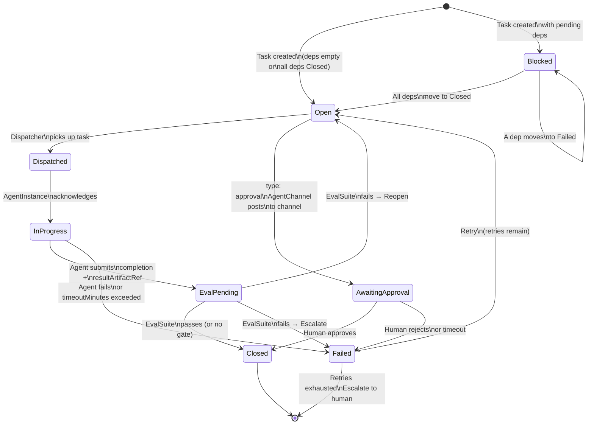

**Controller responsibilities:**
- On create: seed `status.taskStatuses` from `spec.tasks[]` (see `seedTaskStatuses` above)
- On spec change (new tasks added by agent mutation): seed status for new task IDs, validate no cycles
- Watch task deps in `status.taskStatuses` — when all deps `Closed`, transition task `Blocked → Open`
- Notify `Dispatcher` when tasks become Open
- Track concurrent in-flight tasks against `maxConcurrent`
- When agent submits completion (via operator API — see Agent Runtime Contract):
  - Set `resultArtifactRef` on the task's status
  - If `evalGate` is set: transition to `EvalPending`, run bound `EvalSuite`
    - If eval passes: transition to `Closed`, set `completedAt`, store `evalResult`
    - If eval fails with `onFail: Reopen`: transition back to `Open`, inject failure notes, increment `retryCount`
    - If eval fails with `onFail: Escalate`: transition to `Failed`, emit event
  - If no evalGate: transition directly to `Closed`
- Handle `timeoutMinutes`: periodically check InProgress tasks where `now - startedAt > timeoutMinutes` → transition to `Failed`
- Handle retry policy on `Failed` tasks
- Recompute aggregate counters (`totalTasks`, `openTasks`, etc.) and `completionPercent` from `status.taskStatuses` on every status update
- All status writes go through `r.Status().Update(ctx, tg)` — the `/status` subresource

---

### 10. Dispatcher

**Purpose:** The DAG scheduler and agent router. Watches `TaskGraph` for open tasks (all deps closed), selects the correct `AgentSpec` by capability, and delivers work via `AgentMailbox`. Also woken by `AgentLoop` on heartbeat ticks to re-check for ready tasks.

**Clarification from v0.1.0:** The Dispatcher does not receive "ready beads" directly — it watches TaskGraph events and is woken by AgentLoop ticks. It then queries the TaskGraph for Open tasks, routes them, and delivers task assignment messages to mailboxes.

```yaml
apiVersion: karo.dev/v1alpha1
kind: Dispatcher
metadata:
  name: alpha-router
  namespace: team-alpha
spec:
  # Routing mode
  mode: capability                 # capability | llm-route | round-robin

  # Watch these TaskGraphs
  taskGraphSelector:
    matchLabels:
      team: alpha                  # empty = watch all in namespace

  # Capability → AgentSpec routing table
  capabilityRoutes:
    - capability: design
      agentSpecRef:
        name: planner-agent
    - capability: impl
      agentSpecRef:
        name: coder-agent
    - capability: eval
      agentSpecRef:
        name: test-agent
    - capability: review
      agentSpecRef:
        name: reviewer-agent

  # Fallback if no route matches
  fallbackAgentSpecRef:
    name: planner-agent

  # Messaging — how tasks are delivered to agents
  messaging:
    type: mailbox                  # mailbox | webhook | kafka
    # For mailbox: AgentMailbox name per AgentSpec follows pattern {agentSpec}-mailbox
    mailboxPattern: "{agentSpec}-mailbox"

  # LLM-based routing config (used when mode: llm-route)
  llmRoute:
    modelConfigRef:
      name: claude-sonnet
    routingPromptRef:
      configMapRef:
        name: dispatcher-routing-prompt

status:
  phase: Active
  totalDispatched: 47
  pendingTasks: 2
  lastDispatchedAt: "2026-03-27T10:05:00Z"
  conditions:
    - type: AllRoutesHealthy
      status: "True"
```

**Go type definitions:**
```go
type DispatcherSpec struct {
    Mode                 DispatchMode                 `json:"mode"`                 // capability | llm-route | round-robin
    TaskGraphSelector    metav1.LabelSelector         `json:"taskGraphSelector,omitempty"`
    CapabilityRoutes     []CapabilityRoute            `json:"capabilityRoutes,omitempty"`
    FallbackAgentSpecRef *corev1.LocalObjectReference `json:"fallbackAgentSpecRef,omitempty"`
    Messaging            MessagingConfig              `json:"messaging"`
    LLMRoute             *LLMRouteConfig              `json:"llmRoute,omitempty"`
}

type DispatchMode string
const (
    DispatchModeCapability DispatchMode = "capability"
    DispatchModeLLMRoute   DispatchMode = "llm-route"
    DispatchModeRoundRobin DispatchMode = "round-robin"
)

type CapabilityRoute struct {
    Capability   string                      `json:"capability"`
    AgentSpecRef corev1.LocalObjectReference `json:"agentSpecRef"`
}

type MessagingConfig struct {
    Type           string `json:"type"`                     // mailbox | webhook | kafka
    MailboxPattern string `json:"mailboxPattern,omitempty"` // e.g. "{agentSpec}-mailbox"
}

type LLMRouteConfig struct {
    ModelConfigRef   corev1.LocalObjectReference `json:"modelConfigRef"`
    RoutingPromptRef *SystemPromptConfig         `json:"routingPromptRef,omitempty"`
}
```

**Dispatcher flow — step by step:**

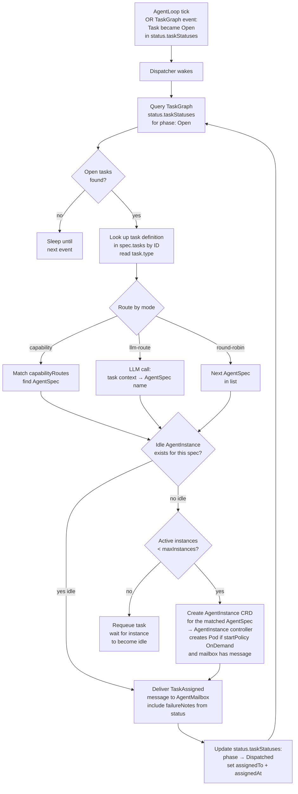

---

### 11. AgentMailbox

**Purpose:** The persistent messaging primitive. Delivers work to agents via structured messages. Survives agent restarts and hibernation — the inbox persists in etcd. This is the Kubernetes-native GUPP hook equivalent.

**Scaling note (v0.4.0):** Messages are stored in `status.pendingMessages` in etcd. This is intentional for v1alpha1 — KARO's message volume is inherently low (messages arrive only on task dispatch, dep unblock, loop tick, or eval result). Even a busy team with 50 tasks generates at most a few hundred messages over a TaskGraph's lifetime. The controller aggressively garbage-collects processed messages from the status array — message history/retention is handled by the audit system (`AgentPolicy.audit`), not by the mailbox. The `maxMessages` default is 100 (not 1000), which at ~500 bytes per message is ~50KB — well within etcd's 1.5MB object limit. If future workloads require higher throughput, the v1beta1 roadmap includes migrating to per-message CRD objects with ownerReferences for independent lifecycle and zero write contention.

```yaml
apiVersion: karo.dev/v1alpha1
kind: AgentMailbox
metadata:
  name: coder-mailbox
  namespace: team-alpha
spec:
  agentSpecRef:
    name: coder-agent

  acceptedMessageTypes:
    - TaskAssigned               # new task dispatched
    - TaskDepUnblocked           # a dependency just closed
    - HumanOverride              # human steering message
    - LoopTick                   # AgentLoop heartbeat
    - EvalResult                 # eval suite result
    - AgentToAgent               # inter-agent message

  # Message limits — keeps etcd object size bounded
  maxPendingMessages: 100        # max unprocessed messages in status; oldest dropped if exceeded
  maxMessageSizeBytes: 4096      # reject messages larger than this

  delivery:
    type: polling                # polling | webhook | env-inject
    pollingIntervalSeconds: 10

status:
  phase: Active
  # Pending messages — the live inbox
  # The controller GCs processed messages immediately after agent acknowledgement.
  # Message history/retention is NOT stored here — it is handled by AgentPolicy.audit.
  pendingMessages:
    - messageType: TaskAssigned
      messageId: msg-abc123
      timestamp: "2026-03-27T10:00:00Z"
      payload:
        taskGraphRef:
          name: feature-auth
        taskId: impl-auth
        taskTitle: "Implement auth endpoints"
        taskType: impl
        acceptanceCriteria:
          - "All endpoints return correct HTTP codes"
          - "Unit tests passing"
        evalGateEnabled: true
        priority: High
        priorFailureNotes: ""
  pendingCount: 1
  totalReceived: 128
  totalProcessed: 127
  oldestPendingMessage: "2026-03-27T10:00:00Z"
  conditions:
    - type: Active
      status: "True"
```

**Go type definitions:**

```go
type AgentMailboxSpec struct {
    AgentSpecRef         corev1.LocalObjectReference `json:"agentSpecRef"`
    AcceptedMessageTypes []MessageType               `json:"acceptedMessageTypes"`
    MaxPendingMessages   int32                       `json:"maxPendingMessages,omitempty"`   // default: 100
    MaxMessageSizeBytes  int32                       `json:"maxMessageSizeBytes,omitempty"`  // default: 4096
    Delivery             DeliveryConfig              `json:"delivery"`
}

type DeliveryConfig struct {
    Type                   string `json:"type"`                             // polling | webhook | env-inject
    PollingIntervalSeconds int32  `json:"pollingIntervalSeconds,omitempty"` // default: 10
}

type MessageType string
const (
    MessageTypeTaskAssigned    MessageType = "TaskAssigned"
    MessageTypeTaskDepUnblocked MessageType = "TaskDepUnblocked"
    MessageTypeHumanOverride   MessageType = "HumanOverride"
    MessageTypeLoopTick        MessageType = "LoopTick"
    MessageTypeEvalResult      MessageType = "EvalResult"
    MessageTypeAgentToAgent    MessageType = "AgentToAgent"
)

type AgentMailboxStatus struct {
    Phase                 string            `json:"phase"`                           // Active | Inactive
    PendingMessages       []MailboxMessage  `json:"pendingMessages,omitempty"`
    PendingCount          int32             `json:"pendingCount"`
    TotalReceived         int64             `json:"totalReceived"`
    TotalProcessed        int64             `json:"totalProcessed"`
    OldestPendingMessage  *metav1.Time      `json:"oldestPendingMessage,omitempty"`
    Conditions            []metav1.Condition `json:"conditions,omitempty"`
}

type MailboxMessage struct {
    MessageType MessageType              `json:"messageType"`
    MessageID   string                   `json:"messageId"`
    Timestamp   metav1.Time              `json:"timestamp"`
    Payload     *runtime.RawExtension    `json:"payload"`    // typed payload, serialised as JSON
}

type TaskAssignedPayload struct {
    TaskGraphRef       corev1.LocalObjectReference `json:"taskGraphRef"`
    TaskID             string                      `json:"taskId"`
    TaskTitle          string                      `json:"taskTitle"`
    TaskType           TaskType                    `json:"taskType"`
    TaskDescription    string                      `json:"taskDescription,omitempty"`
    AcceptanceCriteria []string                    `json:"acceptanceCriteria,omitempty"`
    EvalGateEnabled    bool                        `json:"evalGateEnabled"`
    Priority           TaskPriority                `json:"priority"`
    PriorFailureNotes  string                      `json:"priorFailureNotes,omitempty"`
    // SkillPrompt is injected by the Dispatcher when routing by capability.
    // It contains the instructions from AgentCapability.SkillPrompt for the
    // matched capability, giving the agent specific guidance on HOW to perform
    // this type of task. Empty if the capability has no skill prompt defined.
    SkillPrompt        string                      `json:"skillPrompt,omitempty"`
    ContextRefs        []ContextRef                `json:"contextRefs,omitempty"`
}

type ContextRef struct {
    Kind string `json:"kind"` // MemoryStore | ConfigMap
    Name string `json:"name"`
}
```

**Controller responsibilities:**
- Validate `agentSpecRef` exists on creation
- Accept new messages from Dispatcher / AgentLoop / other controllers
- Enforce `maxPendingMessages` — if exceeded, drop oldest pending message and emit a warning event
- Enforce `maxMessageSizeBytes` — reject oversized messages
- **Garbage collection:** When the agent acknowledges a message (marks it processed), the controller removes it from `status.pendingMessages` immediately. Processed messages are NOT retained in the mailbox — audit/history is handled by `AgentPolicy.audit` logging.
- Recompute `pendingCount` and `oldestPendingMessage` after every status update
- Watch for incoming messages → wake hibernated `AgentInstance` (if `resumeOnMail: true`)
- Report status conditions

**TaskAssigned message schema** (shown inline in status example above — full payload fields defined in `TaskAssignedPayload` Go type).

---

### 12. AgentPolicy

**Purpose:** Governance and policy enforcement for agents. Declares constraints on model usage, tool call rates, data classification, audit logging, loop iteration limits, and — new in v0.2.0 — task mutation permissions.

**Change from v0.1.0:** New `taskGraph` block defines what mutations agents are permitted to make to TaskGraph resources.

```yaml
apiVersion: karo.dev/v1alpha1
kind: AgentPolicy
metadata:
  name: alpha-policy
  namespace: team-alpha
spec:
  targetSelector:
    matchLabels:
      team: alpha

  # Model constraints
  models:
    allowedProviders:
      - anthropic
      - openai
    deniedModels:
      - "gpt-3.5-turbo"
    requireMinContextWindow: 100000

  # Tool call governance
  toolCalls:
    maxPerMinute: 60
    maxPerLoop: 500
    requireSandboxForExecute: true

  # Loop / heartbeat governance
  loop:
    maxIterationsPerRun: 100
    maxRunDurationMinutes: 60
    requireHumanApprovalAfterIterations: 50

  # TaskGraph mutation permissions
  # Governs which agents can add/modify tasks at runtime
  taskGraph:
    allowMutation: true            # agents may patch TaskGraph to add tasks
    mutationScope:
      - addTask                    # can add new tasks
      - closeTask                  # can mark own tasks closed
      - addDependency              # can add deps to tasks they own
    denyMutation:
      - deleteTask                 # cannot delete tasks (audit trail must be preserved)
      - modifyOtherAgentTask       # cannot touch tasks added by other agents
    # All mutations are recorded with addedBy/addedAt in the task
    requireAuditTrail: true

  # Audit logging
  audit:
    enabled: true
    logLevel: Full                 # Full | Summary | None
    logDestination:
      type: stdout                 # stdout | loki | s3
    retentionDays: 365

  # Data classification
  dataClassification:
    allowedLevels:
      - internal
      - confidential
    denyPatterns:
      - ".*api[_-]?key.*"
      - ".*password.*"
      - ".*secret.*"

  # Escalation
  escalation:
    onPolicyViolation: Block       # Block | Warn | Audit
    notifyWebhook: "http://policy-alerts.internal/karo"

status:
  phase: Active
  violationsLast24h: 0
  lastEvaluatedAt: "2026-03-27T10:00:00Z"
  conditions:
    - type: Active
      status: "True"
```

**Go type definitions:**
```go
type AgentPolicySpec struct {
    TargetSelector     metav1.LabelSelector     `json:"targetSelector"`
    Models             ModelConstraints          `json:"models,omitempty"`
    ToolCalls          ToolCallGovernance        `json:"toolCalls,omitempty"`
    Loop               LoopGovernance            `json:"loop,omitempty"`
    TaskGraph          TaskGraphMutationPolicy   `json:"taskGraph,omitempty"`
    Audit              AuditConfig               `json:"audit,omitempty"`
    DataClassification DataClassificationConfig  `json:"dataClassification,omitempty"`
    Escalation         EscalationConfig          `json:"escalation,omitempty"`
}

type ModelConstraints struct {
    AllowedProviders       []string `json:"allowedProviders,omitempty"`
    DeniedModels           []string `json:"deniedModels,omitempty"`
    RequireMinContextWindow int64   `json:"requireMinContextWindow,omitempty"`
}

type ToolCallGovernance struct {
    MaxPerMinute           int32 `json:"maxPerMinute,omitempty"`
    MaxPerLoop             int32 `json:"maxPerLoop,omitempty"`
    RequireSandboxForExecute bool `json:"requireSandboxForExecute,omitempty"`
}

type LoopGovernance struct {
    MaxIterationsPerRun                int32 `json:"maxIterationsPerRun,omitempty"`
    MaxRunDurationMinutes              int32 `json:"maxRunDurationMinutes,omitempty"`
    RequireHumanApprovalAfterIterations int32 `json:"requireHumanApprovalAfterIterations,omitempty"`
}

type TaskGraphMutationPolicy struct {
    AllowMutation    bool     `json:"allowMutation"`
    MutationScope    []string `json:"mutationScope,omitempty"`    // addTask | closeTask | addDependency
    DenyMutation     []string `json:"denyMutation,omitempty"`     // deleteTask | modifyOtherAgentTask
    RequireAuditTrail bool    `json:"requireAuditTrail,omitempty"`
}

type AuditConfig struct {
    Enabled        bool                `json:"enabled"`
    LogLevel       string              `json:"logLevel"`       // Full | Summary | None
    LogDestination LogDestinationConfig `json:"logDestination,omitempty"`
    RetentionDays  int32               `json:"retentionDays,omitempty"`
}

type LogDestinationConfig struct {
    Type string `json:"type"` // stdout | loki | s3
}

type DataClassificationConfig struct {
    AllowedLevels []string `json:"allowedLevels,omitempty"` // internal | confidential | public
    DenyPatterns  []string `json:"denyPatterns,omitempty"`  // regex patterns to block
}

type EscalationConfig struct {
    OnPolicyViolation string `json:"onPolicyViolation"` // Block | Warn | Audit
    NotifyWebhook     string `json:"notifyWebhook,omitempty"`
}
```

---

### 13. EvalSuite

**Purpose:** A library of eval cases used to gate task closure in `TaskGraph` and optionally gate `AgentLoop` execution. Evals run *after* an agent submits task completion, *before* the TaskGraph controller accepts the closure.

**Change from v0.1.0:** EvalSuite is now a library — gate binding is on the TaskGraph task or AgentLoop, not on the EvalSuite itself. The diagram `ES -->|evaluates| AI` is replaced by `TS -->|runs evalGate| ES`. Evals evaluate *task output*, not the agent process.

```yaml
apiVersion: karo.dev/v1alpha1
kind: EvalSuite
metadata:
  name: alpha-evals
  namespace: team-alpha
spec:
  agentSpecRef:
    name: coder-agent

  evalCases:
    - id: basic-code-generation
      description: "Agent can generate syntactically valid Go code"
      # Prompt injected alongside the task output for evaluation
      prompt: "Does the submitted output contain syntactically valid Go code?"
      assertions:
        - type: contains
          value: "func "
        - type: not-contains
          value: "TODO"
        - type: llm-judge
          criteria: "Code is syntactically valid Go and compiles without errors"
          judgeModelConfigRef:
            name: claude-sonnet

    - id: acceptance-criteria-met
      description: "Agent output satisfies task acceptance criteria"
      # acceptance criteria are injected from the task at eval time
      assertions:
        - type: llm-judge
          criteria: "All acceptance criteria listed in the task are demonstrably met by the submitted output"
          judgeModelConfigRef:
            name: claude-sonnet

    - id: no-secrets-leaked
      description: "Output does not contain credentials or secrets"
      assertions:
        - type: not-matches-pattern
          pattern: "(?i)(api.?key|password|secret|token)\\s*[:=]\\s*\\S+"

  # Schedule for standalone eval runs (separate from task-gate usage)
  # When running on schedule (not as a task gate), the eval suite:
  #   1. Creates a temporary AgentInstance from the bound agentSpecRef
  #   2. Sends a synthetic task prompt derived from each evalCase
  #   3. Runs assertions against the agent's response
  #   4. Reports passRate in status — used by AgentLoop evalGate to decide
  #      whether to run the next loop iteration
  # This acts as a regression test / health check for the agent's capabilities.
  schedule: "0 6 * * *"

status:
  phase: Ready
  lastRunAt: "2026-03-27T06:00:00Z"
  lastPassRate: 0.95
  lastRunResult: Passed            # Passed | Failed | Skipped
  totalCases: 3
  passedCases: 3
  failedCases: 0
  conditions:
    - type: Ready
      status: "True"
```

**Go type definitions:**
```go
type EvalSuiteSpec struct {
    AgentSpecRef corev1.LocalObjectReference `json:"agentSpecRef"`
    EvalCases    []EvalCase                  `json:"evalCases"`
    Schedule     string                      `json:"schedule,omitempty"` // cron for standalone runs
}

type EvalCase struct {
    ID          string      `json:"id"`
    Description string      `json:"description"`
    Prompt      string      `json:"prompt,omitempty"`
    Assertions  []Assertion `json:"assertions"`
}

type Assertion struct {
    Type                 AssertionType                `json:"type"`
    Value                string                       `json:"value,omitempty"`
    Pattern              string                       `json:"pattern,omitempty"`
    Criteria             string                       `json:"criteria,omitempty"`         // for llm-judge
    JudgeModelConfigRef  *corev1.LocalObjectReference `json:"judgeModelConfigRef,omitempty"`
}

type AssertionType string
const (
    AssertionTypeContains        AssertionType = "contains"
    AssertionTypeNotContains     AssertionType = "not-contains"
    AssertionTypeMatchesPattern  AssertionType = "matches-pattern"
    AssertionTypeNotMatchesPattern AssertionType = "not-matches-pattern"
    AssertionTypeLLMJudge        AssertionType = "llm-judge"
)
```

**How eval gating works end-to-end:**

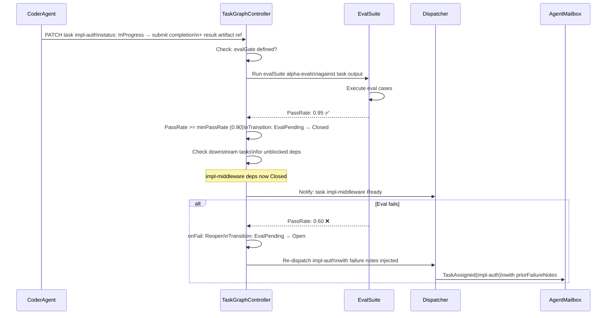

---

### 14. AgentChannel

**Purpose:** The human-to-agent communication bridge. Binds an external messaging platform (Slack, Teams, Discord, webhook) to KARO agent teams, enabling humans to assign work, receive results, and approve handoffs between teams — all from a chat interface. This is the missing "human-in-the-loop" primitive.

**Design rationale:** Agents need human steering, approval, and feedback at key points. Without AgentChannel, the only way to interact with KARO is via `kubectl` and YAML. AgentChannel makes KARO accessible to non-Kubernetes users — a product manager can type in Slack and trigger a multi-team workflow.

**v0.4.0:** New CRD (14th). CRD count: 13 → 14.

```yaml
apiVersion: karo.dev/v1alpha1
kind: AgentChannel
metadata:
  name: alpha-slack-channel
  namespace: team-alpha
spec:
  # Platform binding — one platform per AgentChannel resource.
  # For multi-platform presence, create multiple AgentChannel resources
  # (e.g. alpha-slack-channel, alpha-telegram-channel, alpha-discord-channel)
  # all pointing to the same team. Inspired by OpenClaw's channel adapter pattern.
  #
  # Supported platforms:
  #   v1alpha1: slack, telegram, discord, teams, webhook
  #   v1beta1:  whatsapp, signal, matrix, google-chat, mattermost
  platform:
    type: slack
    slack:
      appCredentialSecret:
        name: karo-slack-app
        key: SLACK_BOT_TOKEN
      signingSecret:
        name: karo-slack-app
        key: SLACK_SIGNING_SECRET
      appToken:                        # required for Socket Mode
        name: karo-slack-app
        key: SLACK_APP_TOKEN
      channelId: "C04ABCDEF12"
      socketMode: true                 # Socket Mode — no public URL needed (recommended for KARO)
      allowedUserIds:
        - "U01ALICE"
        - "U02BOB"
      threadReplies: true              # reply in threads to keep channel clean

  # Inbound: what happens when a human sends a message
  inbound:
    # Which team receives inbound work
    defaultTeamRef:
      name: design-team

    # How inbound messages are interpreted
    mode: task-creation              # task-creation | human-override | auto
    # task-creation: human message creates a new TaskGraph (for "build me X" requests)
    # human-override: message is delivered as HumanOverride to a specific agent's mailbox
    # auto: an LLM classifies the intent and routes accordingly

    # For mode: task-creation — template for the TaskGraph created from inbound messages
    taskGraphTemplate:
      ownerAgentRef:
        name: planner-agent
      dispatcherRef:
        name: design-router
      # The initial task is created from the human message
      # Additional tasks are added by the planner agent via task mutation
      initialTaskType: design

    # For mode: auto — LLM that classifies intent
    autoRoute:
      modelConfigRef:
        name: claude-sonnet
      classificationPrompt:
        inline: |
          Classify the user's message as one of:
          - task-creation: user wants something built, designed, or implemented
          - human-override: user is providing feedback or steering an existing task
          - status-query: user is asking about progress
          Respond with just the classification label.

  # Outbound: when KARO posts to the channel
  outbound:
    # Events that trigger channel notifications
    notifyOn:
      - taskGraphCreated             # "Created TaskGraph 'feature-auth' with 5 tasks"
      - taskGraphCompleted           # "TaskGraph 'feature-auth' completed — all tasks closed"
      - taskFailed                   # "Task 'impl-auth' failed after 2 retries"
      - approvalRequired             # "TaskGraph 'feature-auth' is awaiting your approval"
      - evalGateFailed               # "Task 'impl-auth' failed eval gate (passRate: 0.60)"

    # Format for outbound messages
    format: summary                  # summary | detailed | minimal
    # summary: one-paragraph status with key details
    # detailed: full task list with statuses
    # minimal: one-line notification

    # Optional: LLM-generated summaries for human-readable updates
    summaryModelConfigRef:
      name: claude-sonnet

  # Approval flow — pause between phases and require human approval via channel
  approvals:
    enabled: true
    # How approvals are presented
    style: interactive               # interactive | reply
    # interactive: Slack buttons (Approve / Reject / Request Changes)
    # reply: human replies with "approved", "rejected", or feedback text

    # Timeout: auto-approve or escalate if no response
    timeoutMinutes: 1440             # 24 hours
    onTimeout: escalate              # auto-approve | escalate | block

  # Multi-team handoff — link teams for sequential workflows
  teamHandoff:
    - fromTeamRef:
        name: design-team
      toTeamRef:
        name: dev-team
      # When design-team's TaskGraph completes, create a new TaskGraph for dev-team
      # The output of the design phase is injected as context into the dev phase
      trigger: taskGraphCompleted
      requireApproval: true          # pause for human approval before handoff
      # Template for the downstream TaskGraph
      handoffTaskGraphTemplate:
        ownerAgentRef:
          name: dev-planner-agent
        dispatcherRef:
          name: dev-router
        initialTaskType: impl
        # Context from the upstream TaskGraph is injected as:
        # - MemoryStore entries (design decisions)
        # - resultArtifactRefs from closed tasks
        # - The upstream TaskGraph name for reference
        injectUpstreamContext: true

    - fromTeamRef:
        name: dev-team
      toTeamRef:
        name: qa-team
      trigger: taskGraphCompleted
      requireApproval: false         # auto-handoff to QA after dev completes

status:
  phase: Active                      # Active | Inactive | Error
  platformConnected: true
  lastInboundMessageAt: "2026-03-27T14:30:00Z"
  lastOutboundMessageAt: "2026-03-27T14:35:00Z"
  totalInboundMessages: 47
  totalOutboundMessages: 89
  pendingApprovals: 1
  activeTaskGraphs:
    - name: feature-auth
      phase: InProgress
      team: design-team
    - name: feature-auth-impl
      phase: AwaitingApproval
      team: dev-team
  conditions:
    - type: PlatformConnected
      status: "True"
    - type: SlackAppAuthorized
      status: "True"
```

**Example: Telegram channel** (same team, different platform):

```yaml
apiVersion: karo.dev/v1alpha1
kind: AgentChannel
metadata:
  name: alpha-telegram-channel
  namespace: team-alpha
spec:
  platform:
    type: telegram
    telegram:
      botTokenSecret:
        name: karo-telegram-bot
        key: TELEGRAM_BOT_TOKEN
      chatId: "-1001234567890"         # group chat ID (negative for groups)
      allowedUserIds:
        - "123456789"                  # Telegram numeric user IDs
      dmPolicy: allowlist              # open | allowlist | pairing
      inlineKeyboard: true             # interactive approval buttons
  inbound:
    defaultTeamRef:
      name: design-team
    mode: auto
    autoRoute:
      modelConfigRef:
        name: claude-sonnet
      classificationPrompt:
        inline: "Classify as: task-creation, human-override, or status-query"
  outbound:
    notifyOn: [taskGraphCompleted, approvalRequired, taskFailed]
    format: summary
  approvals:
    enabled: true
    style: interactive                 # uses Telegram inline keyboard buttons
    timeoutMinutes: 1440
    onTimeout: escalate
```

**Example: Discord channel:**

```yaml
apiVersion: karo.dev/v1alpha1
kind: AgentChannel
metadata:
  name: alpha-discord-channel
  namespace: team-alpha
spec:
  platform:
    type: discord
    discord:
      botTokenSecret:
        name: karo-discord-bot
        key: DISCORD_BOT_TOKEN
      guildId: "1234567890123456"      # Discord server ID
      channelId: "9876543210987654"    # text channel ID
      allowedRoleIDs:
        - "1111111111111111"           # @developers role
      threadReplies: true              # create thread per TaskGraph
      messageContentIntent: true       # must enable in Discord Developer Portal
  inbound:
    defaultTeamRef:
      name: dev-team
    mode: task-creation
    taskGraphTemplate:
      ownerAgentRef:
        name: planner-agent
      dispatcherRef:
        name: dev-router
      initialTaskType: impl
  outbound:
    notifyOn: [taskGraphCreated, taskGraphCompleted, taskFailed]
    format: detailed
```

**Multi-platform pattern:** Create one `AgentChannel` per platform, all pointing to the same team. The team gets messages from Slack, Telegram, and Discord simultaneously — the inbound routing and approval flow is identical regardless of source platform. Outbound notifications go back to the originating channel.

**Go type definitions:**

```go
type AgentChannelSpec struct {
    Platform     ChannelPlatform      `json:"platform"`
    Inbound      InboundConfig        `json:"inbound"`
    Outbound     OutboundConfig       `json:"outbound"`
    Approvals    ApprovalConfig       `json:"approvals,omitempty"`
    TeamHandoff  []TeamHandoffRule    `json:"teamHandoff,omitempty"`
}

// ChannelPlatform defines the messaging platform adapter.
// Inspired by OpenClaw's channel adapter pattern — each platform is a pluggable
// adapter with platform-specific config. Multiple AgentChannel resources can
// bind to different platforms, giving agents presence across Slack, Telegram,
// Discord, Teams, and more simultaneously.
type ChannelPlatform struct {
    Type      ChannelPlatformType `json:"type"`
    Slack     *SlackConfig        `json:"slack,omitempty"`
    Telegram  *TelegramConfig     `json:"telegram,omitempty"`
    Discord   *DiscordConfig      `json:"discord,omitempty"`
    Teams     *TeamsConfig        `json:"teams,omitempty"`
    Webhook   *WebhookConfig      `json:"webhook,omitempty"`
}

type ChannelPlatformType string
const (
    ChannelPlatformSlack    ChannelPlatformType = "slack"
    ChannelPlatformTelegram ChannelPlatformType = "telegram"
    ChannelPlatformDiscord  ChannelPlatformType = "discord"
    ChannelPlatformTeams    ChannelPlatformType = "teams"
    ChannelPlatformWhatsApp ChannelPlatformType = "whatsapp"  // v1beta1
    ChannelPlatformSignal   ChannelPlatformType = "signal"    // v1beta1
    ChannelPlatformMatrix   ChannelPlatformType = "matrix"    // v1beta1
    ChannelPlatformWebhook  ChannelPlatformType = "webhook"   // generic fallback
)

type SlackConfig struct {
    AppCredentialSecret corev1.SecretKeySelector `json:"appCredentialSecret"` // SLACK_BOT_TOKEN
    SigningSecret       corev1.SecretKeySelector `json:"signingSecret"`       // SLACK_SIGNING_SECRET
    AppToken            *corev1.SecretKeySelector `json:"appToken,omitempty"` // SLACK_APP_TOKEN (for Socket Mode)
    ChannelID           string                   `json:"channelId"`
    SocketMode          bool                     `json:"socketMode,omitempty"` // true = Socket Mode (no public URL needed)
    AllowedUserIDs      []string                 `json:"allowedUserIds,omitempty"`
    ThreadReplies       bool                     `json:"threadReplies,omitempty"` // reply in thread (default: true)
}

type TelegramConfig struct {
    BotTokenSecret corev1.SecretKeySelector `json:"botTokenSecret"`       // TELEGRAM_BOT_TOKEN from BotFather
    ChatID         string                   `json:"chatId,omitempty"`     // specific chat/group ID (empty = accept DMs)
    AllowedUserIDs []string                 `json:"allowedUserIds,omitempty"` // Telegram user IDs
    // DM policy: how to handle messages from unknown users
    DMPolicy       string                   `json:"dmPolicy,omitempty"`   // open | allowlist | pairing (default: allowlist)
    // Inline keyboard buttons for approvals (Telegram-native interactive UI)
    InlineKeyboard bool                     `json:"inlineKeyboard,omitempty"` // default: true
}

type DiscordConfig struct {
    BotTokenSecret      corev1.SecretKeySelector `json:"botTokenSecret"` // DISCORD_BOT_TOKEN
    GuildID             string                   `json:"guildId"`        // Discord server ID
    ChannelID           string                   `json:"channelId"`     // text channel ID
    AllowedRoleIDs      []string                 `json:"allowedRoleIds,omitempty"` // roles that can trigger work
    ThreadReplies       bool                     `json:"threadReplies,omitempty"`  // create threads for tasks
    MessageContentIntent bool                    `json:"messageContentIntent,omitempty"` // must be enabled in Discord Developer Portal
}

type TeamsConfig struct {
    AppCredentialSecret corev1.SecretKeySelector `json:"appCredentialSecret"` // MS_APP_ID + MS_APP_PASSWORD
    TenantID            string                   `json:"tenantId"`
    TeamID              string                   `json:"teamId,omitempty"`
    ChannelID           string                   `json:"channelId,omitempty"`
    AllowedUserIDs      []string                 `json:"allowedUserIds,omitempty"` // Azure AD user IDs
}

type WebhookConfig struct {
    InboundURL  string                   `json:"inboundUrl"`            // URL KARO exposes for inbound
    OutboundURL string                   `json:"outboundUrl"`           // URL to POST notifications to
    AuthSecret  *corev1.SecretKeySelector `json:"authSecret,omitempty"` // HMAC signing key
}

type InboundConfig struct {
    DefaultTeamRef       corev1.LocalObjectReference `json:"defaultTeamRef"`
    Mode                 InboundMode                 `json:"mode"`  // task-creation | human-override | auto
    TaskGraphTemplate    *TaskGraphTemplate          `json:"taskGraphTemplate,omitempty"`
    AutoRoute            *AutoRouteConfig            `json:"autoRoute,omitempty"`
}

type InboundMode string
const (
    InboundModeTaskCreation  InboundMode = "task-creation"
    InboundModeHumanOverride InboundMode = "human-override"
    InboundModeAuto          InboundMode = "auto"
)

type TaskGraphTemplate struct {
    OwnerAgentRef   corev1.LocalObjectReference `json:"ownerAgentRef"`
    DispatcherRef   corev1.LocalObjectReference `json:"dispatcherRef"`
    InitialTaskType TaskType                    `json:"initialTaskType"`
}

type AutoRouteConfig struct {
    ModelConfigRef       corev1.LocalObjectReference `json:"modelConfigRef"`
    ClassificationPrompt SystemPromptConfig          `json:"classificationPrompt"`
}

type OutboundConfig struct {
    NotifyOn              []ChannelEvent              `json:"notifyOn"`
    Format                OutboundFormat              `json:"format"`  // summary | detailed | minimal
    SummaryModelConfigRef *corev1.LocalObjectReference `json:"summaryModelConfigRef,omitempty"`
}

type ChannelEvent string
const (
    ChannelEventTaskGraphCreated   ChannelEvent = "taskGraphCreated"
    ChannelEventTaskGraphCompleted ChannelEvent = "taskGraphCompleted"
    ChannelEventTaskFailed         ChannelEvent = "taskFailed"
    ChannelEventApprovalRequired   ChannelEvent = "approvalRequired"
    ChannelEventEvalGateFailed     ChannelEvent = "evalGateFailed"
)

type OutboundFormat string
const (
    OutboundFormatSummary  OutboundFormat = "summary"
    OutboundFormatDetailed OutboundFormat = "detailed"
    OutboundFormatMinimal  OutboundFormat = "minimal"
)

type ApprovalConfig struct {
    Enabled        bool           `json:"enabled"`
    Style          ApprovalStyle  `json:"style"`           // interactive | reply
    TimeoutMinutes int32          `json:"timeoutMinutes,omitempty"` // default: 1440 (24h)
    OnTimeout      string         `json:"onTimeout"`       // auto-approve | escalate | block
}

type ApprovalStyle string
const (
    ApprovalStyleInteractive ApprovalStyle = "interactive"  // Slack buttons
    ApprovalStyleReply       ApprovalStyle = "reply"         // text reply
)

type TeamHandoffRule struct {
    FromTeamRef              corev1.LocalObjectReference `json:"fromTeamRef"`
    ToTeamRef                corev1.LocalObjectReference `json:"toTeamRef"`
    Trigger                  string                      `json:"trigger"`          // taskGraphCompleted
    RequireApproval          bool                        `json:"requireApproval"`
    HandoffTaskGraphTemplate *TaskGraphTemplate          `json:"handoffTaskGraphTemplate,omitempty"`
    InjectUpstreamContext    bool                        `json:"injectUpstreamContext,omitempty"`
}
```

**Approval task type:**

Tasks with `type: approval` are not dispatched to agents — they are handled by the AgentChannel controller. When an approval task becomes Open, the controller posts an approval request to the bound channel. The task transitions to `AwaitingApproval` in status. When the human approves, the task is Closed and downstream tasks unblock.

Add to TaskType and TaskPhase enums:

```go
// Additional TaskType
const TaskTypeApproval TaskType = "approval"

// Additional TaskPhase
const TaskPhaseAwaitingApproval TaskPhase = "AwaitingApproval"
```

**Example: Approval task in a TaskGraph:**

```yaml
tasks:
  - id: design-complete
    title: "Design phase complete — awaiting human approval"
    type: approval
    deps: [design-api, design-schema, design-auth-flow]
    priority: High
    addedBy: planner-agent
    addedAt: "2026-03-27T09:00:00Z"
    acceptanceCriteria:
      - "Human has reviewed design outputs"
      - "Human has approved proceeding to implementation"
    # No evalGate — approval is the gate
    # No timeoutMinutes — uses AgentChannel.approvals.timeoutMinutes

  - id: impl-endpoints
    title: "Implement auth endpoints"
    type: impl
    deps: [design-complete]    # blocked until human approves
    priority: High
```

**Controller responsibilities:**
- Validate platform credentials on creation (Slack bot token, signing secret)
- Run an HTTP server (or use Slack Socket Mode) to receive inbound messages
- For `mode: task-creation`: parse human message, create TaskGraph from template, inject message as task description
- For `mode: human-override`: deliver message as `HumanOverride` to the target agent's mailbox
- For `mode: auto`: call LLM to classify intent, route accordingly
- Watch for outbound events (TaskGraphCompleted, TaskFailed, etc.) and post formatted messages to the channel
- Handle approval tasks: when a task with `type: approval` becomes Open, post approval request to channel. Wait for response. On approve → Close task. On reject → Fail task with human feedback as failureNotes. On timeout → apply `onTimeout` policy.
- Handle team handoffs: when a TaskGraph completes and a `teamHandoff` rule matches, optionally post approval request, then create downstream TaskGraph for the target team with upstream context injected
- Track status: connected, pending approvals, active TaskGraphs

**End-to-end flow: Slack → Design Team → Approval → Dev Team → Completion:**

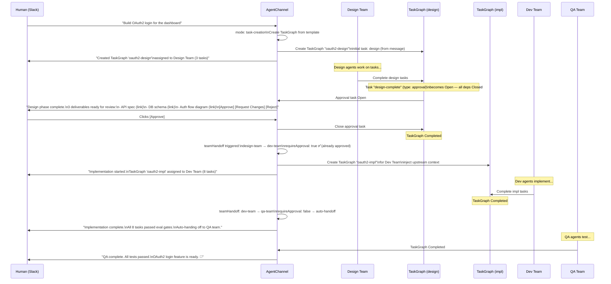

---

## Controller Reconciliation Flows

### AgentSpec Reconciliation

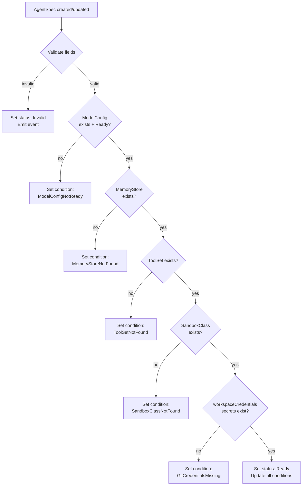

### AgentInstance Reconciliation

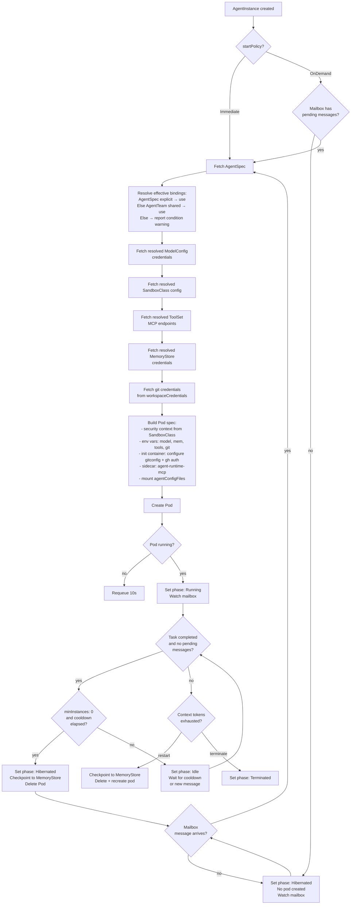

### TaskGraph Reconciliation

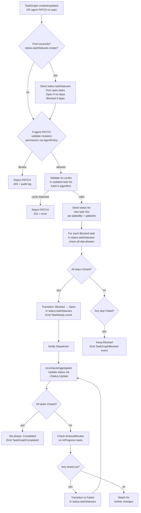

### TaskGraph Eval Gate Reconciliation

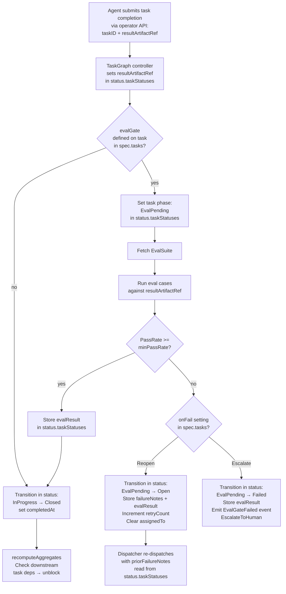

### AgentLoop Reconciliation

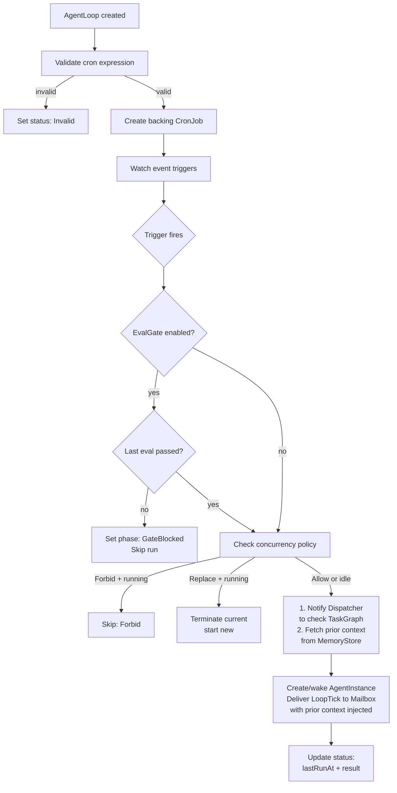

---

## Interaction Flows

### End-to-End: Feature Implementation with Agent Task Mutation

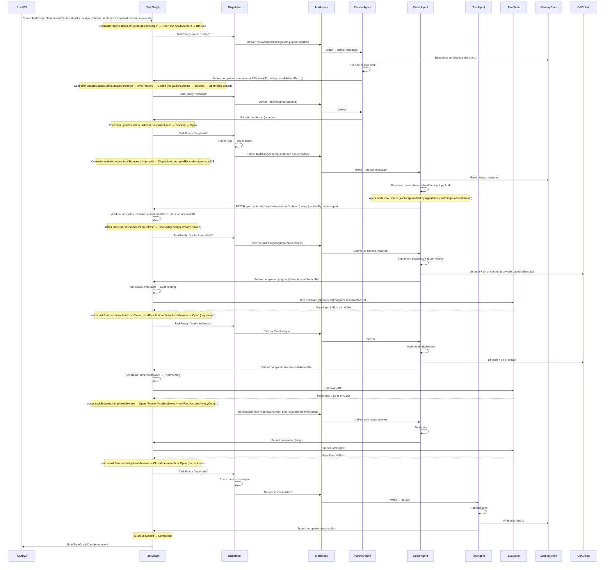

### AgentLoop Heartbeat Flow

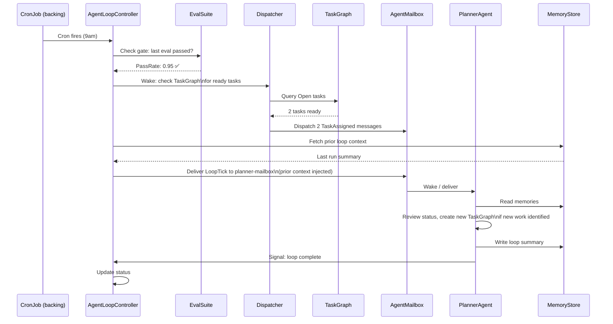

---

## Observability

### Overview

KARO exposes comprehensive metrics for monitoring agent operations, task execution, model usage, and system health. The observability stack is built on **VictoriaMetrics** (Prometheus-compatible) with Grafana dashboards, using the VictoriaMetrics Operator's CRDs (`VMServiceScrape`, `VMRule`) for scrape configuration and alerting.

**Why VictoriaMetrics over raw Prometheus:**
- Drop-in Prometheus replacement with MetricsQL (superset of PromQL)
- Lower resource usage at scale — important when monitoring many agent pods
- VictoriaMetrics Operator integrates natively with Kubernetes via CRDs (`VMServiceScrape`, `VMPodScrape`, `VMRule`)
- `victoria-metrics-k8s-stack` Helm chart provides a complete monitoring stack out of the box
- Compatible with existing Prometheus/Grafana tooling — no lock-in

### Metrics Reference

All metrics are emitted by the KARO operator and the `agent-runtime-mcp` sidecar via `/metrics` endpoints in Prometheus exposition format.

#### Operator Metrics (karo-operator)

**TaskGraph metrics:**

| Metric | Type | Labels | Description |
|---|---|---|---|
| `karo_taskgraph_total` | Gauge | `namespace`, `phase` | Total TaskGraphs by phase (Pending/InProgress/Completed/Failed) |
| `karo_taskgraph_tasks_total` | Gauge | `namespace`, `taskgraph`, `phase` | Tasks per TaskGraph by phase |
| `karo_taskgraph_completion_percent` | Gauge | `namespace`, `taskgraph` | Completion percentage (0-100) |
| `karo_taskgraph_duration_seconds` | Histogram | `namespace`, `taskgraph` | Total time from creation to completion |
| `karo_task_duration_seconds` | Histogram | `namespace`, `taskgraph`, `task_type`, `phase` | Time per task by type and outcome |
| `karo_task_transitions_total` | Counter | `namespace`, `taskgraph`, `from_phase`, `to_phase` | Task phase transitions |
| `karo_task_retries_total` | Counter | `namespace`, `taskgraph`, `task_id` | Retry count per task |
| `karo_task_timeout_total` | Counter | `namespace`, `taskgraph` | Tasks that timed out |

**Agent metrics:**

| Metric | Type | Labels | Description |
|---|---|---|---|
| `karo_agent_instances_total` | Gauge | `namespace`, `agent_spec`, `phase` | AgentInstances by phase |
| `karo_agent_instances_desired` | Gauge | `namespace`, `agent_spec` | Desired instance count (from Dispatcher demand) |
| `karo_agent_instances_max` | Gauge | `namespace`, `agent_spec` | maxInstances from scaling config |
| `karo_agent_scale_up_total` | Counter | `namespace`, `agent_spec` | Scale-up events (new instance created for task) |
| `karo_agent_scale_down_total` | Counter | `namespace`, `agent_spec` | Scale-down events (idle instance terminated after cooldown) |
| `karo_agent_context_tokens_used` | Gauge | `namespace`, `agent_instance` | Current context token usage |
| `karo_agent_context_exhaustion_total` | Counter | `namespace`, `agent_spec`, `action` | Context exhaustion events (restart/checkpoint/terminate) |
| `karo_agent_hibernation_total` | Counter | `namespace`, `agent_spec` | Hibernation events |
| `karo_agent_wake_total` | Counter | `namespace`, `agent_spec`, `trigger` | Wake events by trigger (mailbox/loop) |
| `karo_agent_uptime_seconds` | Gauge | `namespace`, `agent_instance` | Time since agent started |

**Dispatcher metrics:**

| Metric | Type | Labels | Description |
|---|---|---|---|
| `karo_dispatch_total` | Counter | `namespace`, `dispatcher`, `capability`, `result` | Dispatch attempts (success/no_capacity/no_route) |
| `karo_dispatch_latency_seconds` | Histogram | `namespace`, `dispatcher` | Time from task Open → Dispatched |
| `karo_dispatch_queue_depth` | Gauge | `namespace`, `dispatcher` | Open tasks waiting for dispatch |

**Mailbox metrics:**

| Metric | Type | Labels | Description |
|---|---|---|---|
| `karo_mailbox_pending_messages` | Gauge | `namespace`, `mailbox` | Pending message count |
| `karo_mailbox_delivered_total` | Counter | `namespace`, `mailbox`, `message_type` | Messages delivered by type |
| `karo_mailbox_acknowledged_total` | Counter | `namespace`, `mailbox` | Messages acknowledged |
| `karo_mailbox_dropped_total` | Counter | `namespace`, `mailbox` | Messages dropped (capacity exceeded) |

**EvalSuite metrics:**

| Metric | Type | Labels | Description |
|---|---|---|---|
| `karo_eval_runs_total` | Counter | `namespace`, `eval_suite`, `result` | Eval runs (passed/failed) |
| `karo_eval_pass_rate` | Gauge | `namespace`, `eval_suite` | Latest pass rate (0.0-1.0) |
| `karo_eval_duration_seconds` | Histogram | `namespace`, `eval_suite` | Eval execution time |
| `karo_eval_gate_blocks_total` | Counter | `namespace`, `taskgraph`, `task_id` | Eval gate failures (task reopened/escalated) |

**Model usage metrics:**

| Metric | Type | Labels | Description |
|---|---|---|---|
| `karo_model_requests_total` | Counter | `namespace`, `model_config`, `provider` | Model API calls |
| `karo_model_tokens_used_total` | Counter | `namespace`, `model_config`, `direction` | Tokens consumed (input/output) |
| `karo_model_rate_limit_hits_total` | Counter | `namespace`, `model_config` | Rate limit events |
| `karo_model_latency_seconds` | Histogram | `namespace`, `model_config`, `provider` | Model API response time |
| `karo_model_errors_total` | Counter | `namespace`, `model_config`, `error_type` | Model API errors by type |
| `karo_model_estimated_cost_dollars` | Counter | `namespace`, `model_config`, `provider` | Estimated API cost (based on published per-token pricing) |

**AgentChannel metrics:**

| Metric | Type | Labels | Description |
|---|---|---|---|
| `karo_channel_inbound_total` | Counter | `namespace`, `channel`, `platform` | Inbound messages from humans |
| `karo_channel_outbound_total` | Counter | `namespace`, `channel`, `event_type` | Outbound notifications |
| `karo_channel_approval_pending` | Gauge | `namespace`, `channel` | Pending approval requests |
| `karo_channel_approval_duration_seconds` | Histogram | `namespace`, `channel` | Time from approval request to response |
| `karo_channel_handoff_total` | Counter | `namespace`, `channel`, `from_team`, `to_team` | Team handoff events |

**Policy metrics:**

| Metric | Type | Labels | Description |
|---|---|---|---|
| `karo_policy_violations_total` | Counter | `namespace`, `policy`, `violation_type` | Policy violations by type |
| `karo_policy_mutation_allowed_total` | Counter | `namespace`, `agent_spec` | Task mutations permitted |
| `karo_policy_mutation_denied_total` | Counter | `namespace`, `agent_spec`, `reason` | Task mutations denied |

#### Sidecar Metrics (agent-runtime-mcp)

Each `agent-runtime-mcp` sidecar exposes metrics on its debug port (`:9091/metrics`):

| Metric | Type | Labels | Description |
|---|---|---|---|
| `karo_sidecar_tool_calls_total` | Counter | `tool_name`, `result` | MCP tool calls by tool and result (success/error) |
| `karo_sidecar_tool_latency_seconds` | Histogram | `tool_name` | Tool call latency |
| `karo_sidecar_memory_operations_total` | Counter | `operation` | Memory read/write operations |
| `karo_sidecar_mailbox_polls_total` | Counter | | Mailbox poll count |

### Scrape Configuration

KARO's Helm chart includes VictoriaMetrics scrape configurations that auto-discover all KARO components:

```yaml
# VMServiceScrape for the KARO operator
apiVersion: operator.victoriametrics.com/v1beta1
kind: VMServiceScrape
metadata:
  name: karo-operator-metrics
  namespace: karo-system
spec:
  selector:
    matchLabels:
      app.kubernetes.io/name: karo-operator
  endpoints:
    - port: metrics
      interval: 15s
      path: /metrics

---
# VMPodScrape for agent-runtime-mcp sidecars across all namespaces
apiVersion: operator.victoriametrics.com/v1beta1
kind: VMPodScrape
metadata:
  name: karo-sidecar-metrics
  namespace: karo-system
spec:
  selector:
    matchLabels:
      karo.dev/component: agent-runtime-mcp
  podMetricsEndpoints:
    - port: debug
      interval: 30s
      path: /metrics
  namespaceSelector:
    any: true
```

### Alerting Rules

```yaml
apiVersion: operator.victoriametrics.com/v1beta1
kind: VMRule
metadata:
  name: karo-alerts
  namespace: karo-system
spec:
  groups:
    - name: karo-taskgraph
      rules:
        - alert: KAROTaskGraphStuck
          expr: |
            karo_taskgraph_total{phase="InProgress"} > 0
            and on(namespace, taskgraph) (
              time() - karo_taskgraph_duration_seconds > 3600
            )
          for: 30m
          labels:
            severity: warning
          annotations:
            summary: "TaskGraph {{ $labels.taskgraph }} in {{ $labels.namespace }} has been InProgress for over 1 hour"

        - alert: KAROTaskFailureRateHigh
          expr: |
            rate(karo_task_transitions_total{to_phase="Failed"}[15m])
            / rate(karo_task_transitions_total[15m]) > 0.3
          for: 10m
          labels:
            severity: critical
          annotations:
            summary: "Task failure rate exceeds 30% in {{ $labels.namespace }}"

        - alert: KAROEvalGateFailureRateHigh
          expr: karo_eval_pass_rate < 0.7
          for: 15m
          labels:
            severity: warning
          annotations:
            summary: "EvalSuite {{ $labels.eval_suite }} pass rate dropped below 70%"

    - name: karo-agents
      rules:
        - alert: KAROAgentContextNearExhaustion
          expr: |
            karo_agent_context_tokens_used
            / on(namespace, agent_instance) group_left
            karo_agent_context_tokens_max > 0.85
          for: 5m
          labels:
            severity: warning
          annotations:
            summary: "Agent {{ $labels.agent_instance }} context usage above 85%"

        - alert: KAROAgentHibernatedTooLong
          expr: |
            karo_agent_instances_total{phase="Hibernated"} > 0
            and on(namespace, agent_spec)
            karo_mailbox_pending_messages > 0
          for: 15m
          labels:
            severity: warning
          annotations:
            summary: "Agent {{ $labels.agent_spec }} is hibernated but has pending mailbox messages"

    - name: karo-model
      rules:
        - alert: KAROModelRateLimited
          expr: rate(karo_model_rate_limit_hits_total[5m]) > 0
          for: 5m
          labels:
            severity: warning
          annotations:
            summary: "ModelConfig {{ $labels.model_config }} is being rate limited"

        - alert: KAROModelErrorRateHigh
          expr: |
            rate(karo_model_errors_total[5m])
            / rate(karo_model_requests_total[5m]) > 0.1
          for: 10m
          labels:
            severity: critical
          annotations:
            summary: "Model error rate exceeds 10% for {{ $labels.model_config }}"

        - alert: KARODailyCostThresholdExceeded
          expr: |
            increase(karo_model_estimated_cost_dollars[24h]) > 100
          labels:
            severity: warning
          annotations:
            summary: "Estimated daily model API cost exceeds $100 for {{ $labels.model_config }}"

    - name: karo-mailbox
      rules:
        - alert: KAROMailboxNearCapacity
          expr: |
            karo_mailbox_pending_messages
            / on(namespace, mailbox) karo_mailbox_max_pending > 0.8
          for: 10m
          labels:
            severity: warning
          annotations:
            summary: "Mailbox {{ $labels.mailbox }} is at 80% capacity"

    - name: karo-channel
      rules:
        - alert: KAROApprovalPendingTooLong
          expr: karo_channel_approval_duration_seconds > 7200
          labels:
            severity: warning
          annotations:
            summary: "Approval pending for over 2 hours in channel {{ $labels.channel }}"
```

### Grafana Dashboard: KARO Agent Operations

KARO ships a Grafana dashboard as a ConfigMap (auto-provisioned when using `victoria-metrics-k8s-stack`). The dashboard provides four sections:

**Row 1: Fleet Overview**
- Total TaskGraphs by phase (stat panels: Pending, InProgress, Completed, Failed)
- Active AgentInstances by phase (stat panels: Running, Idle, Hibernated)
- Overall task completion rate (gauge: 0-100%)
- Estimated daily cost (stat panel in dollars)

**Row 2: TaskGraph Detail** (variable: `$taskgraph`)
- Task phase distribution (pie chart: Open, Dispatched, InProgress, EvalPending, AwaitingApproval, Closed, Failed, Blocked)
- Task timeline (time series: tasks completing over time)
- Completion percentage over time (time series)
- Avg task duration by type (bar chart: design, impl, eval, review, infra, approval)
- Retry rate by task (table)
- Eval gate pass rate (gauge per task with evalGate)

**Row 3: Agent Performance** (variable: `$namespace`)
- Context token usage per agent (time series with max threshold line)
- Tool calls per minute by tool (time series, stacked)
- Model API latency p50/p95/p99 (time series)
- Model tokens consumed (counter, input vs output)
- Agent uptime / hibernation cycles (time series)
- Dispatch latency (histogram heatmap)

**Row 4: Channel & Cost** (variable: `$channel`)
- Inbound messages over time (time series)
- Pending approvals (stat panel)
- Approval response time (histogram)
- Team handoff flow (status map: design → approval → dev → QA)
- Model cost by provider (time series, stacked)
- Rate limit events (time series)

```yaml
# Grafana dashboard ConfigMap — auto-provisioned by Helm chart
apiVersion: v1
kind: ConfigMap
metadata:
  name: karo-grafana-dashboard
  namespace: karo-system
  labels:
    grafana_dashboard: "true"          # auto-discovered by Grafana sidecar
data:
  karo-agent-operations.json: |
    {
      "dashboard": {
        "title": "KARO Agent Operations",
        "uid": "karo-agent-ops",
        "tags": ["karo", "agents", "kubernetes"],
        "timezone": "browser",
        "templating": {
          "list": [
            {
              "name": "namespace",
              "type": "query",
              "query": "label_values(karo_taskgraph_total, namespace)",
              "refresh": 2
            },
            {
              "name": "taskgraph",
              "type": "query",
              "query": "label_values(karo_taskgraph_tasks_total{namespace=\"$namespace\"}, taskgraph)",
              "refresh": 2
            }
          ]
        },
        "panels": [
          {
            "title": "TaskGraphs by Phase",
            "type": "stat",
            "gridPos": { "h": 4, "w": 6, "x": 0, "y": 0 },
            "targets": [{ "expr": "sum by (phase) (karo_taskgraph_total{namespace=\"$namespace\"})" }]
          },
          {
            "title": "Active Agents",
            "type": "stat",
            "gridPos": { "h": 4, "w": 6, "x": 6, "y": 0 },
            "targets": [{ "expr": "sum by (phase) (karo_agent_instances_total{namespace=\"$namespace\"})" }]
          },
          {
            "title": "Task Completion Rate",
            "type": "gauge",
            "gridPos": { "h": 4, "w": 6, "x": 12, "y": 0 },
            "targets": [{ "expr": "avg(karo_taskgraph_completion_percent{namespace=\"$namespace\"})" }],
            "fieldConfig": { "defaults": { "min": 0, "max": 100, "unit": "percent",
              "thresholds": { "steps": [
                { "color": "red", "value": 0 },
                { "color": "yellow", "value": 50 },
                { "color": "green", "value": 80 }
              ]}
            }}
          },
          {
            "title": "Estimated Daily Cost",
            "type": "stat",
            "gridPos": { "h": 4, "w": 6, "x": 18, "y": 0 },
            "targets": [{ "expr": "sum(increase(karo_model_estimated_cost_dollars{namespace=\"$namespace\"}[24h]))" }],
            "fieldConfig": { "defaults": { "unit": "currencyUSD" } }
          },
          {
            "title": "Task Phase Distribution",
            "type": "piechart",
            "gridPos": { "h": 8, "w": 8, "x": 0, "y": 4 },
            "targets": [{ "expr": "sum by (phase) (karo_taskgraph_tasks_total{namespace=\"$namespace\", taskgraph=\"$taskgraph\"})" }]
          },
          {
            "title": "Task Duration by Type",
            "type": "barchart",
            "gridPos": { "h": 8, "w": 8, "x": 8, "y": 4 },
            "targets": [{ "expr": "histogram_quantile(0.5, sum by (task_type, le) (rate(karo_task_duration_seconds_bucket{namespace=\"$namespace\"}[1h])))" }]
          },
          {
            "title": "Eval Gate Pass Rate",
            "type": "gauge",
            "gridPos": { "h": 8, "w": 8, "x": 16, "y": 4 },
            "targets": [{ "expr": "karo_eval_pass_rate{namespace=\"$namespace\"}" }],
            "fieldConfig": { "defaults": { "min": 0, "max": 1, "unit": "percentunit" } }
          },
          {
            "title": "Context Token Usage",
            "type": "timeseries",
            "gridPos": { "h": 8, "w": 12, "x": 0, "y": 12 },
            "targets": [{ "expr": "karo_agent_context_tokens_used{namespace=\"$namespace\"}", "legendFormat": "{{ agent_instance }}" }]
          },
          {
            "title": "Model API Latency (p95)",
            "type": "timeseries",
            "gridPos": { "h": 8, "w": 12, "x": 12, "y": 12 },
            "targets": [{ "expr": "histogram_quantile(0.95, sum by (model_config, le) (rate(karo_model_latency_seconds_bucket{namespace=\"$namespace\"}[5m])))", "legendFormat": "{{ model_config }}" }]
          },
          {
            "title": "Model Cost by Provider",
            "type": "timeseries",
            "gridPos": { "h": 8, "w": 12, "x": 0, "y": 20 },
            "targets": [{ "expr": "sum by (provider) (increase(karo_model_estimated_cost_dollars{namespace=\"$namespace\"}[1h]))", "legendFormat": "{{ provider }}" }],
            "fieldConfig": { "defaults": { "unit": "currencyUSD" } }
          },
          {
            "title": "Dispatch Latency",
            "type": "heatmap",
            "gridPos": { "h": 8, "w": 12, "x": 12, "y": 20 },
            "targets": [{ "expr": "sum by (le) (increase(karo_dispatch_latency_seconds_bucket{namespace=\"$namespace\"}[5m]))" }]
          }
        ]
      }
    }
```

### Helm Integration

The KARO Helm chart includes observability out of the box:

```yaml
# values.yaml — observability section
observability:
  enabled: true

  # Metrics endpoint on the operator
  metrics:
    port: 8080
    path: /metrics

  # VictoriaMetrics scrape configs (requires victoria-metrics-operator or prometheus-operator)
  vmServiceScrape:
    enabled: true
    interval: 15s

  vmPodScrape:
    enabled: true
    interval: 30s

  # Alerting rules
  vmRule:
    enabled: true

  # Grafana dashboard ConfigMap
  grafanaDashboard:
    enabled: true
    labels:
      grafana_dashboard: "true"      # matches Grafana sidecar label selector
```

**Prerequisites:** VictoriaMetrics `victoria-metrics-k8s-stack` Helm chart (or Prometheus Operator — scrape configs are compatible with both via VictoriaMetrics auto-conversion). Grafana with sidecar dashboard provisioning enabled.

---

## Agent Runtime Contract

### Overview

The Agent Runtime Contract defines how a running agent process inside a pod interacts with the KARO operator. This is the **data plane** — the CRDs and controllers are the control plane.

**Design decision:** The agent-facing contract is **MCP-first**. A built-in MCP server (`agent-runtime-mcp`) runs as a sidecar in every AgentInstance pod and exposes KARO operations as MCP tools. The agent calls `karo_complete_task` the same way it calls `github_create_pr` or `web_search` — through its existing MCP tool-calling interface. The agent does not need to know it is running on Kubernetes.

This aligns with KARO's design principles:
- **Tools are MCP servers with explicit permission grants** — the agent-runtime-mcp tools are governed by the same ToolSet and AgentPolicy as any other tool.
- **Composable with LangGraph** — any agent framework that supports MCP tool calling works without modification.
- **Identity survives ephemerality** — the sidecar handles all Kubernetes API interactions; the agent process is stateless with respect to the platform.

### Architecture

```
┌──────────────────────────────────────────────────────────┐
│  AgentInstance Pod                                        │
│                                                          │
│  ┌────────────────────┐    ┌───────────────────────────┐ │
│  │  Agent Process      │    │  agent-runtime-mcp sidecar     │ │
│  │  (Claude Code,      │    │  (MCP server)             │ │
│  │   LangGraph,        │◄──►│                           │ │
│  │   custom agent)     │MCP │  ┌─────────────────────┐  │ │
│  │                     │    │  │ Kubernetes Client    │  │ │
│  │  Calls MCP tools:   │    │  │ (via pod SA)         │  │ │
│  │  - karo_poll_mailbox│    │  │                     │  │ │
│  │  - karo_complete_   │    │  │ Reads/writes CRDs:  │  │ │
│  │    task             │    │  │ - AgentMailbox       │  │ │
│  │  - karo_add_task    │    │  │ - TaskGraph          │  │ │
│  │  - karo_query_      │    │  │ - AgentInstance      │  │ │
│  │    memory           │    │  │ - MemoryStore        │  │ │
│  │  - github_create_pr │    │  └─────────────────────┘  │ │
│  │  - web_search       │    │                           │ │
│  └────────────────────┘    │  REST debug endpoint:     │ │
│                             │  :9091/healthz            │ │
│                             │  :9091/debug/status       │ │
│                             └───────────────────────────┘ │
└──────────────────────────────────────────────────────────┘
```

### Sidecar Injection

The `AgentInstance` controller automatically injects the `agent-runtime-mcp` sidecar into every agent pod. It is configured via environment variables derived from the `AgentSpec`, `ModelConfig`, and `AgentMailbox` bindings:

```yaml
# Injected sidecar container (added by AgentInstance controller)
- name: agent-runtime-mcp
  image: ghcr.io/karo-dev/agent-runtime-mcp:latest
  env:
    - name: KARO_NAMESPACE
      valueFrom:
        fieldRef:
          fieldPath: metadata.namespace
    - name: KARO_AGENT_INSTANCE
      value: "coder-agent-abc123"
    - name: KARO_AGENT_SPEC
      value: "coder-agent"
    - name: KARO_MAILBOX
      value: "coder-mailbox"
    - name: KARO_MCP_TRANSPORT
      value: "stdio"                    # stdio | sse
    - name: KARO_DEBUG_PORT
      value: "9091"
  resources:
    requests:
      cpu: "50m"
      memory: "64Mi"
    limits:
      cpu: "200m"
      memory: "128Mi"
```

The sidecar is also registered as a built-in entry in the agent's effective ToolSet:

```yaml
# Automatically appended to the agent's ToolSet by the AgentInstance controller
- name: agent-runtime-mcp
  type: mcp
  transport: stdio
  builtin: true                          # not user-removable; always present
  permissions:                           # governed by AgentPolicy like any tool
    - mailbox-read
    - mailbox-ack
    - task-complete
    - task-fail
    - task-add                           # only if AgentPolicy.taskGraph.allowMutation
    - memory-read
    - memory-write
    - status-report
```

### MCP Tool Definitions

The `agent-runtime-mcp` MCP server exposes the following tools. Each tool maps to one or more Kubernetes API operations performed by the sidecar using the pod's ServiceAccount.

#### karo_poll_mailbox

Retrieves pending messages from the agent's bound AgentMailbox.

```json
{
  "name": "karo_poll_mailbox",
  "description": "Get pending messages from your mailbox. Returns task assignments, loop ticks, eval results, and other messages.",
  "inputSchema": {
    "type": "object",
    "properties": {
      "messageTypes": {
        "type": "array",
        "items": { "type": "string" },
        "description": "Optional filter: only return these message types (e.g. ['TaskAssigned', 'EvalResult']). Empty = all."
      },
      "limit": {
        "type": "integer",
        "description": "Max messages to return. Default: 10."
      }
    }
  },
  "outputSchema": {
    "type": "object",
    "properties": {
      "messages": {
        "type": "array",
        "items": {
          "type": "object",
          "properties": {
            "messageId": { "type": "string" },
            "messageType": { "type": "string" },
            "timestamp": { "type": "string" },
            "payload": { "type": "object" }
          }
        }
      },
      "pendingCount": { "type": "integer" }
    }
  }
}
```

**Kubernetes operation:** `GET AgentMailbox/status.pendingMessages` (filtered, limited)

#### karo_ack_message

Acknowledges a message as processed. The controller removes it from the mailbox immediately.

```json
{
  "name": "karo_ack_message",
  "description": "Acknowledge a message as processed. Removes it from your mailbox.",
  "inputSchema": {
    "type": "object",
    "properties": {
      "messageId": { "type": "string", "description": "The messageId to acknowledge." }
    },
    "required": ["messageId"]
  }
}
```

**Kubernetes operation:** Triggers `AgentMailboxReconciler.acknowledgeMessage()` — PATCH AgentMailbox status to remove the message.

#### karo_complete_task

Submits task completion with an artifact reference. Triggers the eval gate if configured.

```json
{
  "name": "karo_complete_task",
  "description": "Mark a task as complete and submit the result. If the task has an eval gate, the result will be evaluated before the task is closed.",
  "inputSchema": {
    "type": "object",
    "properties": {
      "taskGraphName": { "type": "string", "description": "Name of the TaskGraph." },
      "taskId": { "type": "string", "description": "ID of the task to complete." },
      "resultArtifactRef": { "type": "string", "description": "Reference to the output (ConfigMap name, PVC path, git commit SHA, URL, etc.)." },
      "notes": { "type": "string", "description": "Optional completion notes." }
    },
    "required": ["taskGraphName", "taskId", "resultArtifactRef"]
  },
  "outputSchema": {
    "type": "object",
    "properties": {
      "accepted": { "type": "boolean" },
      "newPhase": { "type": "string", "description": "Resulting task phase: EvalPending | Closed" },
      "message": { "type": "string" }
    }
  }
}
```

**Kubernetes operation:** PATCH TaskGraph `status.taskStatuses[taskId]` — set `resultArtifactRef`, transition `InProgress → EvalPending` (or `Closed` if no gate). The TaskGraph controller handles the eval gate asynchronously.

#### karo_fail_task

Reports that a task has failed. The controller applies retry policy.

```json
{
  "name": "karo_fail_task",
  "description": "Report that you cannot complete a task. The controller will apply retry policy or escalate.",
  "inputSchema": {
    "type": "object",
    "properties": {
      "taskGraphName": { "type": "string" },
      "taskId": { "type": "string" },
      "reason": { "type": "string", "description": "Why the task failed." }
    },
    "required": ["taskGraphName", "taskId", "reason"]
  }
}
```

**Kubernetes operation:** PATCH TaskGraph `status.taskStatuses[taskId]` — transition `InProgress → Failed`, set `failureNotes`.

#### karo_add_task

Adds a new task to a TaskGraph. Governed by AgentPolicy task mutation permissions.

```json
{
  "name": "karo_add_task",
  "description": "Add a new task to a TaskGraph. Only available if your policy permits task mutation.",
  "inputSchema": {
    "type": "object",
    "properties": {
      "taskGraphName": { "type": "string" },
      "task": {
        "type": "object",
        "properties": {
          "id": { "type": "string" },
          "title": { "type": "string" },
          "type": { "type": "string", "enum": ["design", "impl", "eval", "review", "infra"] },
          "description": { "type": "string" },
          "deps": { "type": "array", "items": { "type": "string" } },
          "priority": { "type": "string", "enum": ["High", "Medium", "Low"] },
          "timeoutMinutes": { "type": "integer" },
          "acceptanceCriteria": { "type": "array", "items": { "type": "string" } }
        },
        "required": ["id", "title", "type", "deps", "priority"]
      }
    },
    "required": ["taskGraphName", "task"]
  },
  "outputSchema": {
    "type": "object",
    "properties": {
      "accepted": { "type": "boolean" },
      "taskId": { "type": "string" },
      "message": { "type": "string" }
    }
  }
}
```

**Kubernetes operation:** PATCH TaskGraph `spec.tasks[]` to append the new task (sets `addedBy` to current agent, `addedAt` to now). The sidecar calls `validateMutation()` logic — checks `AgentPolicy.taskGraph.allowMutation`, validates no cycles, then submits. The TaskGraph controller seeds the status entry on reconcile.

#### karo_query_memory

Queries the bound MemoryStore for relevant memories.

```json
{
  "name": "karo_query_memory",
  "description": "Search your memory store for relevant memories. Returns memories matching the query, ranked by relevance.",
  "inputSchema": {
    "type": "object",
    "properties": {
      "query": { "type": "string", "description": "Natural language query to search memories." },
      "categories": {
        "type": "array",
        "items": { "type": "string" },
        "description": "Optional filter by category (e.g. ['decisions', 'code-patterns'])."
      },
      "limit": { "type": "integer", "description": "Max memories to return. Default: 10." }
    },
    "required": ["query"]
  },
  "outputSchema": {
    "type": "object",
    "properties": {
      "memories": {
        "type": "array",
        "items": {
          "type": "object",
          "properties": {
            "id": { "type": "string" },
            "content": { "type": "string" },
            "category": { "type": "string" },
            "relevanceScore": { "type": "number" },
            "createdAt": { "type": "string" },
            "createdBy": { "type": "string" }
          }
        }
      }
    }
  }
}
```

**Backend operation:** Calls mem0 API (or configured backend) using credentials from the MemoryStore CRD. Scoped to the agent's bound store.

#### karo_store_memory

Writes a memory to the bound MemoryStore.

```json
{
  "name": "karo_store_memory",
  "description": "Store a memory in your memory store. Memories persist across context window resets and agent restarts.",
  "inputSchema": {
    "type": "object",
    "properties": {
      "content": { "type": "string", "description": "The memory content to store." },
      "category": { "type": "string", "description": "Category (e.g. 'decisions', 'code-patterns', 'errors')." },
      "metadata": {
        "type": "object",
        "description": "Optional key-value metadata."
      }
    },
    "required": ["content", "category"]
  },
  "outputSchema": {
    "type": "object",
    "properties": {
      "memoryId": { "type": "string" },
      "stored": { "type": "boolean" }
    }
  }
}
```

**Backend operation:** Calls mem0 API to store. Sets `createdBy` to current agent name.

#### karo_report_status

Reports agent runtime status back to the operator. Used for context token tracking, liveness, and voluntary checkpoint requests.

```json
{
  "name": "karo_report_status",
  "description": "Report your runtime status to the operator. Call periodically to report token usage, or to request a checkpoint before context exhaustion.",
  "inputSchema": {
    "type": "object",
    "properties": {
      "contextTokensUsed": { "type": "integer", "description": "Current context window token count." },
      "status": { "type": "string", "enum": ["active", "idle", "checkpoint-requested"], "description": "Current agent status." },
      "notes": { "type": "string", "description": "Optional status notes." }
    },
    "required": ["contextTokensUsed", "status"]
  }
}
```

**Kubernetes operation:** PATCH AgentInstance `status.contextTokensUsed` and `status.lastActiveAt`. If `checkpoint-requested`, the controller triggers `onContextExhaustion` behaviour from the AgentSpec.

### Permission Governance

The agent-runtime-mcp MCP tools are governed by the same `AgentPolicy` as any other tool. The sidecar checks permissions before executing each operation:

| Tool | Required Permission | AgentPolicy Check |
|---|---|---|
| `karo_poll_mailbox` | `mailbox-read` | Always permitted for bound agents |
| `karo_ack_message` | `mailbox-ack` | Always permitted for bound agents |
| `karo_complete_task` | `task-complete` | Agent must be `assignedTo` for the task |
| `karo_fail_task` | `task-fail` | Agent must be `assignedTo` for the task |
| `karo_add_task` | `task-add` | `AgentPolicy.taskGraph.allowMutation` must be true |
| `karo_query_memory` | `memory-read` | Agent must be in `MemoryStore.spec.boundAgents` |
| `karo_store_memory` | `memory-write` | Agent must be in `MemoryStore.spec.boundAgents` |
| `karo_report_status` | `status-report` | Always permitted |

### Debug / Operations REST Endpoint

The sidecar also exposes a lightweight REST endpoint on port 9091 for operators and debugging. This is **not** the agent-facing interface — agents use MCP tools exclusively.

```
GET  /healthz                          → 200 OK
GET  /readyz                           → 200 OK (ready to accept MCP calls)
GET  /debug/status                     → current AgentInstance status summary
GET  /debug/mailbox                    → pending message count + oldest timestamp
GET  /debug/tools                      → list of available MCP tools + permissions
POST /debug/drain                      → graceful shutdown: finish current task, checkpoint, terminate
```

### Agent Framework Compatibility

Because the contract is MCP-based, any agent framework that supports MCP tool calling works with KARO without modification:

| Framework | Integration |
|---|---|
| Claude Code | Native MCP support — tools appear automatically |
| LangGraph | MCP tool nodes — `karo_complete_task` is a tool in the graph |
| CrewAI | MCP tools via tool decorator |
| AutoGen/ADK | MCP tool server connection |
| Custom (Python) | `mcp` Python SDK — `async with stdio_client(...)` |
| Custom (Go) | Direct Kubernetes client via pod ServiceAccount (bypass sidecar) |

Go agents that prefer to skip the sidecar can use the Kubernetes client directly — the pod's ServiceAccount has the necessary RBAC. The sidecar is still injected (for healthz/readyz) but the agent process can ignore it and talk to the API server directly.

### Project Structure Addition

```
karo/
├── ...
├── cmd/
│   ├── main.go                          # operator entrypoint
│   └── agent-runtime-mcp/
│       └── main.go                      # sidecar entrypoint
│
├── internal/
│   └── runtime/
│       ├── server.go                    # MCP server implementation
│       ├── tools.go                     # MCP tool definitions + handlers
│       ├── permissions.go               # permission check logic
│       ├── debug.go                     # REST debug endpoint handlers
│       └── kubernetes.go                # Kubernetes API client wrappers
│
├── sdk/
│   └── python/
│       └── karo/
│           ├── __init__.py
│           ├── client.py                # thin wrapper over MCP stdio calls
│           └── types.py                 # Python types for tool inputs/outputs
```

---

## Reference Agent Harnesses

KARO is harness-agnostic — any agent framework that supports MCP tool calling works as the agent process inside a pod. For v1alpha1, KARO ships **two reference harnesses** so users can choose the best fit:

| | **Goose** | **Claude Code** |
|---|---|---|
| **Best for** | Model-agnostic teams, multi-provider setups | Maximum agent capability, Anthropic-first teams |
| **Models** | Any (25+ providers) | Anthropic models (direct API, Bedrock, Vertex AI) |
| **License** | Apache 2.0 (AAIF/Linux Foundation) | Proprietary (Anthropic) |
| **MCP** | Native extension system | Native MCP support with Tool Search |
| **Headless** | `goose run -t "task" --no-session` | `claude -p "task" --allowedTools ...` |
| **Autonomous** | `GOOSE_MODE=auto` | Auto Mode (AI classifier for safe execution) |
| **Config files** | AGENTS.md (native) | CLAUDE.md (native), AGENTS.md (supported) |
| **Language** | Rust | Node.js (TypeScript) |
| **Container** | `karo-goose-harness` | `karo-claude-code-harness` |

### Why Goose

Goose is the right choice for the reference harness because:

- **Open source (Apache 2.0)** — contributed to the Linux Foundation's Agentic AI Foundation (AAIF) alongside MCP and AGENTS.md, under neutral governance
- **Model-agnostic** — supports 25+ LLM providers including Anthropic, OpenAI, AWS Bedrock, GCP Vertex AI, and Ollama. This maps directly to KARO's ModelConfig providers — no harness/model mismatch
- **Native MCP support** — Goose's extension system is built on MCP. The `agent-runtime-mcp` sidecar registers as a Goose extension automatically
- **Headless mode** — `goose run -t "task" --no-session` with `GOOSE_MODE=auto` enables fully autonomous, non-interactive execution in a pod. No human-in-the-loop required
- **Recipes** — Goose's recipe system (YAML-defined reusable agent behaviours with system prompts, extensions, and parameters) maps cleanly to KARO's AgentSpec system prompt + task type pattern
- **Rust binary** — lightweight, fast startup, small container image footprint
- **Context management** — built-in `GOOSE_CONTEXT_STRATEGY=summarize` and `GOOSE_MAX_TURNS` handle context window management natively

### Integration Architecture

```
┌──────────────────────────────────────────────────────────┐
│  AgentInstance Pod                                        │
│                                                          │
│  ┌────────────────────┐    ┌───────────────────────────┐ │
│  │  Goose (headless)   │    │  agent-runtime-mcp        │ │
│  │                     │    │  (MCP sidecar)             │ │
│  │  Config:            │◄──►│                           │ │
│  │  - provider from    │MCP │  Registered as Goose      │ │
│  │    ModelConfig env  │    │  extension automatically   │ │
│  │  - system prompt    │    │                           │ │
│  │    from AgentSpec   │    │  Provides:                │ │
│  │  - recipe from      │    │  - karo_poll_mailbox      │ │
│  │    task type        │    │  - karo_complete_task     │ │
│  │  - GOOSE_MODE=auto  │    │  - karo_add_task          │ │
│  │  - extensions:      │    │  - karo_query_memory      │ │
│  │    agent-runtime-mcp│    │  - karo_store_memory      │ │
│  │    + user MCP tools │    │  - etc.                   │ │
│  └────────────────────┘    └───────────────────────────┘ │
└──────────────────────────────────────────────────────────┘
```

### Container Image: `karo-goose-harness`

The reference harness is packaged as a container image (`ghcr.io/karo-dev/karo-goose-harness`) that:

1. Installs Goose CLI
2. Includes a bootstrap entrypoint script that:
   - Reads KARO env vars (`KARO_AGENT_SPEC`, `KARO_MAILBOX`, model credentials, etc.)
   - Generates a Goose `config.yaml` mapping the ModelConfig provider to the Goose provider
   - Registers the `agent-runtime-mcp` sidecar as a Goose MCP extension
   - Registers user-defined MCP tools from the ToolSet as additional Goose extensions
   - Enters the agent loop: poll mailbox → run task → submit result → repeat

```dockerfile
FROM ghcr.io/block/goose:latest

COPY bootstrap.sh /usr/local/bin/karo-bootstrap
COPY recipes/ /etc/karo/recipes/

ENTRYPOINT ["/usr/local/bin/karo-bootstrap"]
```

### Bootstrap Agent Loop

The bootstrap script implements the KARO agent loop using Goose headless mode:

```bash
#!/bin/bash
set -euo pipefail

# 1. Generate Goose config from KARO env vars
karo-generate-goose-config > ~/.config/goose/config.yaml

# 2. Register agent-runtime-mcp as Goose extension
goose configure --add-extension agent-runtime-mcp \
  --type stdio --command "/usr/local/bin/agent-runtime-mcp"

# 3. Register user MCP tools from ToolSet (injected as env vars by AgentInstance controller)
for tool_config in /etc/karo/tools/*.json; do
  goose configure --add-extension "$(basename $tool_config .json)" \
    --from-config "$tool_config"
done

# 4. Agent loop
while true; do
  # Poll mailbox for pending messages
  MESSAGE=$(goose run --no-session -t \
    "Call karo_poll_mailbox with limit 1. If no messages, respond with EMPTY." \
    2>/dev/null)

  if echo "$MESSAGE" | grep -q "EMPTY"; then
    sleep "${KARO_POLL_INTERVAL:-10}"
    continue
  fi

  # Extract task details from the message and build the prompt
  TASK_PROMPT=$(karo-build-task-prompt "$MESSAGE")

  # Select recipe based on task type (impl, design, eval, review, infra)
  RECIPE="/etc/karo/recipes/${TASK_TYPE:-default}.yaml"

  # Run Goose in headless mode with the task
  GOOSE_MODE=auto GOOSE_MAX_TURNS="${KARO_MAX_TURNS:-50}" \
    goose run --recipe "$RECIPE" --no-session \
    -t "$TASK_PROMPT"

  # Report status
  goose run --no-session -t \
    "Call karo_report_status with status 'idle' and contextTokensUsed from your current usage."
done
```

**Note:** The bootstrap script above is illustrative. The production implementation would use the Goose SDK/API directly rather than shell wrapping, and would handle errors, retries, and graceful shutdown properly.

### Goose Recipe Templates

KARO ships recipe templates for each task type. These map to `TaskGraph.spec.tasks[].type`:

```yaml
# /etc/karo/recipes/impl.yaml
version: 1
name: karo-impl-task
description: "KARO implementation task recipe"
instructions: |
  You are a KARO agent working on an implementation task.
  Your system prompt is provided below. Follow it precisely.

  SYSTEM PROMPT:
  {{system_prompt}}

  TASK:
  {{task_title}}
  {{task_description}}

  ACCEPTANCE CRITERIA:
  {{acceptance_criteria}}

  {{#if prior_failure_notes}}
  PRIOR ATTEMPT FAILED. Failure notes:
  {{prior_failure_notes}}
  Fix the issues identified above.
  {{/if}}

  INSTRUCTIONS:
  1. Query memory for relevant context using karo_query_memory
  2. Implement the task according to acceptance criteria
  3. Test your implementation
  4. Store key decisions using karo_store_memory
  5. Submit completion using karo_complete_task with a resultArtifactRef
  6. If you cannot complete the task, call karo_fail_task with a reason

extensions:
  - agent-runtime-mcp
  - developer  # Goose built-in: file editing, shell execution
```

### Why Claude Code

[Claude Code](https://code.claude.com) is the most capable agent harness available. It is Anthropic's CLI agent with native MCP support, autonomous Auto Mode, built-in file editing/bash/search tools, and the deepest integration with Claude models. For teams running Anthropic models (direct API, AWS Bedrock, or GCP Vertex AI), Claude Code is the highest-capability option.

Claude Code is the right choice when:

- **Maximum agent capability** — Claude Code's built-in tools (Read, Edit, Write, Bash, Search, Glob, Grep, etc.) are more extensive than any other harness. It handles multi-file edits, test execution, git operations, and complex debugging natively without needing external MCP servers for basic operations
- **Auto Mode** — launched March 2026, Auto Mode uses an AI classifier to evaluate each tool call before execution, blocking dangerous actions while letting safe operations proceed. This replaces `--dangerously-skip-permissions` with a principled safety layer for autonomous pod execution
- **Native MCP with Tool Search** — Claude Code's Tool Search feature defers MCP tool definitions and loads them on demand, reducing context usage by up to 95%. Critical when running many MCP tools alongside `agent-runtime-mcp`
- **CLAUDE.md native support** — project-specific guidance files are read automatically from the workspace. Maps directly to KARO's `agentConfigFiles` mount
- **Vertex AI / Bedrock support** — Claude Code can be configured to use Vertex AI on GKE or Bedrock on EKS via environment variables, aligning with KARO's ModelConfig patterns
- **Agent SDK** — the `@anthropic-ai/claude-agent-sdk` provides programmatic access with structured outputs, tool approval callbacks, and MCP server configuration in code
- **Subagents** — Claude Code supports spawning focused sub-agents within a session, each with their own tool access and permissions. Useful for complex tasks that benefit from decomposition

### Claude Code Integration Architecture

```
┌──────────────────────────────────────────────────────────┐
│  AgentInstance Pod                                        │
│                                                          │
│  ┌────────────────────┐    ┌───────────────────────────┐ │
│  │  Claude Code        │    │  agent-runtime-mcp        │ │
│  │  (headless -p mode) │    │  (MCP sidecar)             │ │
│  │                     │◄──►│                           │ │
│  │  Config:            │MCP │  Registered as Claude     │ │
│  │  - ANTHROPIC_API_KEY│    │  Code MCP server via      │ │
│  │    or VERTEX/BEDROCK│    │  .mcp.json                │ │
│  │    env vars         │    │                           │ │
│  │  - CLAUDE.md from   │    │  Provides:                │ │
│  │    agentConfigFiles │    │  - karo_poll_mailbox      │ │
│  │  - .mcp.json with   │    │  - karo_complete_task     │ │
│  │    agent-runtime-mcp│    │  - karo_add_task          │ │
│  │  - Auto Mode        │    │  - karo_query_memory      │ │
│  │    enabled           │    │  - etc.                   │ │
│  │  - --max-turns       │    │                           │ │
│  └────────────────────┘    └───────────────────────────┘ │
└──────────────────────────────────────────────────────────┘
```

### Container Image: `karo-claude-code-harness`

```dockerfile
FROM node:22-slim

# Install Claude Code
RUN npm install -g @anthropic-ai/claude-code

COPY bootstrap-claude-code.sh /usr/local/bin/karo-bootstrap
COPY .mcp.json.template /etc/karo/mcp-template.json

ENTRYPOINT ["/usr/local/bin/karo-bootstrap"]
```

### Claude Code Bootstrap

```bash
#!/bin/bash
set -euo pipefail

# 1. Configure model provider from KARO ModelConfig env vars
# The AgentInstance controller injects provider-specific env vars:
#   Anthropic direct: ANTHROPIC_API_KEY
#   Vertex AI:        CLAUDE_CODE_USE_VERTEX=1, CLOUD_ML_REGION, ANTHROPIC_VERTEX_PROJECT_ID
#   Bedrock:          CLAUDE_CODE_USE_BEDROCK=1, AWS_REGION, AWS_BEDROCK_MODEL_ID
# Claude Code reads these natively — no additional config needed.

# 2. Generate .mcp.json with agent-runtime-mcp sidecar
cat /etc/karo/mcp-template.json | envsubst > /workspace/.mcp.json

# 3. Mount CLAUDE.md from agentConfigFiles (if present)
# The AgentInstance controller mounts agentConfigFiles to /workspace/
# Claude Code reads /workspace/CLAUDE.md automatically

# 4. Agent loop
while true; do
  # Poll mailbox
  MESSAGES=$(claude -p "Call karo_poll_mailbox with limit 1. If no messages, respond ONLY with the word EMPTY." \
    --allowedTools "mcp__agent-runtime-mcp__karo_poll_mailbox" \
    --max-turns 2 \
    --output-format text 2>/dev/null || echo "EMPTY")

  if echo "$MESSAGES" | grep -q "EMPTY"; then
    sleep "${KARO_POLL_INTERVAL:-10}"
    continue
  fi

  # Build task prompt from message
  TASK_PROMPT=$(karo-build-task-prompt "$MESSAGES")

  # Run Claude Code in headless mode with Auto Mode
  # Auto Mode uses an AI classifier to evaluate tool calls for safety
  # --max-turns limits agent iterations to prevent runaway execution
  CLAUDE_AUTO_MODE=1 claude -p "$TASK_PROMPT" \
    --allowedTools "mcp__agent-runtime-mcp__*,Read,Edit,Write,Bash,Search,Glob,Grep" \
    --max-turns "${KARO_MAX_TURNS:-50}" \
    --append-system-prompt "$(cat /workspace/SOUL.md 2>/dev/null || true)" \
    --output-format text

  # Report status
  claude -p "Call karo_report_status with status 'idle'." \
    --allowedTools "mcp__agent-runtime-mcp__karo_report_status" \
    --max-turns 2
done
```

### Claude Code `.mcp.json` Template

```json
{
  "mcpServers": {
    "agent-runtime-mcp": {
      "type": "stdio",
      "command": "/usr/local/bin/agent-runtime-mcp",
      "env": {
        "KARO_NAMESPACE": "${KARO_NAMESPACE}",
        "KARO_AGENT_INSTANCE": "${KARO_AGENT_INSTANCE}",
        "KARO_AGENT_SPEC": "${KARO_AGENT_SPEC}",
        "KARO_MAILBOX": "${KARO_MAILBOX}"
      }
    }
  }
}
```

### Choosing Between Goose and Claude Code

Use **Goose** when:
- You need model flexibility (switch between Anthropic, OpenAI, Ollama, etc.)
- You're in a multi-cloud environment with different model providers per team
- You want an open-source harness under neutral governance (AAIF/Linux Foundation)
- You prefer a Rust binary for minimal container footprint

Use **Claude Code** when:
- You're running Anthropic models (direct, Bedrock, or Vertex AI)
- You need maximum agent capability (built-in tools, subagents, Auto Mode)
- You want native CLAUDE.md support for project-specific guidance
- You're already using Claude Code in your development workflow
- Your tasks involve complex multi-file coding that benefits from Claude's deeper tool integration

Both harnesses can be used simultaneously within the same KARO cluster — different AgentSpecs can reference different `runtime.image` values. A design team might use Claude Code for its superior reasoning, while a test automation team uses Goose with a cost-optimized model.

### Other Compatible Harnesses

Users can also build custom harnesses for any MCP-compatible agent framework:

| Harness | Notes |
|---|---|
| OpenCode | Lightweight, Go-based. Set `runtime.image` to custom image with `opencode` |
| Codex (OpenAI) | OpenAI models only. `codex exec "task"` for headless execution |
| Custom LangGraph | Full control. Use `mcp` Python SDK to connect to `agent-runtime-mcp` sidecar |
| Custom Go agent | Can bypass sidecar entirely — use Kubernetes client directly via pod ServiceAccount |

To use any alternative harness, set `runtime.image` in the AgentSpec. The only requirement is that the agent process connects to the `agent-runtime-mcp` sidecar's MCP endpoint and calls the KARO tools to interact with the platform.

---

## Installation

### Prerequisites

- Kubernetes 1.28+
- cert-manager v1.13+ (for webhook TLS)
- `kubectl` configured
- Optional: gVisor or Kata Containers for strong sandbox isolation
- Optional: mem0 account and API key
- Optional: GitHub/Gitea/GitLab token secrets for coder agent git access

### Helm Installation

```bash
# Add KARO Helm repo
helm repo add karo https://charts.karo.dev
helm repo update

# Install with default values
helm install karo karo/karo \
  --namespace karo-system \
  --create-namespace \
  --set installCRDs=true

# Install with custom values
helm install karo karo/karo \
  --namespace karo-system \
  --create-namespace \
  --values my-values.yaml
```

**Helm values reference (`values.yaml`):**

```yaml
replicaCount: 2
image:
  repository: ghcr.io/karo-dev/karo-operator
  tag: "0.4.0-alpha"
  pullPolicy: IfNotPresent

installCRDs: true

webhook:
  enabled: true
  certManagerEnabled: true

rbac:
  create: true
  serviceAccount:
    create: true
    name: karo-operator

leaderElection:
  enabled: true
  namespace: karo-system

metrics:
  enabled: true
  serviceMonitor:
    enabled: false

resources:
  requests:
    cpu: 100m
    memory: 128Mi
  limits:
    cpu: 500m
    memory: 512Mi
```

### Kustomize Installation

```bash
# Note: these URLs reference the target repository location.
# During development, use local paths: kubectl apply -k config/crd
kubectl apply -k https://github.com/karo-dev/karo/config/crd
kubectl apply -k https://github.com/karo-dev/karo/config/default
kubectl get pods -n karo-system
kubectl get crds | grep karo.dev
```

---

## Project Structure

```
karo/
├── README.md
├── LICENSE                           # Apache 2.0
├── Makefile
├── go.mod
├── go.sum
├── PROJECT                           # operator-sdk project file
│
├── cmd/
│   ├── main.go                       # operator entrypoint
│   └── agent-runtime-mcp/
│       └── main.go                   # sidecar MCP server entrypoint
│
├── api/
│   └── v1alpha1/
│       ├── modelconfig_types.go
│       ├── agentspec_types.go        # modelConfigRef, workspaceCredentials
│       ├── agentinstance_types.go    # currentTaskRef
│       ├── agentteam_types.go
│       ├── memorystore_types.go
│       ├── toolset_types.go
│       ├── sandboxclass_types.go
│       ├── agentloop_types.go
│       ├── taskgraph_types.go        # Task (spec-only), TaskRuntimeState (status-only)
│       ├── dispatcher_types.go
│       ├── agentmailbox_types.go     # MailboxMessage, TaskAssignedPayload
│       ├── agentpolicy_types.go      # taskGraph mutation block
│       ├── evalsuite_types.go        # library only, gate binding on TaskGraph
│       ├── agentchannel_types.go     # Slack/Teams/webhook inbound + outbound + approvals
│       ├── groupversion_info.go
│       └── zz_generated.deepcopy.go
│
├── internal/
│   ├── controller/
│   │   ├── modelconfig_controller.go
│   │   ├── agentspec_controller.go
│   │   ├── agentinstance_controller.go  # injects agent-runtime-mcp sidecar
│   │   ├── agentteam_controller.go
│   │   ├── memorystore_controller.go
│   │   ├── toolset_controller.go
│   │   ├── sandboxclass_controller.go
│   │   ├── agentloop_controller.go
│   │   ├── taskgraph_controller.go   # spec/status split, eval gate, mutation validation
│   │   ├── dispatcher_controller.go  # Watches TaskGraph, routes via AgentMailbox
│   │   ├── agentmailbox_controller.go  # acknowledgeMessage, GC
│   │   ├── agentpolicy_controller.go
│   │   ├── evalsuite_controller.go
│   │   ├── agentchannel_controller.go  # Slack/webhook inbound, outbound, approvals, handoff
│   │   └── suite_test.go
│   ├── eval/
│   │   └── runner.go                 # eval case execution engine
│   ├── git/
│   │   └── injector.go               # git credential init container logic
│   ├── dag/
│   │   └── validator.go              # Kahn's algorithm cycle detection
│   └── runtime/                      # agent-runtime-mcp sidecar internals
│       ├── server.go                 # MCP server implementation (stdio/SSE)
│       ├── tools.go                  # MCP tool definitions + handlers
│       ├── permissions.go            # permission check logic (AgentPolicy)
│       ├── debug.go                  # REST debug endpoint handlers (:9091)
│       └── kubernetes.go             # Kubernetes API client wrappers
│
├── sdk/
│   └── python/
│       └── karo/
│           ├── __init__.py
│           ├── client.py             # thin wrapper over MCP stdio calls
│           └── types.py              # Python types for tool inputs/outputs
│
├── config/
│   ├── crd/
│   ├── default/
│   ├── manager/
│   ├── rbac/
│   ├── webhook/
│   └── samples/
│       ├── modelconfig-sample.yaml
│       ├── agentspec-sample.yaml
│       ├── agentspec-coder-with-git.yaml  # coder agent with workspaceCredentials
│       ├── agentinstance-sample.yaml
│       ├── agentteam-sample.yaml
│       ├── memorystore-sample.yaml
│       ├── toolset-sample.yaml
│       ├── sandboxclass-sample.yaml
│       ├── agentloop-sample.yaml
│       ├── taskgraph-sample.yaml
│       ├── taskgraph-with-evalgates.yaml  # TaskGraph with evalGate on tasks
│       ├── dispatcher-sample.yaml
│       ├── agentmailbox-sample.yaml
│       ├── agentpolicy-sample.yaml
│       ├── evalsuite-sample.yaml
│       └── agentchannel-sample.yaml   # Slack channel with approval + team handoff
│
├── charts/
│   └── karo/
│       ├── Chart.yaml
│       ├── values.yaml
│       ├── templates/
│       └── crds/
│
├── harness/
│   ├── goose/
│   │   ├── Dockerfile                # karo-goose-harness container image
│   │   ├── bootstrap.sh              # agent loop entrypoint
│   │   ├── generate-goose-config.sh  # ModelConfig → Goose provider mapping
│   │   ├── build-task-prompt.sh      # task message → Goose prompt builder
│   │   └── recipes/
│   │       ├── default.yaml          # fallback recipe
│   │       ├── design.yaml           # design task recipe
│   │       ├── impl.yaml             # implementation task recipe
│   │       ├── eval.yaml             # evaluation task recipe
│   │       ├── review.yaml           # code review task recipe
│   │       └── infra.yaml            # infrastructure task recipe
│   └── claude-code/
│       ├── Dockerfile                # karo-claude-code-harness container image
│       ├── bootstrap-claude-code.sh  # agent loop entrypoint
│       ├── build-task-prompt.sh      # task message → Claude Code prompt builder
│       └── .mcp.json.template        # MCP config template with agent-runtime-mcp
│
└── test/
    ├── e2e/
    └── fixtures/
```

---

## Implementation Guide for Claude Code

### Step 1: Scaffold the Operator

```bash
mkdir karo && cd karo
operator-sdk init \
  --domain karo.dev \
  --repo github.com/karo-dev/karo \
  --plugins go/v4

# Create all 14 APIs
operator-sdk create api --group karo --version v1alpha1 --kind ModelConfig --resource --controller
operator-sdk create api --group karo --version v1alpha1 --kind AgentSpec --resource --controller
operator-sdk create api --group karo --version v1alpha1 --kind AgentInstance --resource --controller
operator-sdk create api --group karo --version v1alpha1 --kind AgentTeam --resource --controller
operator-sdk create api --group karo --version v1alpha1 --kind MemoryStore --resource --controller
operator-sdk create api --group karo --version v1alpha1 --kind ToolSet --resource --controller
operator-sdk create api --group karo --version v1alpha1 --kind SandboxClass --resource --controller
operator-sdk create api --group karo --version v1alpha1 --kind AgentLoop --resource --controller
operator-sdk create api --group karo --version v1alpha1 --kind TaskGraph --resource --controller
operator-sdk create api --group karo --version v1alpha1 --kind Dispatcher --resource --controller
operator-sdk create api --group karo --version v1alpha1 --kind AgentMailbox --resource --controller
operator-sdk create api --group karo --version v1alpha1 --kind AgentPolicy --resource --controller
operator-sdk create api --group karo --version v1alpha1 --kind EvalSuite --resource --controller
operator-sdk create api --group karo --version v1alpha1 --kind AgentChannel --resource --controller

# Webhooks
operator-sdk create webhook --group karo --version v1alpha1 --kind AgentInstance \
  --defaulting --programmatic-validation
operator-sdk create webhook --group karo --version v1alpha1 --kind TaskGraph \
  --programmatic-validation
operator-sdk create webhook --group karo --version v1alpha1 --kind AgentPolicy \
  --programmatic-validation
```

### Step 2: Implementation Order

Implement in dependency order:

```
1.  SandboxClass        (no deps)
2.  ModelConfig         (no deps — validates provider credentials)
3.  MemoryStore         (no deps)
4.  ToolSet             (no deps)
5.  AgentPolicy         (no deps)
6.  EvalSuite           (no deps — library only)
7.  AgentSpec           (deps: ModelConfig, MemoryStore, ToolSet, SandboxClass)
8.  AgentMailbox        (deps: AgentSpec)
9.  AgentInstance       (deps: AgentSpec, AgentMailbox, SandboxClass, ModelConfig)
10. TaskGraph           (deps: EvalSuite, AgentPolicy — event-based only, no Dispatcher import)
11. Dispatcher          (deps: AgentSpec, AgentMailbox, TaskGraph)
12. AgentTeam           (deps: AgentSpec, MemoryStore, ToolSet, Dispatcher)
13. AgentLoop           (deps: AgentSpec, Dispatcher, EvalSuite)
14. AgentChannel        (deps: AgentTeam, TaskGraph, Dispatcher, AgentMailbox)
15. agent-runtime-mcp   (deps: all CRD types — MCP sidecar, builds separately as cmd/agent-runtime-mcp)
```

**Note:** Step 15 (`agent-runtime-mcp`) is the MCP sidecar server. It is a separate binary (`cmd/agent-runtime-mcp/main.go`) that imports the CRD types but is not a controller — it runs inside agent pods. It can be implemented in parallel with steps 10-14 since it only depends on the API types, not on controller logic. See the [Agent Runtime Contract](#agent-runtime-contract) section for the full MCP tool specification.

**Note on TaskGraph ↔ Dispatcher coupling:**

TaskGraph and Dispatcher have a runtime coupling — TaskGraph signals when tasks become Open, and Dispatcher picks them up and routes them. However, this coupling is **event-based, not a code import**:

- **TaskGraph controller** emits Kubernetes events (`TaskReady`, `TaskGraphCompleted`, etc.) and updates `status.taskStatuses` when task phases change. It does NOT import or call the Dispatcher controller directly.
- **Dispatcher controller** watches TaskGraph resources for status changes (using `Watches(&karov1alpha1.TaskGraph{}, ...)` in the controller setup). When it sees Open tasks in `status.taskStatuses`, it routes them.

This means TaskGraph can be implemented and **unit-tested in isolation** at step 10 — verify it correctly seeds statuses, transitions `Blocked → Open` when deps close, runs eval gates, and emits the right events. Dispatcher is then built at step 11, watching those events. No stubs or interfaces needed — the Kubernetes watch/event pattern provides the decoupling naturally.

```go
// TaskGraph controller setup — emits events, does NOT reference Dispatcher
func (r *TaskGraphReconciler) SetupWithManager(mgr ctrl.Manager) error {
    return ctrl.NewControllerManagedBy(mgr).
        For(&karov1alpha1.TaskGraph{}).
        Complete(r)
}

// Dispatcher controller setup — watches TaskGraph status changes
func (r *DispatcherReconciler) SetupWithManager(mgr ctrl.Manager) error {
    return ctrl.NewControllerManagedBy(mgr).
        For(&karov1alpha1.Dispatcher{}).
        Watches(&karov1alpha1.TaskGraph{},
            handler.EnqueueRequestsFromMapFunc(r.findDispatcherForTaskGraph)).
        Complete(r)
}

// findDispatcherForTaskGraph maps a TaskGraph change to the Dispatcher(s) watching it
func (r *DispatcherReconciler) findDispatcherForTaskGraph(
    ctx context.Context, obj client.Object) []reconcile.Request {
    tg := obj.(*karov1alpha1.TaskGraph)
    // Find Dispatchers whose taskGraphSelector matches this TaskGraph's labels
    var dispatchers karov1alpha1.DispatcherList
    if err := r.List(ctx, &dispatchers,
        client.InNamespace(tg.Namespace)); err != nil {
        return nil
    }
    var requests []reconcile.Request
    for _, d := range dispatchers.Items {
        selector, err := metav1.LabelSelectorAsSelector(&d.Spec.TaskGraphSelector)
        if err != nil {
            continue
        }
        if selector.Matches(labels.Set(tg.Labels)) {
            requests = append(requests, reconcile.Request{
                NamespacedName: types.NamespacedName{
                    Name:      d.Name,
                    Namespace: d.Namespace,
                },
            })
        }
    }
    return requests
}
```

### Step 3: Key Implementation Patterns

#### Standard Reconciler Pattern (unchanged from v0.1.0)

```go
func (r *AgentSpecReconciler) Reconcile(ctx context.Context, req ctrl.Request) (ctrl.Result, error) {
    log := log.FromContext(ctx)
    var agentSpec karov1alpha1.AgentSpec
    if err := r.Get(ctx, req.NamespacedName, &agentSpec); err != nil {
        return ctrl.Result{}, client.IgnoreNotFound(err)
    }
    if !agentSpec.DeletionTimestamp.IsZero() {
        return r.handleDeletion(ctx, &agentSpec)
    }
    if !controllerutil.ContainsFinalizer(&agentSpec, karoFinalizer) {
        controllerutil.AddFinalizer(&agentSpec, karoFinalizer)
        if err := r.Update(ctx, &agentSpec); err != nil {
            return ctrl.Result{}, err
        }
    }
    if err := r.reconcileAgentSpec(ctx, &agentSpec); err != nil {
        r.setCondition(&agentSpec, "Ready", metav1.ConditionFalse, "ReconcileError", err.Error())
        r.Status().Update(ctx, &agentSpec)
        return ctrl.Result{RequeueAfter: 30 * time.Second}, err
    }
    r.setCondition(&agentSpec, "Ready", metav1.ConditionTrue, "AgentSpecValidated", "All references resolved")
    return ctrl.Result{}, r.Status().Update(ctx, &agentSpec)
}
```

#### Git Credential Init Container (AgentInstance controller)

```go
func (r *AgentInstanceReconciler) buildGitInitContainer(
    agentSpec *karov1alpha1.AgentSpec,
    secrets map[string]string) corev1.Container {

    // Generates a script that:
    // 1. Writes ~/.gitconfig with user.name, user.email, credential helper
    // 2. Configures gh auth for each git host
    // 3. Sets GITHUB_TOKEN / GITLAB_TOKEN env vars
    script := `#!/bin/sh
set -e
git config --global user.email "karo-agent@karo.dev"
git config --global user.name "KARO Agent"
`
    for i, cred := range agentSpec.Spec.WorkspaceCredentials.Git {
        token := secrets[fmt.Sprintf("KARO_GIT_TOKEN_%d", i)]
        script += fmt.Sprintf(`
echo "https://oauth2:%s@%s" >> ~/.git-credentials
git config --global credential.helper store
gh auth login --hostname %s --with-token <<< "%s"
`, token, cred.Host, cred.Host, token)
    }

    return corev1.Container{
        Name:    "git-credential-init",
        Image:   "ghcr.io/karo-dev/karo-git-init:latest",
        Command: []string{"sh", "-c", script},
        Env:     buildGitEnvVars(agentSpec, secrets),
        VolumeMounts: []corev1.VolumeMount{
            {Name: "home", MountPath: "/root"},
        },
    }
}
```

#### TaskGraph DAG Walking (updated: reads/writes status.taskStatuses)

```go
func (r *TaskGraphReconciler) reconcileTaskDeps(ctx context.Context, tg *karov1alpha1.TaskGraph) error {
    if tg.Status.TaskStatuses == nil {
        return nil // not yet seeded
    }

    changed := false
    for _, task := range tg.Spec.Tasks {
        ts, exists := tg.Status.TaskStatuses[task.ID]
        if !exists || ts.Phase != karov1alpha1.TaskPhaseBlocked {
            continue
        }
        allDepsClosed := true
        for _, dep := range task.Deps {
            depStatus, depExists := tg.Status.TaskStatuses[dep]
            if !depExists || depStatus.Phase != karov1alpha1.TaskPhaseClosed {
                allDepsClosed = false
                break
            }
        }
        if allDepsClosed {
            ts.Phase = karov1alpha1.TaskPhaseOpen
            tg.Status.TaskStatuses[task.ID] = ts
            changed = true
            r.Recorder.Eventf(tg, corev1.EventTypeNormal, "TaskReady",
                "Task %s is now ready for dispatch", task.ID)
        }
    }
    if changed {
        r.recomputeAggregates(tg)
        return r.Status().Update(ctx, tg)
    }
    return nil
}

// recomputeAggregates recalculates all aggregate counters from taskStatuses.
// Called before every status update.
func (r *TaskGraphReconciler) recomputeAggregates(tg *karov1alpha1.TaskGraph) {
    var open, dispatched, inProgress, evalPending, closed, failed, blocked int32
    for _, ts := range tg.Status.TaskStatuses {
        switch ts.Phase {
        case karov1alpha1.TaskPhaseOpen:
            open++
        case karov1alpha1.TaskPhaseDispatched:
            dispatched++
        case karov1alpha1.TaskPhaseInProgress:
            inProgress++
        case karov1alpha1.TaskPhaseEvalPending:
            evalPending++
        case karov1alpha1.TaskPhaseClosed:
            closed++
        case karov1alpha1.TaskPhaseFailed:
            failed++
        case karov1alpha1.TaskPhaseBlocked:
            blocked++
        }
    }
    total := int32(len(tg.Status.TaskStatuses))
    tg.Status.TotalTasks = total
    tg.Status.OpenTasks = open
    tg.Status.DispatchedTasks = dispatched
    tg.Status.InProgressTasks = inProgress
    tg.Status.EvalPendingTasks = evalPending
    tg.Status.ClosedTasks = closed
    tg.Status.FailedTasks = failed
    tg.Status.BlockedTasks = blocked
    if total > 0 {
        tg.Status.CompletionPercent = (closed * 100) / total
    }

    // Derive phase
    switch {
    case closed == total:
        tg.Status.Phase = karov1alpha1.TaskGraphPhaseCompleted
    case failed > 0 && open == 0 && inProgress == 0 && dispatched == 0 && evalPending == 0:
        tg.Status.Phase = karov1alpha1.TaskGraphPhaseFailed
    case blocked == total:
        tg.Status.Phase = karov1alpha1.TaskGraphPhaseBlocked
    case open > 0 || inProgress > 0 || dispatched > 0 || evalPending > 0:
        tg.Status.Phase = karov1alpha1.TaskGraphPhaseInProgress
    default:
        tg.Status.Phase = karov1alpha1.TaskGraphPhasePending
    }
}
```

#### TaskGraph Mutation Validation (AgentPolicy check)

```go
func (r *TaskGraphReconciler) validateMutation(
    ctx context.Context,
    tg *karov1alpha1.TaskGraph,
    agentName string,
    mutation TaskMutation) error {

    // 1. Check TaskGraph allows mutation at all
    if !tg.Spec.DispatchPolicy.AllowAgentMutation {
        return fmt.Errorf("TaskGraph %s does not allow agent mutation", tg.Name)
    }

    // 2. Fetch AgentPolicy for this agent
    var policy karov1alpha1.AgentPolicy
    if err := r.Get(ctx, types.NamespacedName{
        Namespace: tg.Namespace,
        Name:      r.getPolicyForAgent(ctx, agentName),
    }, &policy); err != nil {
        return err
    }

    // 3. Check taskGraph.allowMutation
    if !policy.Spec.TaskGraph.AllowMutation {
        return fmt.Errorf("agent %s policy does not permit task mutation", agentName)
    }

    // 4. Check specific mutation type is in mutationScope
    for _, denied := range policy.Spec.TaskGraph.DenyMutation {
        if denied == string(mutation.Type) {
            return fmt.Errorf("mutation type %s is denied for agent %s", mutation.Type, agentName)
        }
    }

    // 5. If modifying a task, verify addedBy matches agent
    if mutation.Type == MutationTypeModify {
        for _, task := range tg.Spec.Tasks {
            if task.ID == mutation.TaskID && task.AddedBy != agentName {
                return fmt.Errorf("agent %s cannot modify task %s added by %s",
                    agentName, mutation.TaskID, task.AddedBy)
            }
        }
    }

    return nil
}
```

#### Eval Gate Runner (updated: reads resultArtifactRef from status, writes evalResult to status)

```go
func (r *TaskGraphReconciler) runEvalGate(
    ctx context.Context,
    tg *karov1alpha1.TaskGraph,
    task *karov1alpha1.Task,
    taskStatus *karov1alpha1.TaskRuntimeState) error {

    if task.EvalGate == nil {
        // No gate — transition directly to Closed
        taskStatus.Phase = karov1alpha1.TaskPhaseClosed
        now := metav1.Now()
        taskStatus.CompletedAt = &now
        return nil
    }

    // Transition to EvalPending
    taskStatus.Phase = karov1alpha1.TaskPhaseEvalPending

    var evalSuite karov1alpha1.EvalSuite
    if err := r.Get(ctx, types.NamespacedName{
        Namespace: tg.Namespace,
        Name:      task.EvalGate.EvalSuiteRef.Name,
    }, &evalSuite); err != nil {
        return err
    }

    runner := eval.NewRunner(r.Client, evalSuite)
    result, err := runner.Run(ctx, eval.RunInput{
        TaskTitle:          task.Title,
        TaskType:           string(task.Type),
        AcceptanceCriteria: task.AcceptanceCriteria,
        ResultArtifact:     taskStatus.ResultArtifactRef,
    })
    if err != nil {
        return err
    }

    now := metav1.Now()
    taskStatus.EvalResult = &karov1alpha1.EvalResult{
        PassRate:     result.PassRate,
        Passed:       result.PassRate >= task.EvalGate.MinPassRate,
        FailureNotes: result.FailureNotes,
        EvaluatedAt:  now,
    }

    if taskStatus.EvalResult.Passed {
        taskStatus.Phase = karov1alpha1.TaskPhaseClosed
        taskStatus.CompletedAt = &now
    } else {
        switch task.EvalGate.OnFail {
        case karov1alpha1.EvalGateFailReopen:
            taskStatus.Phase = karov1alpha1.TaskPhaseOpen
            taskStatus.FailureNotes = result.FailureNotes
            taskStatus.RetryCount++
            taskStatus.AssignedTo = ""
            taskStatus.AssignedAt = nil
            taskStatus.StartedAt = nil
        case karov1alpha1.EvalGateFailEscalate:
            taskStatus.Phase = karov1alpha1.TaskPhaseFailed
            taskStatus.FailureNotes = result.FailureNotes
            r.Recorder.Eventf(tg, corev1.EventTypeWarning, "EvalGateFailed",
                "Task %s failed eval gate — escalating", task.ID)
        }
    }

    return nil
}
```

#### TaskAssigned Message Delivery (updated: enforces maxPendingMessages, aggressive GC)

```go
func (r *DispatcherReconciler) deliverTask(ctx context.Context,
    mailbox *karov1alpha1.AgentMailbox,
    task karov1alpha1.Task,
    taskStatus karov1alpha1.TaskRuntimeState,
    tg *karov1alpha1.TaskGraph) error {

    msg := karov1alpha1.MailboxMessage{
        MessageType: karov1alpha1.MessageTypeTaskAssigned,
        MessageID:   generateMessageID(),
        Timestamp:   metav1.Now(),
        Payload: marshalPayload(karov1alpha1.TaskAssignedPayload{
            TaskGraphRef:       corev1.LocalObjectReference{Name: tg.Name},
            TaskID:             task.ID,
            TaskTitle:          task.Title,
            TaskType:           task.Type,
            AcceptanceCriteria: task.AcceptanceCriteria,
            EvalGateEnabled:    task.EvalGate != nil,
            Priority:           task.Priority,
            PriorFailureNotes:  taskStatus.FailureNotes,
        }),
    }

    // Enforce maxPendingMessages — drop oldest if at capacity
    max := mailbox.Spec.MaxPendingMessages
    if max == 0 {
        max = 100 // default
    }
    if int32(len(mailbox.Status.PendingMessages)) >= max {
        dropped := mailbox.Status.PendingMessages[0]
        mailbox.Status.PendingMessages = mailbox.Status.PendingMessages[1:]
        r.Recorder.Eventf(mailbox, corev1.EventTypeWarning, "MessageDropped",
            "Dropped oldest pending message %s (type: %s) — mailbox at capacity (%d)",
            dropped.MessageID, dropped.MessageType, max)
    }

    mailbox.Status.PendingMessages = append(mailbox.Status.PendingMessages, msg)
    mailbox.Status.TotalReceived++
    r.recomputeMailboxStatus(mailbox)
    return r.Status().Update(ctx, mailbox)
}

// acknowledgeMessage removes a processed message from pendingMessages.
// Called when the agent signals it has consumed the message.
// Message history is NOT retained — audit logging handles retention.
func (r *AgentMailboxReconciler) acknowledgeMessage(ctx context.Context,
    mailbox *karov1alpha1.AgentMailbox,
    messageID string) error {

    filtered := make([]karov1alpha1.MailboxMessage, 0, len(mailbox.Status.PendingMessages))
    found := false
    for _, msg := range mailbox.Status.PendingMessages {
        if msg.MessageID == messageID {
            found = true
            mailbox.Status.TotalProcessed++
            // Emit audit event for retention (handled by AgentPolicy.audit)
            r.Recorder.Eventf(mailbox, corev1.EventTypeNormal, "MessageProcessed",
                "Message %s (type: %s) acknowledged and removed", msg.MessageID, msg.MessageType)
            continue
        }
        filtered = append(filtered, msg)
    }
    if !found {
        return fmt.Errorf("message %s not found in mailbox %s", messageID, mailbox.Name)
    }

    mailbox.Status.PendingMessages = filtered
    r.recomputeMailboxStatus(mailbox)
    return r.Status().Update(ctx, mailbox)
}

func (r *AgentMailboxReconciler) recomputeMailboxStatus(mailbox *karov1alpha1.AgentMailbox) {
    mailbox.Status.PendingCount = int32(len(mailbox.Status.PendingMessages))
    if mailbox.Status.PendingCount > 0 {
        oldest := mailbox.Status.PendingMessages[0].Timestamp
        mailbox.Status.OldestPendingMessage = &oldest
    } else {
        mailbox.Status.OldestPendingMessage = nil
    }
}
```

### Step 4: RBAC Requirements

```yaml
- apiGroups: ["karo.dev"]
  resources: ["*"]
  verbs: ["*"]

- apiGroups: [""]
  resources: ["pods", "pods/status", "configmaps", "secrets", "events", "serviceaccounts"]
  verbs: ["*"]

- apiGroups: ["batch"]
  resources: ["cronjobs", "jobs"]
  verbs: ["*"]

- apiGroups: ["networking.k8s.io"]
  resources: ["networkpolicies"]
  verbs: ["*"]

- apiGroups: ["node.k8s.io"]
  resources: ["runtimeclasses"]
  verbs: ["get", "list", "watch"]
```

### Step 5: Validation Webhooks

- **AgentInstance** — validate AgentSpec exists and is Ready
- **TaskGraph** — validate task DAG is acyclic (Kahn's algorithm); validate mutation permissions on PATCH
- **AgentPolicy** — validate CEL expressions compile
- **Dispatcher** — validate all capabilityRoutes reference existing AgentSpecs
- **AgentSpec** — validate ModelConfig exists; validate git credential secrets exist
- **AgentChannel** — validate platform credentials exist; validate team refs exist; validate handoff chain has no cycles

#### DAG cycle detection (updated: tasks not beads)

```go
func validateNoCycles(tasks []karov1alpha1.Task) error {
    inDegree := make(map[string]int)
    graph := make(map[string][]string)

    for _, t := range tasks {
        inDegree[t.ID] = len(t.Deps)
        for _, dep := range t.Deps {
            graph[dep] = append(graph[dep], t.ID)
        }
    }

    queue := []string{}
    for id, deg := range inDegree {
        if deg == 0 {
            queue = append(queue, id)
        }
    }

    visited := 0
    for len(queue) > 0 {
        node := queue[0]
        queue = queue[1:]
        visited++
        for _, neighbor := range graph[node] {
            inDegree[neighbor]--
            if inDegree[neighbor] == 0 {
                queue = append(queue, neighbor)
            }
        }
    }

    if visited != len(tasks) {
        return fmt.Errorf("TaskGraph contains a cycle — %d tasks are unreachable", len(tasks)-visited)
    }
    return nil
}
```

---

## Roadmap

### v1alpha1 (Initial Release) — 14 CRDs
- ModelConfig (Anthropic, OpenAI, AWS Bedrock/IRSA, GKE Vertex/Workload Identity, Ollama)
- AgentSpec (with workspaceCredentials for git), AgentInstance, AgentTeam
- MemoryStore (mem0), ToolSet (MCP-only), SandboxClass (pluggable runtimeClassName)
- AgentLoop, TaskGraph (tasks + evalGate + mutation + spec/status split), Dispatcher, AgentMailbox
- AgentPolicy (with taskGraph mutation governance), EvalSuite (library + gate runner)
- AgentChannel (Slack integration, approval gates, multi-team handoff)
- `agent-runtime-mcp` sidecar — MCP server auto-injected into every AgentInstance pod (8 tools)
- Reference agent harnesses: Goose (model-agnostic) and Claude Code (maximum capability, Vertex AI/Bedrock support)
- Helm chart + Kustomize installation
- Validating webhooks for all critical resources
- Prometheus metrics via controller-runtime
- Sample manifests for all CRDs including provider-specific ModelConfig examples

### v1beta1
- `InteractionRecord` CRD — structured interaction history / episodic memory
- `Skill` CRD — standalone reusable skill definitions with prompt, required tools, and eval cases. Shared across agents. Replaces inline `AgentCapability.skillPrompt` for cross-team reuse
- `agentConfigFiles.source.gitRef` — fetch AGENTS.md / SOUL.md / TOOLS.md directly from a git repo at pod startup, instead of requiring a ConfigMap
- Additional MemoryStore backends: Redis, pgvector
- LLM-route mode for Dispatcher
- `SandboxWarmPool` — pre-warmed agent environments (agent-sandbox SIG integration)
- `MailboxMessage` CRD — migrate mailbox messages from `status.pendingMessages` array to per-message CRD objects with ownerReferences, eliminating write contention and object size limits for high-throughput workloads
- AgentChannel additional platforms: WhatsApp (Business API), Signal (signal-cli), Matrix, Google Chat, Mattermost, LINE — inspired by OpenClaw's 20+ channel adapter ecosystem
- AgentChannel cross-platform identity: bind the same human across Slack + Telegram + Discord so context is shared regardless of originating platform
- OLM (OperatorHub) packaging
- KARO CLI (`karo`) for local development
- Federated TaskGraph — cross-namespace work items
- Azure OpenAI ModelConfig with Managed Identity (no static key)

### v1
- Stable API with conversion webhooks
- CNCF Sandbox application
- Comprehensive conformance test suite
- Backstage plugin for KARO resource visualization
- Cross-cluster TaskGraph federation

### Future Consideration: A2A (Agent2Agent Protocol)

> **Not included in v1alpha1 or v1beta1. Tracked here for awareness.**

The [A2A Protocol](https://a2a-protocol.org) (Linux Foundation, v1.0) defines a standard for peer agent discovery and communication over HTTP using JSON-RPC 2.0. It introduces `AgentCard` (discovery metadata), `Task` (HTTP session-scoped unit of work), and `Artifact` (task output) as its core primitives.

**Why KARO deliberately excludes A2A in v1alpha1:**

KARO's primary design goal is a **durable agent runtime** where task state survives agent failure. The `TaskGraph` controller in etcd is the source of truth. A2A tasks are session-scoped and ephemeral — they live inside an agent process and are lost if the pod crashes. Using A2A for task handoff between agents would undermine the reliability guarantees that `TaskGraph` provides.

KARO also found from McKinsey ARK's production experience that agents should not orchestrate themselves via peer communication — a deterministic workflow engine enforcing phase transitions (the `TaskGraph` DAG controller) outperforms agent self-orchestration on complex multi-agent workloads.

**Where A2A could add value in a future release:**

A2A is not incompatible with KARO — it operates at a different layer. Potential future use cases:

- **Intra-task peer dialogue**: A coder agent asking a reviewer agent a clarifying question mid-task, without creating a formal `TaskGraph` task for it. This would use A2A's short-lived `Message` mode.
- **External agent delegation**: A KARO team delegating a sub-task to an external A2A-compliant agent outside the cluster (e.g. a specialised security scanner, a third-party supplier agent). The KARO `Dispatcher` would wrap the external A2A call and report the result back into the `TaskGraph`.
- **`AgentCard` CRD**: Publishing a discoverable A2A Agent Card for each `AgentSpec`, enabling external clients to find and interact with KARO agents without going through the `TaskGraph` plane.

In all cases, **`TaskGraph` remains the authoritative task tracking plane**. A2A would be an optional peer communication transport — not a replacement for durable task state.

**Protocol relationship summary:**

```
MCP    — agent calls tools (GitHub, web-search, code-exec)    ← IN KARO v1alpha1
TaskGraph — durable task DAG, dep enforcement, retry, eval    ← IN KARO v1alpha1
A2A    — optional peer agent dialogue / external delegation   ← FUTURE consideration
```

### Complementary Ecosystem Projects

> **Not included in KARO — noted here for architectural awareness.**

The following open-source projects operate at layers KARO intentionally leaves to external systems and pair naturally with a KARO deployment:

- **[llm-d](https://github.com/llm-d/llm-d)** — Kubernetes-native distributed LLM inference built on vLLM. Provides high-performance model serving with smart load balancing (KV-cache aware, P/D aware) and scale-to-zero. Fits behind `ModelConfig` as a self-hosted inference backend (reachable via an OpenAI-compatible endpoint). KARO orchestrates agents; llm-d serves the models those agents call.

- **[Agent Gateway](https://github.com/agentgateway/agentgateway)** — Open-source proxy for agent-to-LLM, agent-to-tool, and agent-to-agent traffic using MCP and A2A protocols. Provides request-level governance, observability, failover, and budget controls. Sits between `ModelConfig`/`ToolSet` endpoints and upstream providers, adding runtime traffic management that complements KARO's CRD-level governance.

These projects are **not dependencies** and KARO does not integrate with them directly. They are noted here because they address the inference serving and request-level governance layers that KARO's control-plane design deliberately excludes.

---

## References

- [kubernetes-sigs/agent-sandbox](https://github.com/kubernetes-sigs/agent-sandbox) — SIG Apps sandbox CRD, SandboxWarmPool inspiration
- [McKinsey ARK](https://mckinsey.github.io/agents-at-scale-ark/) — ModelConfig pattern, Team CRD, deterministic orchestration principle
- [kagent (CNCF Sandbox)](https://kagent.dev) — ModelConfig separation, AgentTeam pattern, ToolServer CRD
- [Steve Yegge — Welcome to Gas Town](https://steve-yegge.medium.com/welcome-to-gas-town-4f25ee16dd04) — Beads/Tasks, GUPP/AgentLoop, Convoy/TaskGraph, hooks/AgentMailbox
- [McKinsey — Agentic workflows for software development](https://medium.com/quantumblack/agentic-workflows-for-software-development-dc8e64f4a79d) — deterministic orchestration > agent self-orchestration
- [agentic-layer/agent-runtime-operator](https://github.com/agentic-layer/agent-runtime-operator) — MCP gateway CRDs
- [A2A Protocol v1.0](https://a2a-protocol.org) — Agent2Agent standard; considered but deferred — see Roadmap
- [Operator SDK](https://sdk.operatorframework.io/) — Go operator framework
- [controller-runtime](https://github.com/kubernetes-sigs/controller-runtime) — Kubernetes controller library
- [mem0](https://mem0.ai) — Default MemoryStore backend
- [Model Context Protocol](https://modelcontextprotocol.io) — MCP tool transport standard
- [CNCF AI Conformance Program](https://github.com/cncf/ai-conformance) — KARs for agentic workloads
- [AWS Bedrock API](https://docs.aws.amazon.com/bedrock/) — Bedrock model invocation, IRSA auth pattern
- [Google Vertex AI](https://cloud.google.com/vertex-ai) — Vertex model serving, Workload Identity pattern
- [llm-d](https://github.com/llm-d/llm-d) — Kubernetes-native distributed LLM inference; complementary infrastructure layer
- [Agent Gateway](https://github.com/agentgateway/agentgateway) — MCP/A2A proxy for agent traffic governance; complementary infrastructure layer
